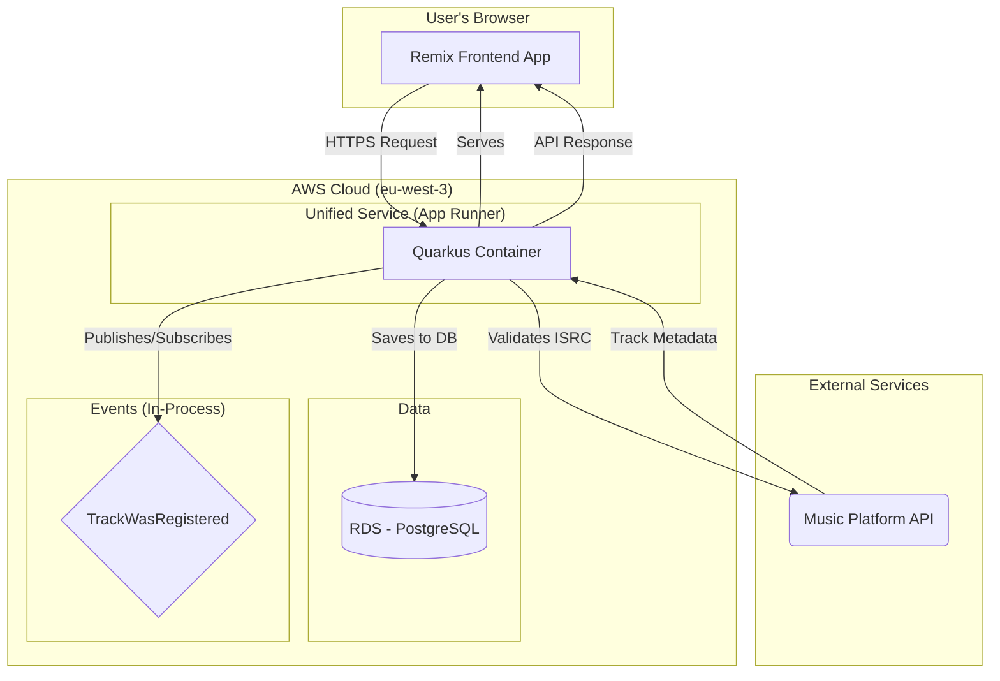

# music-data-hub Fullstack Architecture Document

## Introduction

This document outlines the complete fullstack architecture for music-data-hub, including backend systems, frontend implementation, and their integration. It serves as the single source of truth for AI-driven development, ensuring consistency across the entire technology stack.

This unified approach combines what would traditionally be separate backend and frontend architecture documents, streamlining the development process for modern fullstack applications where these concerns are increasingly intertwined.

### Starter Template or Existing Project

N/A - Greenfield project

### Change Log

| Date | Version | Description | Author |
| --- | --- | --- | --- |
| {{date}} | 1.0 | Initial architecture draft | Winston |

## High Level Architecture

### Technical Summary

The architecture for "music-data-hub" is designed as a modern web application deployed on a flexible cloud infrastructure. The front-end will be a Single-Page Application (SPA) developed with **Remix (TypeScript)**, communicating via a REST API with a robust back-end based on **Quarkus (Java)**. This event-driven architecture, adhering to Domain-Driven Design (DDD) principles, is designed to meet the PRD goals: rapid ISRC validation, centralized catalog management, and high potential for future scalability.

### Platform and Infrastructure Choice

For the Proof of Concept (PoC), the recommendation is to use **Docker containers** deployed on **AWS**, leveraging managed services to balance flexibility and operational simplicity.

*   **Platform:** AWS
*   **Key Services:**
    *   **Compute:** AWS App Runner (for containerized Quarkus and Remix applications)
    *   **Database:** Amazon RDS for PostgreSQL
    *   **Storage:** Amazon S3 (for potential future file storage needs)
*   **Deployment Host and Regions:** `eu-west-3` (Paris) to be close to potential European users.

**Risk Mitigation:** To manage the complexity and cost of AWS, we will adopt an Infrastructure as Code (IaC) approach with Terraform from the start, utilize budget alerts, and focus on simple, managed services like App Runner. An alternative for the PoC could be a simpler PaaS like Render, with a plan to migrate to AWS later.

### Repository Structure

A monorepo is the chosen approach to streamline development and dependency management.

*   **Structure:** Monorepo
*   **Monorepo Tool:** Start with `pnpm` workspaces for the front-end and shared packages. Avoid more complex tools like Nx or Turborepo until a clear need arises.
*   **Package Organization:**
    *   `apps/frontend`: The Remix application.
    *   `apps/backend`: The Quarkus application.
    *   `packages/shared-types`: Shared TypeScript types for API contracts.

### High Level Architecture Diagram



### Architectural Patterns

The following patterns will guide development:

*   **Hexagonal Architecture (Ports & Adapters) - Backend:** This is a core requirement from the PRD. It will allow us to decouple the business logic (domain) from technical details like the database, REST API, or event bus. This ensures high testability and future flexibility.
*   **Domain-Driven Design (DDD) - Backend:** Also a requirement. We will organize the code around business concepts (Producer, Artist, Track) using aggregates, entities, and value objects. This aligns the code with the business language and helps manage complexity.
*   **Event-Driven Architecture (Internal) - Backend:** As discussed, we will use an in-memory event bus for the PoC. The loose coupling between the `Producer` and `Artist` contexts (via the `TrackWasRegistered` event) is a cornerstone of the design.
*   **Single-Page Application (SPA) - Frontend:** The Remix front-end will behave as a SPA, providing a rich, responsive user experience without full-page reloads for core actions.
*   **Component-Based Architecture - Frontend:** The UI will be built from reusable React components, promoting maintainability and consistency.

## Tech Stack

This section defines the definitive list of technologies, libraries, and tools for the project. The choices below are based on the PRD and the decisions made so far.

| Category | Technology | Version | Purpose | Rationale |
| :--- | :--- | :--- | :--- | :--- |
| Frontend Language | TypeScript | ~5.x | Static typing for the frontend | Ensures robustness, self-documentation, and maintainability. |
| Frontend Framework | Remix | latest | Full-stack framework for React | Chosen in the PRD. Enables rich user experiences and optimized performance. |
| UI Component Library | shadcn/ui | latest | Composable and accessible UI components | Provides unstyled, copy-paste components for full control and customizability. Aligns with a modern Tailwind CSS workflow. |
| Backend Language | Java | 21 (LTS) | Core backend language | Specified in the PRD. Robust, performant, and widely used in enterprise. |
| Backend Framework | Quarkus | latest | Cloud-native Java framework | Specified in the PRD. Offers fast startup times and low memory consumption. |
| Code Generation | Lombok | latest | Reduce boilerplate Java code | Keeps domain classes (entities, value objects) clean by auto-generating getters, setters, constructors, etc. |
| API Style | REST | - | Frontend/Backend Communication | The simplest and most standard approach for this type of application. |
| Event Bus (In-Memory) | Quarkus Vert.x Events | - | Manage internal, in-process events | Leverages the built-in, lightweight Vert.x event bus for asynchronous communication between contexts (e.g., `TrackWasRegistered`). |
| Database | PostgreSQL | 16.x | Relational data storage | Specified in the PRD. Powerful, open-source, and reliable. |
| DB Migration | Flyway | latest | Database schema migrations | Provides version-controlled, automated database schema evolution. Essential for CI/CD. |
| Frontend Testing | Vitest & RTL | latest | Unit/component testing | Specified in the PRD. The standard ecosystem for testing React/Vite applications. |
| Backend Testing | JUnit 5 & Mockito | latest | Unit/integration testing | Specified in the PRD. The standard ecosystem for testing in Java/Quarkus. |
| Code Coverage | Jacoco | latest | Measure backend test coverage | Required by the PRD (NFR3: 80% coverage). Provides a clear metric for code quality and testing thoroughness. |
| Architecture Testing | ArchUnit | latest | Enforce architectural rules | Automatically verifies that our hexagonal architecture rules (e.g., dependencies between modules) are not violated. |
| HTTP Service Mocking | io.quarkiverse.wiremock:quarkus-wiremock | latest | Mock external APIs in tests | Allows for reliable and fast integration tests by simulating external HTTP services (e.g., the Music Platform API). |
| Object Mapping | MapStruct | latest | Map between DTOs and domain objects | Generates type-safe, performant mapping code, keeping conversion logic separate from business logic. |
| Monitoring | io.quarkiverse.micrometer.registry:quarkus-micrometer-registry-otlp | latest | Export application metrics | Industry standard (Micrometer + OpenTelemetry) for maximum observability and compatibility with various backends. |
| Build & Deployment | Docker Containers | latest | Application packaging | Industry standard for deployment. Allows running applications consistently anywhere. |
| IaC (Infra as Code) | Terraform | latest | Managing AWS infrastructure | Enables versioned, reproducible, and automated infrastructure management. |
| CI/CD | GitHub Actions | - | Build/test/deploy automation | Natively integrated with GitHub, easy to set up for a project hosted on the platform. |

## Data Models

This section defines the core business entities. It is a conceptual model that will serve as the basis for both the database schema and the shared API types.

#### Technical Concerns

`createdAt` and `updatedAt` timestamps are considered technical concerns. They will be handled automatically by the persistence layer (e.g., database default values) and are thus excluded from these domain models.

#### ID Generation Strategy

A hybrid approach will be used for primary key generation to combine robustness and idempotence:
*   **Producer:** IDs will be **deterministic UUIDv5**. They will be generated from a constant namespace and the immutable `producerCode`. This guarantees that the same producer code always results in the same ID, simplifying "upsert" logic.
*   **Artist:** IDs will be **random UUIDv4**. The artist's name is mutable, so a random UUID is used to decouple the entity's identity from its data, allowing for name changes without breaking references.

#### Value Objects

To increase type safety and encapsulate validation logic within the domain, several attributes will be implemented as Value Objects, not primitive strings. While they are serialized as strings in the API, they are treated as rich objects in the backend code.
*   **`ProducerCode`**: A 5-character code identifying a producer.
*   **`ISRC`**: A 12-character International Standard Recording Code.
*   **`TrackTitle`**: A non-empty title for a track.
*   **`ArtistName`**: A non-empty name for an artist.

---

### Database Schema Management

Database schema changes will be managed through **Flyway**. Migration scripts will be stored in the backend source code (`src/main/resources/db/migration`). This ensures that schema changes are version-controlled, repeatable, and automatically applied upon application startup, which is critical for a reliable CI/CD pipeline.

### Model: Producer

*   **Purpose:** The main aggregate representing a rights holder. It owns and manages a collection of `Track` objects.
*   **Business Attributes:**
    *   `id`: `UUID` (Deterministic v5)
    *   `producerCode`: `ProducerCode`
    *   `name`: `String` (Optional)
    *   `tracks`: `Set<Track>`

#### TypeScript Interface
```typescript
export interface Producer {
  id: string; // UUID
  producerCode: string;
  name?: string;
  tracks: Track[];
}
```

### Model: Track

*   **Purpose:** A child entity within the `Producer` aggregate, identified by its ISRC.
*   **Business Attributes:**
    *   `isrc`: `ISRC`
    *   `title`: `TrackTitle`
    *   `artistNames`: `Array<ArtistName>`
    *   `sources`: `Array<Source>`
    *   `status`: `'Provisional' | 'Verified'`

#### TypeScript Interface
```typescript
export interface Source {
  sourceName: 'Spotify' | 'Tidal' | 'Deezer' | 'Apple Music' | 'Manual';
  sourceId: string;
}

export interface Track {
  isrc: string;
  title: string;
  artistNames: string[];
  sources: Source[];
  status: 'Provisional' | 'Verified';
}
```

### Model: Artist

*   **Purpose:** An aggregate representing an artist in its own bounded context. It holds references to tracks, but does not own them.
*   **Business Attributes:**
    *   `id`: `UUID` (Random v4)
    *   `name`: `ArtistName`
    *   `status`: `'Provisional' | 'Verified'`
    *   `sources`: `Array<Source>`
    *   `trackIds`: `Array<ISRC>`

#### TypeScript Interface
```typescript
export interface Artist {
  id: string; // UUID
  name: string;
  status: 'Provisional' | 'Verified';
  sources: Source[];
  trackIds: string[]; // Set of ISRC codes
}
```

## API Specification

Based on the REST style, this OpenAPI 3.0 specification defines the core endpoints.

```yaml
openapi: 3.0.0
info:
  title: "Music Data Hub API"
  version: "1.0.0"
  description: "API for managing the music catalog."
servers:
  - url: "/api/v1"

paths:
  /producers:
    post:
      summary: "Register a new track"
      description: "Submits an ISRC. The system finds or creates the corresponding Producer, validates the ISRC, and adds the track to the producer's catalog."
      requestBody:
        required: true
        content:
          application/json:
            schema:
              type: object
              properties:
                isrc:
                  type: string
                  example: "FRLA12400001"
              required:
                - isrc
      responses:
        '202':
          description: "Accepted. The track registration is in progress."
          content:
            application/json:
              schema:
                $ref: "#/components/schemas/Producer"
        '400':
          description: "Invalid ISRC format."
        '422':
          description: "Unprocessable ISRC (e.g., valid but not found)."

  /producers/{producerId}:
    get:
      summary: "Get a Producer by ID"
      parameters:
        - in: path
          name: producerId
          required: true
          schema:
            type: string
            format: uuid
      responses:
        '200':
          description: "A Producer object."
          content:
            application/json:
              schema:
                $ref: "#/components/schemas/Producer"
        '404':
          description: "Producer not found."

  /artists:
    get:
      summary: "List all Artists"
      responses:
        '200':
          description: "A list of artists."
          content:
            application/json:
              schema:
                type: array
                items:
                  $ref: "#/components/schemas/Artist"

components:
  schemas:
    Producer:
      type: object
      properties:
        id:
          type: string
          format: uuid
        producerCode:
          type: string
        name:
          type: string
        tracks:
          type: array
          items:
            $ref: "#/components/schemas/Track"

    Track:
      type: object
      properties:
        isrc:
          type: string
        title:
          type: string
        artistNames:
          type: array
          items:
            type: string
        sources:
          type: array
          items:
            $ref: "#/components/schemas/Source"
        status:
          type: string
          enum: [Provisional, Verified]

    Source:
      type: object
      properties:
        sourceName:
          type: string
          enum: [Spotify, Tidal, Deezer, Apple Music, Manual]
        sourceId:
          type: string

    Artist:
      type: object
      properties:
        id:
          type: string
          format: uuid
        name:
          type: string
        status:
          type: string
          enum: [Provisional, Verified]
        sources:
          type: array
          items:
            $ref: "#/components/schemas/Source"
        trackIds:
          type: array
          items:
            type: string

```

## Unified Project Structure

This section outlines the concrete project structure within our monorepo, optimized for our chosen stack (Quarkus + Remix) and architectural decisions. It uses a multi-module Maven setup for the backend to enforce architectural boundaries.

### Monorepo Root Structure

```plaintext
music-data-hub/
├── .github/                    # CI/CD Workflows (GitHub Actions)
│   └── workflows/
│       └── ci.yaml
├── apps/                       # Deployable application packages
│   ├── frontend/               # The Remix UI application
│   └── backend/                # The Quarkus API application (Maven Parent)
├── packages/                   # Shared local packages
│   └── shared-types/           # Shared TypeScript interfaces
├── infrastructure/             # Infrastructure as Code
│   └── terraform/
├── .gitignore
├── package.json                # Root package.json for monorepo scripts
├── pnpm-workspace.yaml         # PNPM workspace configuration
└── README.md
```

### Backend Multi-Module Structure (`apps/backend/`)

The backend is organized as a multi-module Maven project to strictly enforce the boundaries of our Hexagonal and Domain-Driven Design. Each context and layer is an independent module with explicitly defined dependencies. Module names are prefixed to ensure clarity and global uniqueness of artifacts.

```plaintext
backend/
├── pom.xml                 # Parent POM declaring all backend modules
│
├── bootstrap/              # Module for application startup and configuration
│   ├── pom.xml
│   └── src/
│
├── producer/               # Parent module for the 'producer' bounded context
│   ├── pom.xml
│   ├── producer-domain/
│   │   └── pom.xml         # --- CORE DOMAIN: No external dependencies
│   ├── producer-application/
│   │   └── pom.xml         # --- Depends on: producer-domain
│   └── producer-adapters/    # Parent module for producer's adapters
│       ├── pom.xml
│       ├── producer-adapter-persistence/
│       │   └── pom.xml     # --- Implements persistence ports
│       ├── producer-adapter-rest/
│       │   └── pom.xml     # --- Implements REST API (primary adapter)
│       └── producer-adapter-spi/
│           └── pom.xml     # --- Implements external service clients (secondary adapter)
│
└── artist/                 # Parent module for the 'artist' bounded context
    ├── pom.xml
    ├── artist-domain/
    │   └── pom.xml         # --- CORE DOMAIN: No external dependencies
    ├── artist-application/
    │   └── pom.xml         # --- Depends on: artist-domain
    └── artist-adapters/      # Parent module for artist's adapters
        ├── pom.xml
        ├── artist-adapter-persistence/
        │   └── pom.xml     # --- Implements persistence ports
        ├── artist-adapter-messaging/
        │   └── pom.xml     # --- Listens for events (secondary adapter)
        └── artist-adapter-rest/
            └── pom.xml     # --- Implements REST API
```

## Resilience and Observability

*   **Observability:**
    *   **Metrics:** Application metrics (JVM, HTTP requests, etc.) will be exposed using **Micrometer** and the `quarkus-micrometer-registry-otlp` extension. This will allow sending them to any OpenTelemetry-compatible backend.
    *   **Logging:** Logging will follow Quarkus standards, producing structured (JSON) logs in production for easy analysis.

*   **Resilience:**
    *   **External Calls:** For the PoC, no retry policies or circuit breakers will be implemented for the call to the external music API. This will be a consideration for the post-PoC version. Basic error handling (timeouts, 5xx errors) will be implemented.
    *   **Caching:** No caching strategy is defined for the PoC.

## Security and Secrets Management

This section outlines the strategy for handling sensitive information like API keys and database credentials.

### Prerequisite: External API Access

**CRITICAL BLOCKER:** Development cannot begin until access details for the external Music Platform API are acquired. This includes:
*   API Base URL
*   Authentication method (e.g., API Key, OAuth)
*   The API Key or credentials themselves
*   Rate limits and usage policies

This information must be obtained by the project owner and securely shared with the development team.

### Secrets Management Strategy

*   **Local Development:** Secrets will be managed using environment variables loaded via a `.env` file at the root of the backend and frontend applications. These files **must be included in `.gitignore`** and never committed to version control. An `.env.example` file should be created to document required variables.
*   **Production (AWS):** Secrets will be stored securely in **AWS Secrets Manager**. The Quarkus and Remix applications will be granted IAM permissions to fetch these secrets at runtime. This avoids storing sensitive data in container images or environment variables on the production host.

## Development and Deployment with Quinoa

The integration between frontend and backend is managed by the [Quarkus Quinoa extension](https://quarkus.io/blog/quinoa-modern-ui-with-no-hassle/), which unifies their lifecycles.

*   **Local Development:** A single command, `quarkus dev`, from the `apps/backend` directory will start both the Quarkus backend and the Remix development server, with transparent proxying for a seamless live-reload experience.
*   **Build:** The `mvn package` command in `apps/backend` will first trigger the Remix build (`pnpm run build`) and then bundle the resulting static assets directly into the final Quarkus application JAR.
*   **Deployment:** The deployment process is maximally simplified. A single Docker container is built from the Quarkus application and deployed to AWS App Runner. This single container is responsible for serving both the API and the user interface assets.

## Coding Standards

This section defines the minimal but critical rules that development agents (AI or human) must follow. The goal is to enforce consistency and adhere to the architectural decisions made.

### Commit Message Format

All git commits **must** follow the [Conventional Commits](https://www.conventionalcommits.org/en/v1.0.0/) specification. This creates a clear and machine-readable commit history, which facilitates automated versioning and changelog generation.

*   **Example `feat`:** `feat(producer): allow track registration via ISRC`
*   **Example `fix`:** `fix(api): correct artist name serialization`
*   **Example `docs`:** `docs(architecture): add db migration strategy`

### Critical Full-stack Rules

1.  **Shared Types via `shared-types`**: All interfaces or types used in API DTOs **must** be defined in the `packages/shared-types` package. Both the frontend and backend **must** use this package to ensure contract consistency.
2.  **Domain Immutability**: Domain objects (`domain` layer) **must be** immutable. Any modification to an aggregate must result in a new instance of that aggregate.
3.  **Enforce Value Objects**: In the backend domain, **prefer creating Value Objects** (`ISRC`, `ProducerCode`, `ArtistName`, etc.) over using primitive types like `String` for any data that has intrinsic rules, format, or constraints. This is a primary tool for enforcing domain invariants and making the code more expressive.
4.  **No Logic in Adapters**: REST controllers and other adapters **must be** as "thin" as possible. They only convert requests/events into application service calls and map the results. All business logic **must reside** in the `application` and `domain` layers.
5.  **Application Service Entry Points**: The frontend (via REST controllers) and other contexts (via events) **must never** interact directly with repositories or the domain. They **must always** go through the application services (the use case layer).
6.  **Configuration over Environment Variables**: **Never** access environment variables directly (`process.env` or `System.getenv`). Use the configuration mechanisms provided by the frameworks (Quarkus or Remix) for clean dependency injection of configuration.

### Naming Conventions

| Element | Frontend (Remix/React) | Backend (Java/Quarkus) | Example |
| :--- | :--- | :--- | :--- |
| UI Components | `PascalCase` | N/A | `TrackCard.tsx` |
| Route Files | `kebab-case.tsx` | N/A | `producers.$id.tsx` |
| Service Classes | N/A | `PascalCase` | `ProducerService.java` |
| REST Endpoints | N/A | `kebab-case` | `/api/v1/producers` |
| DB Tables | `snake_case` | `snake_case` | `producers`, `tracks` |
| DB Columns | `snake_case` | N/A | `producer_code`, `artist_names` | 