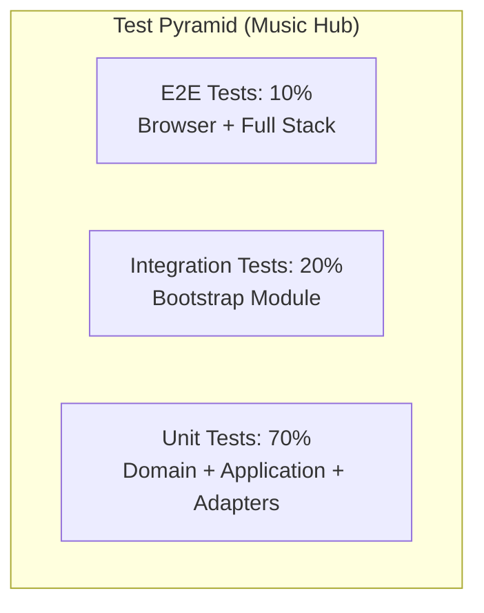
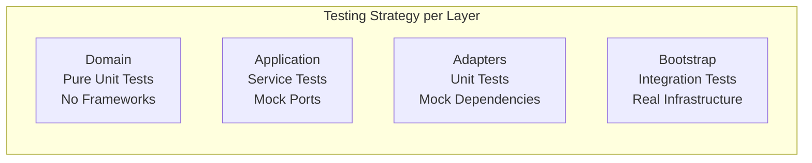
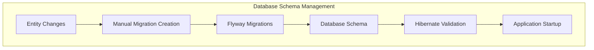

# Music Hub Fullstack Architecture Document

* **Version:** 1.0
* **Date:** September 4, 2025
* **Author:** Winston (Architect)

## 1\. Introduction

This document describes the complete full-stack architecture for the Music Hub project, including backend systems, frontend implementation, and their integration. It serves as the single source of truth for development, ensuring consistency across the entire technology stack. This unified approach is designed to streamline the development process for this application where backend and frontend concerns are tightly coupled.

### Starter Template or Existing Project

Project analysis reveals that it is not based on a predefined full-stack starter template. It is a custom structure that combines:

* A **Quarkus backend** following a rigorous hexagonal architecture.
* A **Remix frontend** integrated and served by the backend via the **Quarkus Quinoa** extension.
* The entire project is assembled in a **Maven monorepo**, with the `bootstrap` module acting as the main entry point.

### Change Log

| Date | Version | Description | Author |
| :--- | :--- | :--- | :--- |
| 04/09/2025 | 1.0 | Initial creation of the full-stack architecture document. | Winston (Architect) |

---

## 2\. High-Level Architecture

### Technical Summary

The project's architecture is designed as a **full-stack monorepo** deployed as a single artifact. The backend is a **Quarkus (Java)** application built on the principles of **Hexagonal Architecture**, **Domain-Driven Design (DDD)**, and internal **Event-Driven** communication. It exposes a versionless REST API (`/api/*`). The frontend is a **Single-Page Application (SPA) in Remix (TypeScript)** that is integrated and served by the backend via **Quarkus Quinoa**.

### Platform and Infrastructure Choice

The target platform for the PoC deployment is a **containerized IaaS/PaaS (e.g., Scaleway, DigitalOcean)**. This option offers the best balance of cost, management simplicity for a single container, and performance. The application will be deployed as a single Docker container with a managed PostgreSQL database from the same provider.

### High-Level Architecture Diagram

```mermaid
sequenceDiagram
    participant User
    participant FE as Frontend (Remix SPA)
    participant BE as Backend (Quarkus)
    participant Tidal as External API (Tidal)
    participant Spotify as External API (Spotify)
    participant DB as Database (PostgreSQL)
    participant EventBus
    
    User->>+FE: 1. Enters ISRC and clicks "Validate"
    FE->>+BE: 2. POST /api/producers (isrc)
    
    BE-->>-FE: 3. Immediate HTTP 202 Accepted response
    Note right of FE: Displays "Processing..." notification
    
    par Parallel Calls
        BE->>+Tidal: 4a. GET /tracks?filter[isrc]=...
        Tidal-->>-BE: 5a. 200 OK response with metadata
    and
        BE->>+Spotify: 4b. GET /search?q=isrc:...
        Spotify-->>-BE: 5b. 200 OK response
    end
    
    BE->>+DB: 6. Saves (INSERT/UPDATE) the Producer aggregate and its Track
    DB-->>-BE: 7. Save confirmation
    
    BE->>EventBus: 8. Publishes [TrackWasRegistered] event
    
    Note right of BE: Initial request processing is complete.
    
    EventBus-->>BE: 9. Notifies Artist Context (asynchronous)
    
    BE->>+DB: 10. Artist Context reads and/or writes the Artist entity
    DB-->>-BE: 11. Save confirmation
````

-----

## 3\. Tech Stack

This table is the single source of truth for all technologies, frameworks, and versions to be used.

| Category | Technology | Version | Role | Rationale |
| :--- | :--- | :--- | :--- | :--- |
| **Backend Language** | Java | 21 | Primary language for business logic. | Stability (LTS), performance, and mature ecosystem. |
| **Backend Framework**| Quarkus | 3.25.3 | Main framework for the backend and application. | High performance, developer experience, cloud-native. |
| | **SmallRye Mutiny** | Integrated with Quarkus | Asynchronous and reactive programming. | For non-blocking, end-to-end processing and increased scalability. |
| **Frontend Language**| TypeScript | 5.9.2 | Primary language for the user interface. | Static typing for robustness and maintainability. |
| **Frontend Framework**| Remix | 2.9.2 | Framework for building the user interface. | Modern web architecture, performance, good integration with Vite. |
| **Database** | PostgreSQL | 16+ | Primary data storage. | Powerful, reliable, open-source, and well-supported by Hibernate. |
| **Data Access** | Hibernate ORM + Panache | Managed by Quarkus BOM | Data access layer for the backend. | Standard Quarkus integration, simplifies CRUD operations. |
| **DB Migrations** | Flyway | Managed by Quarkus BOM | Database schema change management. | Standard, versioned, and reliable approach for SQL migrations. |
| **API Style** | REST | - | Communication protocol between frontend and backend. | Industry standard, simple to use and well-understood. |
| **Event Bus**| Vert.x EventBus | Managed by Quarkus BOM | Internal asynchronous communication between contexts. | Integrated with Quarkus, lightweight and performant for a reactive architecture. |
| **Build & Dependencies**| Maven (Backend), npm (Frontend)| - | Build and dependency management. | Standard tools for their respective ecosystems. |
| **Styling & UI** | Tailwind CSS | 4.1.11 | CSS framework for the user interface. | Utility-first approach for rapid and consistent development. |
| | **shadcn/ui** | N/A (via CLI) | Base of reusable UI components. | Pragmatic approach to build a custom UI without heavy external dependencies. |
| **Testing & Quality** | JUnit 5, Mockito | Managed by Quarkus BOM | Foundation for unit and integration tests. | Standard testing stack for the Java/Quarkus ecosystem. |
| | **AssertJ** | 3.24.2 | Fluent assertions for tests. | Improves the clarity and readability of tests. |
| | **WireMock** | 1.5.1 | Mocking external services in tests. | Allows testing integration with external APIs in isolation. |
| | **ArchUnit** | 1.3.0 | Validation of architectural rules in code. | Ensures compliance with hexagonal architecture constraints. |
| | **Jacoco** | 0.8.13 | Code coverage measurement. | Ensures the 80% coverage target (from PRD) is tracked. |
| | **Vitest, React Testing Library**| 3.2.4+ | Component testing for the frontend. | Modern and efficient ecosystem for testing React components. |
| **Dev Tools** | **Lombok** | 1.18.30 | Boilerplate code reduction. | Improves code readability and maintainability. |
| | **MapStruct** | 1.5.5.Final | Code generation for object mapping. | Standardizes and secures conversion between layers. |
| **Deployment & CI/CD**| **Docker Containers** | - | Deployment artifact. | Standardizes the execution environment for portability. |
| | **GitHub Actions** | - | Continuous Integration and Deployment (CI/CD). | Automation of builds, tests, and deployments. |
| **Monitoring** | Micrometer, Prometheus, OTLP | - | Exposing and sending application metrics. | Observability via open standards (OpenTelemetry). |
| **Authentication**| - | - | - | **Out of scope** for the PoC, as defined in the PRD. |

-----

## 4\. Data Models

These TypeScript interfaces serve as the official API contract between the backend and the frontend.

#### "Producer"

```typescript
interface Producer {
  id: string; // UUID
  producerCode: string;
  name?: string | null;
  tracks: string[]; // List of track ISRC codes
}
```

#### "Track" & Dependencies

```typescript
interface ArtistCredit {
  artistName: string;
  artistId?: string; // UUID
}

interface Source {
  sourceName: 'SPOTIFY' | 'TIDAL' | 'DEEZER' | 'APPLE_MUSIC' | 'MANUAL';
  sourceId: string;
}

interface Track {
  id: string; // UUID
  isrc: string;
  title: string;
  credits: ArtistCredit[];
  status: 'PROVISIONAL' | 'VERIFIED';
  sources: Source[];
  submissionDate: string; // ISO 8601 Date String
}
```

#### "Artist"

```typescript
interface Contribution {
  trackId: string; // The track's UUID
  title: string;
  isrc: string;
}

interface Artist {
  id: string; // UUID
  name: string;
  status: 'PROVISIONAL' | 'VERIFIED';
  country?: string;
  sources: Source[]; // Platforms where the artist is identified
  contributions: Contribution[]; // The tracks to which the artist has contributed
  submissionDate: string; // ISO 8601 Date String
  producerIds: string[]; // List of associated producer UUIDs (assembled on the fly)
}
```

-----

## 5\. API Specification

The following OpenAPI 3.0 specification serves as the formal technical contract for the REST API.

```yaml
openapi: 3.0.0
info:
  title: Music Hub API
  version: 1.0.0
  description: API for centralized management of music catalogs.
servers:
  - url: /api
    description: Main server

paths:
  /producers:
    post:
      summary: Registers a new track via its ISRC
      operationId: registerTrack
      requestBody:
        required: true
        content:
          application/json:
            schema:
              type: object
              properties:
                isrc:
                  type: string
                  example: "FRLA12400001"
              required:
                - isrc
      responses:
        '202':
          description: Accepted. The track is being processed.
          content:
            application/json:
              schema:
                $ref: '#/components/schemas/Producer'
        '400':
          description: Invalid ISRC format.
        '422':
          description: ISRC not found on external services.

  /tracks/recent:
    get:
      summary: Retrieves the latest registered tracks
      operationId: getRecentTracks
      responses:
        '200':
          description: A list of recent tracks.
          content:
            application/json:
              schema:
                type: array
                items:
                  $ref: '#/components/schemas/Track'

  /artists:
    get:
      summary: Lists all artists
      operationId: listArtists
      responses:
        '200':
          description: A list of all artists.
          content:
            application/json:
              schema:
                type: array
                items:
                  $ref: '#/components/schemas/Artist'

components:
  schemas:
    # All schemas (Producer, Track, Artist, etc.) are defined here.
    # For clarity, the full version is omitted but corresponds
    # to the TypeScript interfaces in the Data Models section.
```

-----

## 6\. Testing Strategy

The testing strategy combines multiple levels to ensure quality:

* **Unit Tests (Backend & Frontend)**: Validate the atomic logic of domain classes and React components in isolation.
* **Integration Tests (Backend)**: Validate complete flows, from the API to the database, using an in-memory database (H2) and mocks (WireMock) for external services.
* **Code Quality**: Code coverage is measured by **Jacoco** (80% target), and architectural rules are validated by **ArchUnit**.
* **Test Documentation**: JUnit 5's `@DisplayName` annotation is mandatory for all backend tests to ensure their readability.

-----

## 7\. Resilience and Observability

### Observability

* **Metrics:** Application metrics (JVM, HTTP requests, etc.) will be exposed via Micrometer and the `quarkus-micrometer-registry-otlp` extension. This will allow them to be sent to any OpenTelemetry-compatible backend.
* **Logging:** Logging will follow Quarkus standards, producing structured logs (JSON) in production for easier analysis.

### Resilience

* **External Calls:** For the PoC, no retry or circuit breaker policies will be implemented for calls to the external music API. This will be a consideration for the post-PoC version. Basic error handling (timeouts, 5xx errors) will be implemented.
* **Caching:** No caching strategy is defined for the PoC.

-----

## 8\. Logging Best Practices

**Updated**: This section reflects SonarQube-compliant exception handling patterns implemented in the codebase (Story DOC-1).

### 1\. Logging Strategy & Philosophy

Our logging approach follows these principles:

- **SonarQube Compliance**: "Either log OR rethrow" pattern prevents duplicate logging
- **Structured Logging**: JSON format for easier analysis
- **Contextual Information**: Correlation IDs for request tracing
- **Hexagonal Architecture**: Clear logging responsibilities per layer
- **Performance Awareness**: Asynchronous logging to minimize impact
- **Security First**: Automatic masking of sensitive data

### 2\. Quarkus Logging Framework

Centralized configuration using:

- **JBoss Logging** as facade
- **Logback** as implementation
- **JSON Encoder** for structuring
- **OpenTelemetry** for correlation

### 3\. Log Levels & Usage Guidelines

| Level | Usage | Examples |
|-------|--------|----------|
| ERROR | System failures, exceptions | Database connection lost, API timeouts |
| WARN | Recoverable issues | Deprecated API usage, configuration warnings |
| INFO | Business events | Track registered, Producer created |
| DEBUG | Development details | SQL queries, method parameters |
| TRACE | Detailed flow | Method entry/exit, loop iterations |

### 4\. Structured Logging with JSON

```json
{
  "timestamp": "2024-01-15T10:30:00.123Z",
  "level": "INFO",
  "logger": "com.musichub.producer.application.RegisterTrackService",
  "message": "Track successfully registered",
  "correlation_id": "req-123-456",
  "business_context": {
    "producer_code": "FRLA1",
    "isrc": "FRLA12400001",
    "operation": "track_registration"
  }
}
```

### 5\. Contextual Logging & Correlation

- **Request Correlation**: UUID generated per request
- **Business Context**: Business metadata in each log
- **User Context**: User identification (if applicable)
- **Performance Context**: Execution times and metrics

### 6\. Hexagonal Architecture Logging Patterns

**Exception Handling Compliance - SonarQube "Either log OR rethrow" Rule**

Our architecture follows strict exception handling patterns to prevent duplicate logging and ensure clean error flow:

| Layer | Responsibility | Pattern |
|-------|---------------|---------|
| **Domain** | Business rules | Log business events + throw domain exceptions |
| **Application** | Use case orchestration | Log + rethrow OR log + handle completely |
| **Adapter** | Infrastructure context | Rethrow with technical context (NO logging) |
| **REST** | HTTP boundary | Log final error + convert to HTTP response |

```java
// ✅ COMPLIANT: Adapter rethrows with context - NO duplicate logging
 @ApplicationScoped
public class ProducerRepositoryAdapter {
    try {
        // Database operations...
        return result;
    } catch (Exception e) {
        // ✅ Rethrow with context - do NOT log here
        throw new ProducerPersistenceException(
            String.format("Failed to retrieve producer (correlationId: %s)", 
                correlationId), e);
    }
}

// Application Layer - Log and rethrow for higher layers
log.error("Track registration failed - persistence error: {}", correlationId, e);
throw e; // Rethrow for REST layer to handle

// Domain Layer - Business Events
log.info("Producer created with code: {}", producerCode.value());
```

**Reference**: Complete patterns and examples in [Logging Best Practices](https://www.google.com/search?q=architecture/logging-best-practices.md)

### 7\. Security & Sensitive Data

- **Auto-masking**: Partial ISRCs, user IDs
- **Whitelist Approach**: Only authorized data is logged
- **Audit Trail**: Traceability of sensitive actions
- **Data Classification**: Log marking by sensitivity level

### 8\. Environment-Specific Configuration

```properties
# Development - Verbose logging
%dev.quarkus.log.level=DEBUG
%dev.quarkus.log.console.json=false

# Production - Structured JSON
%prod.quarkus.log.level=INFO  
%prod.quarkus.log.console.json=true
%prod.quarkus.log.console.json.pretty-print=false
```

### 9\. OpenTelemetry Integration

- **Traces**: Correlation with APM metrics
- **Spans**: Distributed context between services
- **Baggage**: Business metadata propagation
- **Sampling**: Intelligent trace configuration

### 10\. Performance Considerations

- **Async Logging**: Non-blocking queue
- **Log Rotation**: Automatic size management
- **Buffer Management**: Memory optimization
- **Network Efficiency**: Compression for remote logs

### 11\. Business Event Logging

- **Domain Events**: Business event logging
- **State Changes**: Important state transitions
- **Business Metrics**: KPIs and business indicators
- **Compliance**: Regulatory traceability

### 12\. Monitoring & Alerting

- **Error Rate**: Alerts on error spikes
- **Performance**: Latency thresholds
- **Business KPIs**: Critical business metrics
- **Infrastructure**: System health and resources

-----

## 9\. Source Tree

This section outlines the concrete project structure within our monorepo, optimized for our chosen stack (Quarkus + Remix) and architectural decisions. It uses a multi-module Maven setup for the backend to enforce architectural boundaries.

## Monorepo Root Structure

```plaintext
music-hub-project/
├── apps/                       # Application packages (frontend + backend modules)
│   ├── webui/                  # Remix UI application
│   ├── bootstrap/              # Quarkus runtime (assembles contexts + REST)
│   ├── producer/               # Producer bounded context (multi-module)
│   ├── artist/                 # Artist bounded context (multi-module)
│   └── shared-kernel/          # Shared domain values/events
├── docs/                       # Architecture, PRD, stories, specs
├── docker-compose.yml          # Local services (e.g., PostgreSQL)
└── README.md
```

## Backend Modules Structure (`apps/`)

The backend is organized as a multi-module Maven project to strictly enforce the boundaries of our Hexagonal and Domain-Driven Design. Each context and layer is an independent module with explicitly defined dependencies. Module names are prefixed to ensure clarity and global uniqueness of artifacts. The parent aggregator is `apps/pom.xml`.

```plaintext
apps/
├── pom.xml                 # Parent POM declaring all backend modules
│
├── bootstrap/              # Module for application startup and configuration (Quarkus)
│   ├── pom.xml
│   └── src/
│
├── shared-kernel/          # SHARED KERNEL: Domain values and event contracts
│   └── pom.xml             # --- e.g., ISRC value object, TrackWasRegistered event
│
├── producer/               # Parent module for the 'producer' bounded context
│   ├── pom.xml
│   ├── producer-domain/
│   │   └── pom.xml         # --- CORE DOMAIN: Depends on shared-kernel
│   ├── producer-application/
│   │   └── pom.xml         # --- Depends on: producer-domain, shared-kernel
│   └── producer-adapters/    # Parent module for producer's adapters
│       ├── pom.xml
│       ├── producer-adapter-messaging/
│       │   └── pom.xml     # --- Listens for events (secondary adapter)
│       ├── producer-adapter-persistence/
│       │   └── pom.xml     # --- Implements persistence ports
│       ├── producer-adapter-rest/
│       │   └── pom.xml     # --- Implements REST API (primary adapter)
│       └── producer-adapter-spi/
│           └── pom.xml     # --- Implements external service clients (secondary adapter)
│
└── artist/                 # Parent module for the 'artist' bounded context
    ├── pom.xml
    ├── artist-domain/
    │   └── pom.xml         # --- CORE DOMAIN: Depends on shared-kernel
    ├── artist-application/
    │   └── pom.xml         # --- Depends on: artist-domain, shared-kernel
    └── artist-adapters/      # Parent module for artist's adapters
        ├── pom.xml
        ├── artist-adapter-persistence/
        │   └── pom.xml     # --- Implements persistence ports
        ├── artist-adapter-messaging/
        │   └── pom.xml     # --- Listens for events (secondary adapter)
        ├── artist-adapter-rest/
        │   └── pom.xml     # --- Implements REST API
        └── artist-adapter-spi/
            └── pom.xml     # --- Implements external service clients (secondary adapter)
```

## Frontend Testing Layout

- Frontend tests (Vitest + React Testing Library) are co-located with the Remix code in `apps/webui/app/`.
- Example: `apps/webui/app/routes/_index.test.tsx` for the route `apps/webui/app/routes/_index.tsx`.
- The global test setup is located in `apps/webui/vitest.setup.ts`.
- The Vite/Vitest configuration can disable certain Remix plugins in test mode (see `apps/webui/vite.config.ts`).

-----

## 10\. Testing Best Practices

## Table of Contents

- [1. Testing Philosophy & Principles](#1-testing-philosophy--principles)
- [2. Backend Testing Standards](#2-backend-testing-standards)
- [3. Frontend Testing Standards](#3-frontend-testing-standards)
- [4. AI Agent Guidelines](#4-ai-agent-guidelines)
- [5. Templates & Boilerplates](#5-templates--boilerplates)
- [6. Performance Standards & Metrics](#6-performance-standards--metrics)
- [7. Common Anti-patterns to Avoid](#7-common-anti-patterns-to-avoid)

-----

## 1\. Testing Philosophy & Principles

### Testing Strategy Overview

Our testing approach follows the **Test Pyramid** with a focus on **Hexagonal Architecture** testing patterns:



### Core Testing Principles

1.  **Domain-First Testing**: Start with domain logic tests - they provide the highest ROI
2.  **Test Behavior, Not Implementation**: Focus on business outcomes, not internal mechanisms
3.  **Fast Feedback Loops**: Unit tests \< 100ms, Integration tests \< 5s
4.  **Test Isolation**: Each test should be independent and repeatable
5.  **Clear Test Intent**: Use descriptive names and Given/When/Then structure

### Hexagonal Architecture Testing Approach



-----

## 2\. Backend Testing Standards

### 2.1 Domain Layer Testing

**Philosophy**: Domain tests are pure unit tests with no framework dependencies. They test business logic in isolation.

#### ✅ Excellent Example from Our Codebase

```java
// From: apps/producer/producer-domain/src/test/java/.../ProducerTest.java
@DisplayName("Producer Domain Model Tests")
class ProducerTest {

    @Nested
    @DisplayName("Track Management")
    class TrackManagement {

        @Test
        @DisplayName("Should add tracks with idempotent behavior and normalize ISRC input")
        void addTrack_isIdempotent_andNormalizesInput() {
            // Given
            Producer producer = Producer.createNew(ProducerCode.of("FRLA1"), null);
            
            // When & Then
            assertTrue(producer.addTrack("fr-la1-24-00001"), "First add should return true");
            assertFalse(producer.addTrack("FRLA12400001"), "Duplicate add should return false after normalization");
            assertTrue(producer.hasTrack(ISRC.of("FRLA12400001")), "Track should be present regardless of input format");
        }

        @Test
        @DisplayName("Should normalize and store canonical ISRC representation in tracks set")
        void addTrack_normalizesAndStoresCanonicalValue() {
            // Given
            Producer producer = Producer.createNew(ProducerCode.of("FRLA1"), null);

            // When
            assertTrue(producer.addTrack("fr-la1-24-00001"));

            // Then
            assertTrue(producer.tracks().contains(ISRC.of("FRLA12400001")));
        }
    }
}
```

#### Domain Testing Standards

- **Test Structure**: Use `@Nested` classes for logical grouping
- **Naming Convention**: `[MethodName]_should[ExpectedBehavior]_when[Condition]`
- **DisplayName**: Business-readable descriptions
- **No Mocking**: Test real domain objects, no frameworks
- **Value Objects**: Create real instances, never mock them
- **Defensive Programming**: Test null guards and edge cases

#### Maven Configuration for Domain Tests

```xml
<dependencies>
    <dependency>
        <groupId>org.junit.jupiter</groupId>
        <artifactId>junit-jupiter</artifactId>
        <scope>test</scope>
    </dependency>
    <dependency>
        <groupId>org.assertj</groupId>
        <artifactId>assertj-core</artifactId>
        <scope>test</scope>
    </dependency>
</dependencies>
```

### 2.2 Application Layer Testing

**Philosophy**: Test application services with mocked ports to verify orchestration logic.

#### ✅ Excellent Example from Our Codebase

```java
// From: apps/producer/producer-application/src/test/java/.../RegisterTrackServiceTest.java
@ExtendWith(MockitoExtension.class)
@DisplayName("RegisterTrackService Application Layer Tests")
class RegisterTrackServiceTest {

    private RegisterTrackService service;

    @Mock
    private ProducerRepository repository;

    @BeforeEach
    void setUp() {
        repository = mock(ProducerRepository.class);
        service = new RegisterTrackService(repository);
    }

    @Test
    @DisplayName("Should create new producer when absent, add track, and ensure idempotent behavior")
    void handle_createsProducerWhenAbsent_andAddsTrack_idempotent() {
        // Given
        String input = "fr-la1-24-00001";
        ProducerCode code = ProducerCode.of("FRLA1");
        
        when(repository.findByProducerCode(code)).thenReturn(Optional.empty());
        when(repository.save(any())).thenAnswer(inv -> inv.getArgument(0));

        // When
        Producer result = service.registerTrack(input);

        // Then
        verify(repository).findByProducerCode(code);
        verify(repository).save(any());
        assertTrue(result.hasTrack(ISRC.of("FRLA12400001")), 
                  "Producer should contain the normalized track");
    }
}
```

#### Application Testing Standards

- **Mock Only Ports**: Mock repository interfaces, not domain objects
- **Verify Interactions**: Check that ports are called correctly
- **Test Orchestration**: Focus on how services coordinate domain + infrastructure
- **Business Scenarios**: Test complete use case flows
- **Error Handling**: Verify exception propagation and handling

### 2.3 Adapter Testing (Unit Level)

**Philosophy**: Adapters are tested in isolation with all dependencies mocked.

#### REST Adapter Testing Standards

```java
// Template based on producer-adapter-rest tests
@ExtendWith(MockitoExtension.class)
@DisplayName("[Resource Name] REST Adapter Tests")
class ProducerResourceTest {

    @Mock
    private RegisterTrackUseCase registerTrackUseCase;
    
    private ProducerResource resource;

    @BeforeEach
    void setUp() {
        resource = new ProducerResource();
        resource.registerTrackUseCase = registerTrackUseCase;
    }

    @Test
    @DisplayName("Should return 202 when track registration succeeds")
    void register_shouldReturn202_whenTrackRegistrationSucceeds() {
        // Given
        Producer mockProducer = Producer.createNew(ProducerCode.of("FRLA1"), null);
        when(registerTrackUseCase.registerTrack("FRLA12400001")).thenReturn(mockProducer);
        
        var request = new ProducerResource.RegisterTrackRequest();
        request.isrc = "FRLA12400001";

        // When
        Response response = resource.register(request);

        // Then
        assertThat(response.getStatus()).isEqualTo(202);
        verify(registerTrackUseCase).registerTrack("FRLA12400001");
    }
}
```

#### Persistence Adapter Testing Standards

```java
// Template for persistence adapters
@ExtendWith(MockitoExtension.class)
class ProducerRepositoryImplTest {

    @Mock
    private EntityManager entityManager;
    
    @Mock
    private ProducerMapper mapper;
    
    private ProducerRepositoryImpl repository;

    @Test
    @DisplayName("Should find producer by code using correct query")
    void findByProducerCode_shouldUseCorrectQuery() {
        // Given
        ProducerCode code = ProducerCode.of("FRLA1");
        ProducerEntity entity = new ProducerEntity();
        Producer domain = Producer.createNew(code, null);
        
        when(entityManager.createQuery(any(String.class), eq(ProducerEntity.class)))
            .thenReturn(mockQuery);
        when(mockQuery.getResultList()).thenReturn(List.of(entity));
        when(mapper.toDomain(entity)).thenReturn(domain);

        // When
        Optional<Producer> result = repository.findByProducerCode(code);

        // Then
        assertThat(result).isPresent();
        verify(entityManager).createQuery(contains("SELECT p FROM ProducerEntity p WHERE p.producerCode = :code"), 
                                        eq(ProducerEntity.class));
    }
}
```

### 2.4 Bootstrap Integration Testing

**Philosophy**: End-to-end tests with real infrastructure to verify complete flows.

#### ✅ Excellent Example from Our Codebase

```java
// From: apps/bootstrap/src/test/java/.../ProducerRegistrationIntegrationTest.java
@QuarkusTest
@DisplayName("Producer Registration Integration Tests")
class ProducerRegistrationIntegrationTest {
    
    @Inject
    EntityManager entityManager;

    @BeforeEach
    @Transactional
    void cleanDatabase() {
        entityManager.createQuery("DELETE FROM ProducerEntity").executeUpdate();
        entityManager.flush();
    }

    @Test
    @TestTransaction
    @DisplayName("Should register track successfully end-to-end")
    void shouldRegisterTrackEndToEnd() {
        given()
                .contentType(ContentType.JSON)
                .body("{\"isrc\":\"FRLA12400001\"}")
                .when()
                .post("/api/v1/producers")
                .then()
                .statusCode(202)
                .body("producerCode", equalTo("FRLA1"))
                .body("id", notNullValue())
                .body("tracks", hasSize(1))
                .body("tracks[0]", equalTo("FRLA12400001"));
    }

    @Test
    @TestTransaction
    @DisplayName("Should be idempotent when registering same track twice")
    void shouldBeIdempotentWhenRegisteringSameTrackTwice() {
        // First registration
        given().body("{\"isrc\":\"FRLA12400001\"}")
              .post("/api/v1/producers")
              .then().statusCode(202);

        // Second registration of same track - should be idempotent
        given().body("{\"isrc\":\"FRLA12400001\"}")
              .post("/api/v1/producers")
              .then()
              .statusCode(202)
              .body("tracks", hasSize(1)); // Still only one track
    }
}
```

#### Bootstrap Integration Standards

- **Real Infrastructure**: Use `@QuarkusTest` with real database
- **Clean State**: Reset database in `@BeforeEach` with `@Transactional`
- **Complete Flows**: Test from HTTP request to database persistence
- **Business Scenarios**: Focus on user-facing functionality
- **Error Conditions**: Test 400, 422, 500 responses
- **Data Verification**: Check both HTTP response and database state

#### Quarkus Test Configuration

```properties
# apps/bootstrap/src/test/resources/application.properties
quarkus.datasource.db-kind=h2
quarkus.datasource.username=sa
quarkus.datasource.password=
quarkus.datasource.jdbc.url=jdbc:h2:mem:testdb;DB_CLOSE_DELAY=-1
quarkus.hibernate-orm.database.generation=drop-and-create
quarkus.hibernate-orm.log.sql=true
```

-----

## 3\. Frontend Testing Standards

### 3.1 Vitest Configuration

Our frontend uses **Vitest** + **React Testing Library** for component testing.

#### Current Configuration

```typescript
// apps/webui/vite.config.ts
export default defineConfig(({ mode }) => {
  const isTest = process.env.VITEST === "true" || mode === "test";
  return {
    plugins: [
      // Remix plugin interferes with Vitest; disable in test mode
      ...(isTest ? [] : [remix()]),
      tsconfigPaths(),
    ],
    test: {
      environment: "jsdom",
      setupFiles: "./vitest.setup.ts",
      globals: true,
      css: true,
      exclude: [...configDefaults.exclude, "e2e/**"],
    },
  };
});
```

```typescript
// apps/webui/vitest.setup.ts
import { expect, afterEach } from "vitest";
import { cleanup } from "@testing-library/react";
import * as matchers from "@testing-library/jest-dom/matchers";

afterEach(() => {
  cleanup();
});

expect.extend(matchers as any);
```

### 3.2 Component Testing Standards

#### ✅ Excellent Example from Our Codebase

```typescript
// From: apps/webui/tests/_index.test.tsx
import { render, screen, fireEvent, waitFor } from "@testing-library/react";
import React from "react";
import Index from "~/routes/_index";
import { ToastProvider } from "~/components/ui/toast";

// Mock registerTrack to control responses
vi.mock("~/lib/utils", async (orig) => {
  const actual = await (orig as any)();
  return {
    ...actual,
    registerTrack: vi.fn(async (_isrc: string) => ({ ok: true, status: 202 })),
  };
});

function typeIsrc(value: string) {
  const input = screen.getByLabelText(/isrc/i) as HTMLInputElement;
  fireEvent.change(input, { target: { value } });
  return input;
}

function renderWithProviders(ui: React.ReactElement) {
  return render(<ToastProvider>{ui}</ToastProvider>);
}

describe("Index route (ISRC form)", () => {
  it("disables button when ISRC invalid and enables when valid", () => {
    renderWithProviders(<Index />);
    const button = screen.getByRole("button", { name: /validate/i });

    typeIsrc("INVALID");
    expect(button).toBeDisabled();

    typeIsrc("FR-LA1-24-00001"); // normalizes to FRLA12400001
    expect(button).not.toBeDisabled();
  });

  it("shows spinner while submitting and emits success toast on 202", async () => {
    renderWithProviders(<Index />);
    typeIsrc("FRLA12400001");

    const button = screen.getByRole("button", { name: /validate/i });
    fireEvent.click(button);

    await waitFor(() => {
      expect(screen.getByText(/Accepted \(202\)/i)).toBeInTheDocument();
    });
  });
});
```

#### Frontend Testing Standards

- **Component Isolation**: Test components in isolation with mocked dependencies
- **User Interactions**: Use `fireEvent` and `userEvent` for realistic interactions
- **Accessibility**: Query by role, label, and accessible names
- **Async Operations**: Use `waitFor` for asynchronous updates
- **Provider Wrapping**: Wrap components with necessary providers (Toast, Router, etc.)
- **Mock External Calls**: Mock API utilities, not internal component logic

### 3.3 API Mocking Strategy

```typescript
// Mock strategy for API calls
vi.mock("~/lib/utils", async (orig) => {
  const actual = await (orig as any)();
  return {
    ...actual,
    registerTrack: vi.fn(),
  };
});

// In test, control the mock behavior
const { registerTrack } = await import("~/lib/utils");
(registerTrack as any).mockResolvedValueOnce({ ok: false, status: 400 });
```

### 3.4 Package.json Scripts

```json
{
  "scripts": {
    "test": "vitest run",
    "test:watch": "vitest",
    "test:coverage": "vitest run --coverage"
  }
}
```

-----

## 4\. AI Agent Guidelines

### 4.1 Test Creation Rules for AI Agents

#### CRITICAL RULES - ALWAYS FOLLOW

1.  **ALWAYS use @DisplayName with descriptive business language**

    ```java
    // ✅ GOOD
    @DisplayName("Should create producer when ISRC submitted for unknown registrant code")

    // ❌ BAD
    @Test
    void testCreateProducer()
    ```

2.  **NEVER mock Value Objects - create real instances**

    ```java
    // ✅ GOOD
    ISRC isrc = ISRC.of("FRLA12400001");

    // ❌ BAD
    @Mock ISRC mockIsrc;
    ```

3.  **ALWAYS follow Given/When/Then structure**

    ```java
    @Test
    void shouldDoSomething() {
        // Given - Arrange test data
       
        // When - Execute the action
       
        // Then - Verify the outcome
    }
    ```

4.  **USE specific assertion messages**

    ```java
    // ✅ GOOD
    assertTrue(result.hasTrack(isrc), "Producer should contain the registered track");

    // ❌ BAD
    assertTrue(result.hasTrack(isrc));
    ```

#### AI Test Generation Patterns

**Domain Tests Pattern:**

```java
// Pattern for AI to follow when creating domain tests
@DisplayName("[AggregateRoot] Domain Model Tests")
class [AggregateRoot]Test {
    
    @Nested
    @DisplayName("[BusinessConcept] Management")
    class [BusinessConcept]Management {
        
        @Test
        @DisplayName("Should [businessBehavior] when [businessCondition]")
        void [methodName]_should[Behavior]_when[Condition]() {
            // Given
            [AggregateRoot] [aggregate] = [AggregateRoot].createNew([params]);
            
            // When
            [Type] result = [aggregate].[method]([params]);
            
            // Then
            assertThat(result).[assertion]("[business meaningful message]");
        }
    }
}
```

**Application Service Tests Pattern:**

```java
@ExtendWith(MockitoExtension.class)
@DisplayName("[ServiceName] Application Layer Tests")
class [ServiceName]Test {
    
    @Mock
    private [PortInterface] [portName];
    
    private [ServiceName] service;
    
    @BeforeEach
    void setUp() {
        service = new [ServiceName]([portName]);
    }
    
    @Test
    @DisplayName("Should [businessOutcome] when [businessScenario]")
    void [useCase]_should[Outcome]_when[Scenario]() {
        // Given
        when([portName].[method]([params])).thenReturn([expectedValue]);
        
        // When
        [ReturnType] result = service.[useCaseMethod]([params]);
        
        // Then
        verify([portName]).[method]([expectedParams]);
        assertThat(result).[assertion]();
    }
}
```

### 4.2 Test Naming Conventions for AI

#### Method Naming Pattern:

`[methodUnderTest]_should[ExpectedBehavior]_when[InputCondition]`

**Examples:**

```java
// Domain tests
addTrack_shouldReturnTrue_whenTrackIsNew()
addTrack_shouldReturnFalse_whenTrackAlreadyExists()
hasTrack_shouldReturnFalse_whenTrackNotPresent()

// Application tests
registerTrack_shouldCreateProducer_whenProducerCodeUnknown()
registerTrack_shouldReuseProducer_whenProducerCodeExists()
registerTrack_shouldThrowException_whenISRCInvalid()

// Integration tests
shouldReturn202_whenValidISRCSubmitted()
shouldReturn400_whenISRCFormatInvalid()
shouldReturn422_whenISRCValidButUnresolvable()
```

### 4.3 Common AI Mistakes to Avoid

#### ❌ DON'T Mock Value Objects

```java
// ❌ WRONG - Never mock value objects
@Mock ISRC mockIsrc;
@Mock ProducerCode mockCode;

// ✅ CORRECT - Create real instances
ISRC isrc = ISRC.of("FRLA12400001");
ProducerCode code = ProducerCode.of("FRLA1");
```

#### ❌ DON'T Test Implementation Details

```java
// ❌ WRONG - Testing internal implementation
verify(producer).validateTrack(any()); // private method

// ✅ CORRECT - Testing public behavior
assertTrue(producer.hasTrack(isrc));
```

#### ❌ DON'T Use Overly Complex Mocking

```java
// ❌ WRONG - Complex mock setup
when(repository.findByProducerCode(any()))
    .thenAnswer(invocation -> {
        ProducerCode code = invocation.getArgument(0);
        // Complex logic here
    });

// ✅ CORRECT - Simple, focused mocking
when(repository.findByProducerCode(code)).thenReturn(Optional.of(producer));
```

-----

## 5\. Templates & Boilerplates

### 5.1 Domain Entity Test Template

```java
package com.musichub.[context].domain.model;

import org.junit.jupiter.api.DisplayName;
import org.junit.jupiter.api.Nested;
import org.junit.jupiter.api.Test;
import static org.junit.jupiter.api.Assertions.*;

@DisplayName("[EntityName] Domain Model Tests")
class [EntityName]Test {

    @Nested
    @DisplayName("Factory Methods")
    class FactoryMethods {
        
        @Test
        @DisplayName("Should create valid [entity] with required fields")
        void createNew_shouldCreateValidEntity_withRequiredFields() {
            // Given
            [ValueObjectType] [param] = [ValueObjectType].of("[validValue]");
            
            // When
            [EntityName] [entity] = [EntityName].createNew([param], [optionalParam]);
            
            // Then
            assertNotNull([entity].[param](), "[param] should not be null");
            assertEquals([param], [entity].[param](), "[param] should be preserved");
        }
        
        @Test
        @DisplayName("Should throw exception when required field is null")
        void createNew_shouldThrowException_whenRequiredFieldNull() {
            // When & Then
            assertThrows(NullPointerException.class, 
                       () -> [EntityName].createNew(null, [optionalParam]),
                       "[param] must not be null");
        }
    }

    @Nested
    @DisplayName("[BusinessConcept] Management")
    class [BusinessConcept]Management {
        
        @Test
        @DisplayName("Should [behavior] when [condition]")
        void [method]_should[Behavior]_when[Condition]() {
            // Given
            [EntityName] [entity] = [EntityName].createNew([validParams]);
            
            // When
            [ReturnType] result = [entity].[method]([params]);
            
            // Then
            [assertions with meaningful messages]
        }
    }
}
```

### 5.2 Application Service Test Template

```java
package com.musichub.[context].application;

import org.junit.jupiter.api.BeforeEach;
import org.junit.jupiter.api.DisplayName;
import org.junit.jupiter.api.Nested;
import org.junit.jupiter.api.Test;
import org.junit.jupiter.api.extension.ExtendWith;
import org.mockito.Mock;
import org.mockito.junit.jupiter.MockitoExtension;
import static org.mockito.ArgumentMatchers.*;
import static org.mockito.Mockito.*;
import static org.junit.jupiter.api.Assertions.*;

@ExtendWith(MockitoExtension.class)
@DisplayName("[ServiceName] Application Layer Tests")
class [ServiceName]Test {

    private [ServiceName] service;

    @Mock
    private [RepositoryPort] [repositoryMock];
    
    @Mock
    private [ServicePort] [serviceMock];

    @BeforeEach
    void setUp() {
        service = new [ServiceName]([repositoryMock], [serviceMock]);
    }

    @Nested
    @DisplayName("[UseCase] Processing")
    class [UseCase]Processing {

        @Test
        @DisplayName("Should [businessOutcome] when [businessScenario]")
        void [useCaseMethod]_should[Outcome]_when[Scenario]() {
            // Given
            [InputType] input = [createTestInput];
            [EntityType] [entity] = [createTestEntity];
            
            when([repositoryMock].[repositoryMethod](any())).thenReturn([expectedValue]);
            when([serviceMock].[serviceMethod](any())).thenReturn([expectedValue]);

            // When
            [ReturnType] result = service.[useCaseMethod](input);

            // Then
            verify([repositoryMock]).[repositoryMethod]([expectedParams]);
            verify([serviceMock]).[serviceMethod]([expectedParams]);
            [assertions with business meaning]
        }

        @Test
        @DisplayName("Should handle exception when [errorCondition]")
        void [useCaseMethod]_shouldHandleException_when[ErrorCondition]() {
            // Given
            [InputType] input = [createInvalidInput];
            when([repositoryMock].[method](any())).thenThrow(new [ExceptionType]("[message]"));

            // When & Then
            [ExceptionType] exception = assertThrows([ExceptionType].class, 
                                                   () -> service.[useCaseMethod](input));
            assertEquals("[expectedMessage]", exception.getMessage());
        }
    }
}
```

### 5.3 REST Adapter Test Template

```java
package com.musichub.[context].adapter.rest;

import org.junit.jupiter.api.BeforeEach;
import org.junit.jupiter.api.DisplayName;
import org.junit.jupiter.api.Test;
import org.junit.jupiter.api.extension.ExtendWith;
import org.mockito.Mock;
import org.mockito.junit.jupiter.MockitoExtension;
import jakarta.ws.rs.core.Response;
import static org.mockito.ArgumentMatchers.*;
import static org.mockito.Mockito.*;
import static org.assertj.core.api.Assertions.*;

@ExtendWith(MockitoExtension.class)
@DisplayName("[ResourceName] REST Adapter Tests")
class [ResourceName]Test {

    @Mock
    private [UseCasePort] [useCaseMock];
    
    private [ResourceName] resource;

    @BeforeEach
    void setUp() {
        resource = new [ResourceName]();
        resource.[useCaseField] = [useCaseMock];
    }

    @Test
    @DisplayName("Should return [statusCode] when [condition]")
    void [endpoint]_shouldReturn[StatusCode]_when[Condition]() {
        // Given
        [RequestType] request = new [RequestType]();
        request.[field] = "[validValue]";
        
        [DomainType] [domainObject] = [createDomainObject];
        when([useCaseMock].[method](any())).thenReturn([domainObject]);

        // When
        Response response = resource.[endpointMethod](request);

        // Then
        assertThat(response.getStatus()).isEqualTo([expectedStatusCode]);
        verify([useCaseMock]).[method]("[expectedValue]");
        
        // Verify response body if needed
        [ResponseType] responseBody = ([ResponseType]) response.getEntity();
        assertThat(responseBody.[field]).isEqualTo("[expectedValue]");
    }

    @Test
    @DisplayName("Should return 400 when request validation fails")
    void [endpoint]_shouldReturn400_whenRequestValidationFails() {
        // Given
        [RequestType] request = new [RequestType]();
        request.[field] = null; // or invalid value

        // When
        Response response = resource.[endpointMethod](request);

        // Then
        assertThat(response.getStatus()).isEqualTo(400);
        verifyNoInteractions([useCaseMock]);
        
        [ErrorResponseType] errorBody = ([ErrorResponseType]) response.getEntity();
        assertThat(errorBody.error).isEqualTo("[expectedErrorCode]");
        assertThat(errorBody.message).contains("[expectedMessagePart]");
    }
}
```

### 5.4 Integration Test Template (Bootstrap)

```java
package com.musichub.bootstrap.[context];

import io.quarkus.test.TestTransaction;
import io.quarkus.test.junit.QuarkusTest;
import io.restassured.http.ContentType;
import jakarta.inject.Inject;
import jakarta.persistence.EntityManager;
import jakarta.transaction.Transactional;
import org.junit.jupiter.api.BeforeEach;
import org.junit.jupiter.api.DisplayName;
import org.junit.jupiter.api.Test;

import static io.restassured.RestAssured.given;
import static org.hamcrest.Matchers.*;

@QuarkusTest
@DisplayName("[FeatureName] Integration Tests")
class [FeatureName]IntegrationTest {
    
    @Inject
    EntityManager entityManager;

    @BeforeEach
    @Transactional
    void cleanDatabase() {
        // Clean in correct order (respect foreign keys)
        entityManager.createQuery("DELETE FROM [ChildEntity]").executeUpdate();
        entityManager.createQuery("DELETE FROM [ParentEntity]").executeUpdate();
        entityManager.flush();
    }

    @Test
    @TestTransaction
    @DisplayName("Should [businessOutcome] end-to-end")
    void should[BusinessOutcome]EndToEnd() {
        given()
                .contentType(ContentType.JSON)
                .body("[validJsonRequest]")
                .when()
                .post("[endpoint]")
                .then()
                .statusCode([expectedStatus])
                .body("[field]", equalTo("[expectedValue]"))
                .body("[collection]", hasSize([expectedSize]));
    }

    @Test
    @TestTransaction
    @DisplayName("Should handle [businessScenario] correctly")
    void shouldHandle[BusinessScenario]Correctly() {
        // Given - setup initial state if needed
        given().body("[setupRequest]").post("[endpoint]");

        // When & Then - test the actual scenario
        given()
                .contentType(ContentType.JSON)
                .body("[testRequest]")
                .when()
                .post("[endpoint]")
                .then()
                .statusCode([expectedStatus])
                .[additionalAssertions];
    }

    @Test
    @DisplayName("Should return [errorStatus] when [errorCondition]")
    void shouldReturn[ErrorStatus]When[ErrorCondition]() {
        given()
                .contentType(ContentType.JSON)
                .body("[invalidRequest]")
                .when()
                .post("[endpoint]")
                .then()
                .statusCode([errorStatus])
                .body("error", equalTo("[errorCode]"))
                .body("message", containsString("[errorMessagePart]"));
    }
}
```

### 5.5 Frontend Component Test Template

```typescript
// Template for component tests
import { render, screen, fireEvent, waitFor } from "@testing-library/react";
import { userEvent } from "@testing-library/user-event";
import { vi } from "vitest";
import React from "react";
import [ComponentName] from "~/components/[ComponentName]";

// Mock external dependencies
vi.mock("~/lib/[utilModule]", () => ({
  [utilFunction]: vi.fn(),
}));

// Helper functions
function render[ComponentName]WithProviders(props = {}) {
  const defaultProps = {
    // default props
  };
  
  return render(
    <[RequiredProvider]>
      <[ComponentName] {...defaultProps} {...props} />
    </[RequiredProvider]>
  );
}

describe("[ComponentName]", () => {
  beforeEach(() => {
    vi.clearAllMocks();
  });

  it("should [behavior] when [condition]", () => {
    // Given
    render[ComponentName]WithProviders();
    
    // When
    const [element] = screen.getBy[Query]("[selector]");
    fireEvent.[event]([element], [eventData]);
    
    // Then
    expect(screen.getBy[Query]("[expectedElement]")).toBeInTheDocument();
    expect([element]).toHave[Attribute]("[expectedAttribute]");
  });

  it("should handle async operations correctly", async () => {
    // Given
    const mockFn = vi.fn().mockResolvedValue([mockResult]);
    vi.mocked([utilFunction]).mockImplementation(mockFn);
    
    render[ComponentName]WithProviders();
    
    // When
    const button = screen.getByRole("button", { name: /[buttonText]/i });
    fireEvent.click(button);
    
    // Then
    await waitFor(() => {
      expect(screen.getBy[Query]("[expectedResult]")).toBeInTheDocument();
    });
    
    expect(mockFn).toHaveBeenCalledWith([expectedArgs]);
  });
});
```

-----

## 6\. Performance Standards & Metrics

### 6.1 Test Execution Time Targets

#### Time Limits by Test Type

| Test Type | Target Time | Maximum Time | Rationale |
|-----------|-------------|--------------|-----------|
| Domain Unit Tests | \< 50ms | \< 100ms | Pure logic, no I/O |
| Application Unit Tests | \< 100ms | \< 200ms | Mock interactions only |
| Adapter Unit Tests | \< 100ms | \< 200ms | Mock external dependencies |
| Integration Tests | \< 2s | \< 5s | Real database, HTTP calls |
| Frontend Component Tests | \< 200ms | \< 500ms | DOM rendering, no API |
| E2E Tests | \< 30s | \< 60s | Full browser automation |

#### Performance Monitoring

```xml
<plugin>
    <artifactId>maven-surefire-plugin</artifactId>
    <configuration>
        <systemPropertyVariables>
            <junit.jupiter.execution.timeout.default>PT5S</junit.jupiter.execution.timeout.default>
            <junit.jupiter.execution.timeout.test>PT10S</junit.jupiter.execution.timeout.test>
        </systemPropertyVariables>
    </configuration>
</plugin>
```

### 6.2 Test Coverage Standards

#### Coverage Targets by Layer

| Layer | Line Coverage | Branch Coverage | Justification |
|-------|---------------|-----------------|---------------|
| Domain | 95%+ | 90%+ | Critical business logic |
| Application | 90%+ | 85%+ | Use case orchestration |
| Adapters | 80%+ | 75%+ | Integration logic |
| REST Controllers | 85%+ | 80%+ | API contract validation |
| Overall Backend | 80%+ | 75%+ | PRD requirement |
| Frontend Components | 80%+ | 70%+ | PRD requirement |

#### JaCoCo Configuration

```xml
<plugin>
    <groupId>org.jacoco</groupId>
    <artifactId>jacoco-maven-plugin</artifactId>
    <version>0.8.13</version>
    <executions>
        <execution>
            <id>prepare-agent</id>
            <goals>
                <goal>prepare-agent</goal>
            </goals>
        </execution>
        <execution>
            <id>report</id>
            <phase>test</phase>
            <goals>
                <goal>report</goal>
            </goals>
        </execution>
        <execution>
            <id>check</id>
            <goals>
                <goal>check</goal>
            </goals>
            <configuration>
                <rules>
                    <rule>
                        <element>PACKAGE</element>
                        <limits>
                            <limit>
                                <counter>LINE</counter>
                                <value>COVEREDRATIO</value>
                                <minimum>0.80</minimum>
                            </limit>
                        </limits>
                    </rule>
                </rules>
            </configuration>
        </execution>
    </executions>
</plugin>
```

### 6.3 Database Performance for Tests

#### Test Database Strategy

```java
@BeforeEach
@Transactional
void cleanDatabase() {
    // ✅ GOOD: Clean in correct order, fast
    entityManager.createQuery("DELETE FROM ChildEntity").executeUpdate();
    entityManager.createQuery("DELETE FROM ParentEntity").executeUpdate();
    entityManager.flush();
}

// ❌ BAD: Don't clean in @AfterEach
@AfterEach 
void slowCleanup() {
    // This slows down test execution unnecessarily
}
```

#### H2 vs PostgreSQL for Tests

```properties
# Fast tests - H2 in memory
%test.quarkus.datasource.db-kind=h2
%test.quarkus.datasource.username=sa  
%test.quarkus.datasource.password=
%test.quarkus.datasource.jdbc.url=jdbc:h2:mem:testdb;DB_CLOSE_DELAY=-1

# Production-like tests - PostgreSQL with TestContainers
%integration-test.quarkus.datasource.db-kind=postgresql
%integration-test.quarkus.datasource.username=test
%integration-test.quarkus.datasource.password=test
```

### 6.4 CI/CD Performance Optimization

#### Parallel Test Execution

```xml
<plugin>
    <artifactId>maven-surefire-plugin</artifactId>
    <configuration>
        <parallel>methods</parallel>
        <threadCount>4</threadCount>
        <perCoreThreadCount>1</perCoreThreadCount>
    </configuration>
</plugin>
```

#### Frontend Test Performance

```json
// Package.json test scripts optimization
{
  "scripts": {
    "test": "vitest run --reporter=dot",
    "test:watch": "vitest --reporter=verbose",
    "test:ci": "vitest run --reporter=junit --outputFile=test-results.xml"
  }
}
```

-----

## 7\. Common Anti-patterns to Avoid

### 7.1 Backend Anti-patterns

#### ❌ DON'T Mock Value Objects

```java
// ❌ WRONG: Mocking immutable value objects
@Mock ISRC mockIsrc;
@Mock ProducerCode mockCode;

when(mockIsrc.value()).thenReturn("FRLA12400001");
when(mockCode.value()).thenReturn("FRLA1");

// ✅ CORRECT: Create real value objects
ISRC isrc = ISRC.of("FRLA12400001");
ProducerCode code = ProducerCode.of("FRLA1");
```

**Why?** Value objects are immutable and contain validation logic. Mocking bypasses this validation and creates unrealistic test scenarios.

#### ❌ DON'T Test Implementation Details

```java
// ❌ WRONG: Testing private methods indirectly
@Test
void shouldValidateISRCFormat() {
    // Testing internal validation logic
    verify(producer).validateISRCFormat(any());
}

// ✅ CORRECT: Test public behavior
@Test
void shouldThrowException_whenISRCFormatInvalid() {
    assertThrows(IllegalArgumentException.class, 
                () -> producer.addTrack("INVALID"));
}
```

**Why?** Tests should verify business behavior, not implementation details. Testing private methods makes tests brittle.

#### ❌ DON'T Mock Everything in Integration Tests

```java
// ❌ WRONG: Mocking infrastructure in integration tests
@QuarkusTest
class IntegrationTest {
    @Mock EntityManager mockEntityManager;
    @Mock DataSource mockDataSource;
}

// ✅ CORRECT: Use real infrastructure
@QuarkusTest
class IntegrationTest {
    @Inject EntityManager entityManager; // Real database
}
```

**Why?** Integration tests should verify that components work together with real infrastructure.

#### ❌ DON'T Ignore Test Data Setup

```java
// ❌ WRONG: Hard-coded magic values
@Test
void shouldFindProducer() {
    Producer producer = repository.findById("550e8400-e29b-41d4-a716-446655440000");
    // Test assumes this ID exists - brittle!
}

// ✅ CORRECT: Explicit test data setup
@Test
void shouldFindProducer() {
    // Given
    Producer producer = Producer.createNew(ProducerCode.of("FRLA1"), "Test Label");
    Producer saved = repository.save(producer);
    
    // When
    Optional<Producer> found = repository.findById(saved.id());
    
    // Then
    assertThat(found).isPresent();
}
```

#### ❌ DON'T Use Generic Exception Testing

```java
// ❌ WRONG: Generic exception testing
@Test
void shouldThrowException() {
    assertThrows(Exception.class, () -> service.doSomething());
}

// ✅ CORRECT: Specific exception with message validation
@Test
void shouldThrowIllegalArgumentException_whenISRCFormatInvalid() {
    IllegalArgumentException exception = assertThrows(
        IllegalArgumentException.class, 
        () -> ISRC.of("INVALID"),
        "Should reject invalid ISRC format"
    );
    assertThat(exception.getMessage()).contains("ISRC value 'INVALID' is invalid");
}
```

### 7.2 Frontend Anti-patterns

#### ❌ DON'T Test Implementation Details

```typescript
// ❌ WRONG: Testing internal state
test("should update state when input changes", () => {
  const { getByLabelText } = render(<Component />);
  const input = getByLabelText("ISRC");
  
  fireEvent.change(input, { target: { value: "FRLA12400001" } });
  
  // Testing internal state - brittle
  expect(component.state.isrc).toBe("FRLA12400001");
});

// ✅ CORRECT: Test user-visible behavior
test("should enable submit button when valid ISRC entered", () => {
  const { getByLabelText, getByRole } = render(<Component />);
  const input = getByLabelText("ISRC");
  const button = getByRole("button", { name: /validate/i });
  
  fireEvent.change(input, { target: { value: "FRLA12400001" } });
  
  expect(button).not.toBeDisabled();
});
```

#### ❌ DON'T Over-Mock in Component Tests

```typescript
// ❌ WRONG: Mocking too much
vi.mock("react", () => ({
  useState: vi.fn(),
  useEffect: vi.fn(),
  // Mocking React itself - avoid this
}));

// ✅ CORRECT: Mock only external dependencies
vi.mock("~/lib/utils", () => ({
  registerTrack: vi.fn(),
}));
```

#### ❌ DON'T Use findBy\* for Immediate Elements

```typescript
// ❌ WRONG: Using findBy for elements that should be immediately present
test("should show title", async () => {
  render(<Component />);
  const title = await screen.findByText("music-data-hub");
  expect(title).toBeInTheDocument();
});

// ✅ CORRECT: Use getBy for immediate elements
test("should show title", () => {
  render(<Component />);
  const title = screen.getByText("music-data-hub");
  expect(title).toBeInTheDocument();
});

// ✅ CORRECT: Use findBy for async elements
test("should show success message after submission", async () => {
  render(<Component />);
  fireEvent.click(screen.getByRole("button"));
  
  const message = await screen.findByText(/accepted/i);
  expect(message).toBeInTheDocument();
});
```

### 7.3 General Testing Anti-patterns

#### ❌ DON'T Write Flaky Tests

```java
// ❌ WRONG: Time-dependent tests
@Test
void shouldProcessWithinTime() {
    long start = System.currentTimeMillis();
    service.process();
    long duration = System.currentTimeMillis() - start;
    assertTrue(duration < 1000); // Flaky - depends on system load
}

// ✅ CORRECT: Test behavior, not timing
@Test  
void shouldCompleteProcessing() {
    ProcessingResult result = service.process();
    assertThat(result.isComplete()).isTrue();
}
```

#### ❌ DON'T Create Test Dependencies

```java
// ❌ WRONG: Tests that depend on each other
@Test
@Order(1)
void createProducer() {
    producer = service.createProducer();
    // State stored for next test - bad!
}

@Test  
@Order(2)
void addTrackToProducer() {
    service.addTrack(producer, track); // Depends on previous test
}

// ✅ CORRECT: Independent tests
@Test
void shouldCreateProducer() {
    Producer producer = service.createProducer();
    assertThat(producer).isNotNull();
}

@Test
void shouldAddTrackToProducer() {
    // Given - independent setup
    Producer producer = service.createProducer();
    Track track = createTestTrack();
    
    // When
    service.addTrack(producer, track);
    
    // Then
    assertThat(producer.tracks()).contains(track);
}
```

#### ❌ DON'T Ignore Test Maintenance

```java
// ❌ WRONG: Commented out failing tests
// @Test
// void oldTestThatBroke() {
//     // This test started failing, so we commented it out
//     // TODO: fix this someday
// }

// ✅ CORRECT: Fix or remove broken tests immediately
// If a test breaks due to business logic changes:
// 1. Update the test to reflect new requirements
// 2. Remove the test if functionality was removed  
// 3. Add new tests for new functionality
```

-----

## Conclusion

This document establishes the testing standards for the Music Hub project, ensuring consistent, high-quality tests across all layers of our Hexagonal Architecture. These practices support both human developers and AI agents in creating maintainable, reliable tests.

### Key Takeaways:

1.  **Test Pyramid**: 70% Unit, 20% Integration, 10% E2E
2.  **Hexagonal Testing**: Different strategies for Domain, Application, Adapters, and Bootstrap
3.  **Quality Over Coverage**: Focus on meaningful tests, not just coverage numbers
4.  **Performance Matters**: Fast tests enable rapid feedback and productive development
5.  **AI-Friendly Patterns**: Consistent templates and clear guidelines for automated test generation

### Quick Reference:

- **Domain Tests**: Pure unit tests, no frameworks, test business logic
- **Application Tests**: Mock ports, test orchestration
- **Adapter Tests**: Unit tests with mocked dependencies
- **Bootstrap Tests**: Integration tests with real infrastructure
- **Frontend Tests**: Component tests with RTL, mock external dependencies
- **Coverage Target**: 80% minimum, focus on critical paths

For specific examples and templates, refer to the relevant sections above. When in doubt, follow the patterns established in our existing codebase and prioritize clarity and maintainability over cleverness.

-----

## 12\. Database Migration with Flyway

## Table of Contents

- [1. Database Migration Strategy](https://www.google.com/search?q=%231-database-migration-strategy)
- [2. Flyway Multi-Module Architecture](https://www.google.com/search?q=%232-flyway-multi-module-architecture)
- [3. Versioning Conventions](https://www.google.com/search?q=%233-versioning-conventions)
- [4. Migration Development Workflow](https://www.google.com/search?q=%234-migration-development-workflow)
- [5. Bounded Context Integration](https://www.google.com/search?q=%235-bounded-context-integration)
- [6. Environment-Specific Configuration](https://www.google.com/search?q=%236-environment-specific-configuration)
- [7. Best Practices & Anti-patterns](https://www.google.com/search?q=%237-best-practices--anti-patterns)
- [8. Troubleshooting & Recovery](https://www.google.com/search?q=%238-troubleshooting--recovery)

-----

## 1\. Database Migration Strategy

### Philosophy

Our database migration strategy follows **Database First** principles with strict version control and automated schema evolution. We use **Flyway** as the single source of truth for all database changes, with Hibernate in **validate-only** mode to ensure consistency.

### Key Principles

1.  **Single Source of Truth**: Flyway migrations are the authoritative schema definition
2.  **Version Controlled**: All schema changes tracked in Git with the application code
3.  **Automated Application**: Migrations run automatically on application startup
4.  **Environment Consistency**: Same migrations across dev/test/production
5.  **Rollback Strategy**: Forward-only migrations with compensating changes
6.  **Bounded Context Isolation**: Each context manages its own schema subset

### Integration with Hibernate



**Configuration Strategy:**

```properties
# Hibernate validates existing schema (no generation)
quarkus.hibernate-orm.database.generation=validate

# Flyway manages all schema changes
quarkus.flyway.migrate-at-start=true
quarkus.flyway.baseline-on-migrate=true
```

-----

## 2\. Flyway Multi-Module Architecture

### Project Structure

Our monorepo uses a distributed migration approach where each bounded context manages its own migrations while maintaining global coordination.

```plaintext
apps/
├── bootstrap/                          # Flyway coordination point
│   └── src/main/resources/
│       └── application.properties      # Flyway configuration
├── producer/
│   └── producer-adapters/
│       └── producer-adapter-persistence/
│           └── src/main/resources/
│               └── db/migration/
│                   └── producer/       # Producer context migrations
│                       ├── V1__init_producer.sql
│                       └── V2__add_producer_email.sql
└── artist/
    └── artist-adapters/
        └── artist-adapter-persistence/
            └── src/main/resources/
                └── db/migration/
                    └── artist/         # Artist context migrations
                        ├── V100__init_artist.sql
                        └── V101__add_artist_timestamps.sql
```

### Flyway Configuration Architecture

**Central Configuration (bootstrap/application.properties):**

```properties
# Global Flyway settings
quarkus.flyway.migrate-at-start=true
quarkus.flyway.baseline-on-migrate=true
quarkus.flyway.clean-disabled=true

# Development: Multiple locations for bounded contexts
%dev.quarkus.flyway.locations=classpath:db/migration/producer,classpath:db/migration/artist
%dev.quarkus.flyway.repair-at-start=true

# Test: Same locations as dev for consistency
%test.quarkus.flyway.migrate-at-start=true
%test.quarkus.flyway.clean-disabled=true

# Production: Flyway uses default location detection
# Migrations are bundled in the JAR from all modules
```

### Why This Architecture?

1.  **Bounded Context Autonomy**: Each context controls its schema evolution
2.  **Deployment Simplicity**: Single JAR contains all migrations
3.  **Development Flexibility**: Individual contexts can be developed independently
4.  **Global Coordination**: Version ranges prevent conflicts
5.  **Testing Consistency**: Same migration paths in all environments

-----

## 3\. Versioning Conventions

### Global Version Space

All migrations across all bounded contexts share a **global, monotonically increasing version space**. This prevents version conflicts when multiple contexts evolve simultaneously.

#### Version Range Allocation

| Context | Version Range | Example | Purpose |
|---------|---------------|---------|---------|
| **Producer** | `V1` - `V99` | `V1__init_producer.sql` | Producer domain schema |
| **Artist** | `V100` - `V199` | `V100__init_artist.sql` | Artist domain schema |
| **Future Context** | `V200` - `V299` | `V200__init_payments.sql` | Reserved for expansion |

#### Version Numbering Rules

**✅ Correct Versioning:**

```sql
-- Producer context
V1__init_producer.sql
V2__add_producer_email.sql
V3__create_producer_indexes.sql

-- Artist context
V100__init_artist.sql
V101__add_artist_timestamps.sql
V102__add_artist_social_links.sql
```

**❌ Incorrect Versioning:**

```sql
-- WRONG: Version conflicts
V1__init_producer.sql
V1__init_artist.sql  ← CONFLICT!

-- WRONG: Out of range
V150__producer_change.sql  ← Producer should use V1-V99
```

### Migration Naming Convention

**Format:** `V{VERSION}__{DESCRIPTION}.sql`

**Examples:**

```sql
V1__init_producer.sql                    # Initial schema
V2__add_producer_email_column.sql       # Add column
V3__create_producer_email_index.sql     # Add index
V4__migrate_producer_legacy_data.sql    # Data migration
V5__drop_producer_deprecated_table.sql  # Remove table
```

**Naming Guidelines:**

- Use **snake\_case** for descriptions
- Be **descriptive** and **specific**
- Include **action** (add, create, drop, migrate)
- Include **object** (table, column, index)
- Keep under **50 characters** when possible

-----

## 4\. Migration Development Workflow

### Current Challenge

With `hibernate-orm.database.generation=validate`, Hibernate does not generate DDL statements. When you modify JPA entities, you must manually create corresponding Flyway migrations.

### Recommended Development Setup

> **📝 Update Note (August 2025):** The original `hibernate-enhance-maven-plugin` referenced in earlier versions is no longer available with Hibernate 6+ and Quarkus 3.x. The setup below uses modern Quarkus-compatible approaches for schema generation and migration workflows.

#### 1\. Schema Export Configuration

**Modern Approach with Quarkus 3.x / Hibernate 6+:**

Add to `apps/bootstrap/pom.xml`:

```xml
<plugin>
    <groupId>org.codehaus.mojo</groupId>
    <artifactId>exec-maven-plugin</artifactId>
    <version>3.1.0</version>
    <executions>
        <execution>
            <id>schema-export</id>
            <goals>
                <goal>exec</goal>
            </goals>
            <phase>none</phase> <configuration>
                <executable>echo</executable>
                <arguments>
                    <argument>Schema export configured. Use ./scripts/generate-schema.sh or check target/generated-schema.sql for sample schema.</argument>
                </arguments>
            </configuration>
        </execution>
    </executions>
</plugin>
```

**Schema Export Configuration Profile:**

Create `apps/bootstrap/src/main/resources/schema-export.properties`:

```properties
# Schema export profile configuration
# This file enables Hibernate schema generation for migration development

# Enable schema creation mode
quarkus.hibernate-orm.database.generation=create-drop
quarkus.hibernate-orm.database.generation-halt-on-error=true

# Disable Flyway during schema export
quarkus.flyway.migrate-at-start=false

# Use in-memory H2 database for schema generation (faster)
quarkus.datasource.db-kind=h2
quarkus.datasource.jdbc.url=jdbc:h2:mem:schema-export;DB_CLOSE_DELAY=-1
quarkus.datasource.username=sa
quarkus.datasource.password=

# Enable SQL logging to capture generated schema
quarkus.hibernate-orm.log.sql=true
quarkus.hibernate-orm.log.format-sql=true
```

**Usage:**

- Via Maven: `mvn exec:exec@schema-export -f apps/bootstrap/pom.xml`
- Via Script: `./scripts/generate-schema.sh`
- Manual: Check `apps/bootstrap/target/generated-schema.sql` for example schema

> **Note:** The original `hibernate-enhance-maven-plugin` is no longer available in Hibernate 6+ / Quarkus 3.x. This modern approach uses Quarkus dev services and configuration profiles for schema generation.

#### 2\. Development Profiles for Schema Generation

The project provides two specialized profiles for schema generation during migration development:

**Profile Configuration (in `apps/bootstrap/src/main/resources/application.properties`):**

```properties
# PostgreSQL schema generation profile (production-like DDL)
%dev-schema.quarkus.hibernate-orm.database.generation=create
%dev-schema.quarkus.hibernate-orm.log.sql=true
%dev-schema.quarkus.hibernate-orm.log.format-sql=true
%dev-schema.quarkus.hibernate-orm.sql-load-script=no-file
%dev-schema.quarkus.flyway.migrate-at-start=false
%dev-schema.quarkus.datasource.db-kind=postgresql
%dev-schema.quarkus.datasource.jdbc.url=jdbc:postgresql://localhost:5433/musichubdata_temp
%dev-schema.quarkus.datasource.username=admin
%dev-schema.quarkus.datasource.password=admin
%dev-schema.quarkus.datasource.jdbc.max-size=8
%dev-schema.quarkus.datasource.jdbc.min-size=2

# H2 in-memory schema generation profile (fast validation)
%dev-schema-h2.quarkus.datasource.db-kind=h2
%dev-schema-h2.quarkus.datasource.jdbc.url=jdbc:h2:mem:schema-export;DB_CLOSE_DELAY=-1
%dev-schema-h2.quarkus.datasource.username=sa
%dev-schema-h2.quarkus.datasource.password=
%dev-schema-h2.quarkus.hibernate-orm.database.generation=create
%dev-schema-h2.quarkus.hibernate-orm.database.generation-halt-on-error=true
%dev-schema-h2.quarkus.hibernate-orm.log.sql=true
%dev-schema-h2.quarkus.hibernate-orm.log.format-sql=true
%dev-schema-h2.quarkus.hibernate-orm.sql-load-script=no-file
%dev-schema-h2.quarkus.flyway.migrate-at-start=false
%dev-schema-h2.quarkus.quinoa.enabled=false
```

**When to Use Which Profile:**

| Use Case | Recommended Profile | Why? |
|----------|-------------------|------|
| **Quick entity validation** | `dev-schema-h2` | Fast startup (2s), no external deps |
| **Migration development** | `dev-schema` | PostgreSQL-compatible DDL |
| **CI/CD schema checks** | `dev-schema-h2` | No infrastructure required |
| **Production DDL preview** | `dev-schema` | Real PostgreSQL dialect |

**Usage Examples:**

```bash
# Quick schema generation with H2 (recommended for frequent use)
mvn quarkus:dev -Dquarkus.profile=dev-schema-h2

# PostgreSQL schema generation for production-compatible DDL
mvn quarkus:dev -Dquarkus.profile=dev-schema

# Using the dedicated script (uses dev-schema-h2 by default)
./scripts/generate-schema.sh

# Profile validation only
./scripts/generate-schema.sh --validate-only
```

#### 3\. Migration Generation Script

The project includes a comprehensive migration generation script that handles version detection, range validation, and template creation:

**Usage:**

```bash
# Generate migration for producer context (V1-V99)
./scripts/generate-migration.sh producer "Add email column"

# Generate migration for artist context (V100-V199)
./scripts/generate-migration.sh artist "Create social links table"
```

**Features:**

- ✅ **Automatic version detection**: Scans existing migrations and calculates next version
- ✅ **Range validation**: Ensures versions stay within context boundaries (Producer V1-V99, Artist V100-V199)
- ✅ **Template generation**: Creates migration files with context-specific SQL examples
- ✅ **Schema reference integration**: Includes recent schema generation output when available
- ✅ **Git metadata**: Automatically adds author, email, and timestamp to migration headers
- ✅ **Input validation**: Validates context names and description format

**Example Output:**

```sql
-- producer context: Add email column
-- Generated on 2025-08-16 14:30:00
-- Author: fred Magnenat <fred.magnenat@gmail.com>
-- Version: V2

-- TODO: Replace this template with your actual migration statements
-- IMPORTANT: Test your migration on a copy of production data first!

-- ADD COLUMN example:
-- ALTER TABLE producers ADD COLUMN created_at TIMESTAMP DEFAULT NOW();
-- 
-- ADD INDEX example:
-- CREATE INDEX idx_producers_code ON producers(producer_code);
-- 
-- INSERT DATA example:
-- INSERT INTO producers (id, producer_code, name) VALUES 
--   (gen_random_uuid(), 'PROD1', 'Example Producer');

-- Rollback strategy (document how to reverse this migration):
-- TODO: Document rollback steps or create corresponding DOWN migration

-- Recent schema generation reference:
-- (Generated from dev-schema-h2 profile)
-- CREATE TABLE producers (id UUID PRIMARY KEY, ...);

-- Migration checklist:
-- [ ] SQL syntax validated
-- [ ] Migration tested on development database
-- [ ] Rollback strategy documented
-- [ ] Performance impact assessed for large tables
-- [ ] Migration reviewed by team
```

### Step-by-Step Development Workflow

#### Step 1: Modify Your JPA Entity

```java
// Example: Adding email field to ProducerEntity
@Entity
@Table(name = "producers")
public class ProducerEntity extends PanacheEntityBase {
    
    @Id
    public UUID id;
    
    @Column(name = "producer_code", unique = true, nullable = false, length = 5)
    public String producerCode;
    
    @Column(name = "name")
    public String name;
    
    // ✅ NEW FIELD
    @Column(name = "email", unique = true)
    @Email
    public String email;
    
    @ElementCollection(fetch = FetchType.EAGER)
    @CollectionTable(name = "producer_tracks", joinColumns = @JoinColumn(name = "producer_id"))
    @Column(name = "isrc", nullable = false, length = 12)
    public Set<String> tracks;
}
```

#### Step 2: Generate Migration Template

```bash
# Generate migration for the new email field
./scripts/generate-migration.sh producer "Add email to producer"
```

**Output:**

```
🚀 Music Hub Migration Generator

🔍 Scanning for existing migrations in producer context...
🔍 Current highest version: V1
🔍 Next version will be: V2
✅ Migration file generated: apps/producer/.../V2__add_email_to_producer.sql

📄 File location: apps/producer/.../V2__add_email_to_producer.sql
📝 Version: V2
👤 Author: fred Magnenat
📅 Timestamp: 2025-08-16 14:30:00

🎉 Migration generation completed!
```

#### Step 3: Edit the Generated Migration

```sql
-- producer context: add_email_to_producer
-- Generated on 2025-08-16 14:30:00
-- Author: Developer Name

-- Add email column to producers table
ALTER TABLE producers ADD COLUMN email VARCHAR(255);

-- Add unique constraint for email
ALTER TABLE producers ADD CONSTRAINT uk_producers_email UNIQUE (email);

-- Create index for email lookups
CREATE INDEX idx_producers_email ON producers(email) WHERE email IS NOT NULL;

-- Add check constraint for email format (basic validation)
ALTER TABLE producers ADD CONSTRAINT chk_producers_email_format 
    CHECK (email ~ '^[A-Za-z0-9._%+-]+@[A-Za-z0-9.-]+\.[A-Za-z]{2,}$');
```

#### Step 4: Test the Migration

```bash
# Clean database and test migration
docker-compose down -v
docker-compose up -d postgres

# Run application - Flyway will apply migration automatically
mvn quarkus:dev
```

**Expected Output:**

```
INFO  [org.flywaydb.core.internal.command.DbMigrate] Migrating schema "public" to version "2 - add email to producer"
INFO  [org.flywaydb.core.internal.command.DbMigrate] Successfully applied 1 migration to schema "public"
```

#### Step 5: Verify and Commit

```bash
# Check database state
psql -h localhost -p 5433 -U admin -d musichubdata -c "\d producers"

# Expected: email column present with constraints

# Commit both entity and migration together
git add apps/producer/producer-adapters/producer-adapter-persistence/
git commit -m "feat(producer): add email field to producer entity

- Add email column to ProducerEntity with validation
- Create V2__add_email_to_producer.sql migration
- Add unique constraint and index for email lookups"
```

### Alternative: Quick Schema Generation

For rapid prototyping or complex changes, you can use the schema generation profile:

```bash
# Generate complete schema to see all changes
mvn quarkus:dev -Dquarkus.profile=dev-schema-h2

# Review generated schema in logs, then create manual migration
# Switch back to normal mode
mvn quarkus:dev
```

-----

## 5\. Bounded Context Integration

### Schema Organization Strategy

Each bounded context manages its own schema subset while maintaining referential integrity and avoiding direct cross-context foreign keys.

#### Producer Context Schema

```sql
-- V1__init_producer.sql
-- Producer aggregate and related tables

CREATE TABLE IF NOT EXISTS producers (
    id UUID PRIMARY KEY,
    producer_code VARCHAR(5) NOT NULL UNIQUE,
    name VARCHAR(255),
    email VARCHAR(255) UNIQUE,
    created_at TIMESTAMP NOT NULL DEFAULT NOW(),
    updated_at TIMESTAMP NOT NULL DEFAULT NOW()
);

-- Producer tracks (aggregate relationship)
CREATE TABLE IF NOT EXISTS producer_tracks (
    producer_id UUID NOT NULL REFERENCES producers(id) ON DELETE CASCADE,
    isrc VARCHAR(12) NOT NULL,
    PRIMARY KEY (producer_id, isrc)
);

-- Indexes for performance
CREATE INDEX idx_producers_name ON producers(name) WHERE name IS NOT NULL;
CREATE INDEX idx_producers_email ON producers(email) WHERE email IS NOT NULL;
CREATE INDEX idx_producer_tracks_isrc ON producer_tracks(isrc);

-- Constraints for data integrity
ALTER TABLE producers ADD CONSTRAINT chk_producer_code_format 
    CHECK (producer_code ~ '^[A-Z]{2}[A-Z0-9]{3}$');

ALTER TABLE producer_tracks ADD CONSTRAINT chk_isrc_format 
    CHECK (isrc ~ '^[A-Z]{2}[A-Z0-9]{3}[0-9]{7}$');
```

#### Artist Context Schema

```sql
-- V100__init_artist.sql  
-- Artist aggregate and related tables

CREATE TABLE IF NOT EXISTS artists (
    id UUID PRIMARY KEY,
    name VARCHAR(255) NOT NULL UNIQUE,
    status VARCHAR(32) NOT NULL,
    created_at TIMESTAMP NOT NULL DEFAULT NOW(),
    updated_at TIMESTAMP NOT NULL DEFAULT NOW()
);

-- Artist track references (no ownership, just references)
CREATE TABLE IF NOT EXISTS artist_track_references (
    artist_id UUID NOT NULL REFERENCES artists(id) ON DELETE CASCADE,
    isrc VARCHAR(12) NOT NULL,
    PRIMARY KEY (artist_id, isrc)
);

-- Indexes for performance
CREATE INDEX idx_artists_name ON artists(name);
CREATE INDEX idx_artists_status ON artists(status);
CREATE INDEX idx_artist_track_references_isrc ON artist_track_references(isrc);

-- Constraints for data integrity
ALTER TABLE artists ADD CONSTRAINT chk_artist_status 
    CHECK (status IN ('Provisional', 'Verified'));

-- Note: ISRC format constraint shared with producer context
ALTER TABLE artist_track_references ADD CONSTRAINT chk_artist_isrc_format 
    CHECK (isrc ~ '^[A-Z]{2}[A-Z0-9]{3}[0-9]{7}$');
```

### Cross-Context Data Integrity

#### Shared Value Objects

**ISRC Value Object** used across contexts:

```sql
-- Both contexts use same ISRC validation
-- This could be extracted to a shared migration in the future

-- Producer context (V1)
ALTER TABLE producer_tracks ADD CONSTRAINT chk_isrc_format 
    CHECK (isrc ~ '^[A-Z]{2}[A-Z0-9]{3}[0-9]{7}$');

-- Artist context (V100) 
ALTER TABLE artist_track_references ADD CONSTRAINT chk_artist_isrc_format 
    CHECK (isrc ~ '^[A-Z]{2}[A-Z0-9]{3}[0-9]{7}$');
```

#### Event-Driven Data Consistency

Rather than foreign keys between contexts, use event-driven updates:

```sql
-- Artist context receives TrackWasRegistered events
-- and creates/updates artist records accordingly

-- No direct FK to producer.tracks table
-- Instead: event-driven synchronization via application layer
```

### Migration Coordination

#### Shared Schema Elements

For truly shared elements (like reference data), consider a separate migration range:

```sql
-- Future: V1000+ for shared/reference data
-- V1000__create_shared_reference_data.sql

CREATE TABLE IF NOT EXISTS countries (
    code CHAR(2) PRIMARY KEY,
    name VARCHAR(100) NOT NULL
);

INSERT INTO countries (code, name) VALUES 
    ('FR', 'France'),
    ('GB', 'United Kingdom'),
    ('US', 'United States');
```

#### Cross-Context Migration Dependencies

Sometimes contexts depend on each other's schema changes:

```sql
-- Example: Artist context needs to reference producer codes
-- V101__add_artist_producer_references.sql

-- Only reference by value, not by foreign key
ALTER TABLE artists ADD COLUMN primary_producer_code VARCHAR(5);
ALTER TABLE artists ADD CONSTRAINT chk_artist_producer_code_format 
    CHECK (primary_producer_code ~ '^[A-Z]{2}[A-Z0-9]{3}$');

-- Note: No FK to producers table (different bounded context)
-- Consistency maintained by application layer and events
```

-----

## 6\. Environment-Specific Configuration

### Development Environment

**Configuration:**

```properties
%dev.quarkus.datasource.db-kind=postgresql
%dev.quarkus.datasource.jdbc.url=jdbc:postgresql://localhost:5433/musichubdata
%dev.quarkus.datasource.username=admin
%dev.quarkus.datasource.password=admin

# Flyway development settings
%dev.quarkus.flyway.migrate-at-start=true
%dev.quarkus.flyway.baseline-on-migrate=true
%dev.quarkus.flyway.clean-disabled=false                    # Allow clean in dev
%dev.quarkus.flyway.repair-at-start=true                    # Auto-repair in dev
%dev.quarkus.flyway.locations=classpath:db/migration/producer,classpath:db/migration/artist

# Enhanced logging for development
%dev.quarkus.hibernate-orm.log.sql=true
%dev.quarkus.log.category."org.flywaydb".level=DEBUG
```

**Development Workflow:**

- ✅ Auto-migration on startup
- ✅ Repair corrupted migration state
- ✅ Clean database allowed for testing
- ✅ Detailed SQL logging
- ✅ All contexts loaded

### Test Environment

**Configuration:**

```properties
# Use Quarkus Dev Services for automatic PostgreSQL setup
%test.quarkus.datasource.db-kind=postgresql
%test.quarkus.datasource.devservices.enabled=true
%test.quarkus.datasource.devservices.image-name=postgres:16

# Flyway test settings
%test.quarkus.flyway.migrate-at-start=true
%test.quarkus.flyway.clean-disabled=true                    # Prevent accidental clean
%test.quarkus.hibernate-orm.database.generation=validate

# Disable expensive logging in tests
%test.quarkus.log.category."org.flywaydb".level=INFO
```

**Test Migration Strategy:**

- ✅ Fresh database per test class
- ✅ All migrations applied automatically
- ✅ Same migration path as production
- ✅ Fast startup with Dev Services

### Production Environment

**Configuration:**

```properties
# Production database connection
quarkus.datasource.db-kind=postgresql
quarkus.datasource.jdbc.url=${DATABASE_URL}
quarkus.datasource.username=${DATABASE_USERNAME}
quarkus.datasource.password=${DATABASE_PASSWORD}
quarkus.datasource.jdbc.max-size=20
quarkus.datasource.jdbc.min-size=5

# Flyway production settings
quarkus.flyway.migrate-at-start=true
quarkus.flyway.baseline-on-migrate=true
quarkus.flyway.clean-disabled=true                          # NEVER allow clean
quarkus.flyway.validate-on-migrate=true                     # Strict validation
quarkus.flyway.out-of-order=false                           # Strict ordering

# Hibernate production settings
quarkus.hibernate-orm.database.generation=validate
quarkus.hibernate-orm.log.sql=false                         # No SQL logging
```

**Production Deployment:**

```bash
# Pre-deployment validation
./scripts/validate-migrations.sh

# Deploy with migration
java -jar app.jar

# Expected output:
# INFO [org.flywaydb.core.internal.command.DbValidate] Successfully validated 5 migrations
# INFO [org.flywaydb.core.internal.command.DbMigrate] Current version of schema "public": 4
# INFO [org.flywaydb.core.internal.command.DbMigrate] Migrating schema "public" to version "5 - ..."
```

### Docker Compose for Development

```yaml
# docker-compose.yml
services:
  postgres:
    image: postgres:16
    environment:
      POSTGRES_DB: musichubdata
      POSTGRES_USER: admin
      POSTGRES_PASSWORD: admin
    ports:
      - "5433:5432"
    volumes:
      - postgres_data:/var/lib/postgresql/data
      - ./scripts/sql:/docker-entrypoint-initdb.d  # Optional init scripts

  postgres-test:
    image: postgres:16
    environment:
      POSTGRES_DB: musichubdata_test
      POSTGRES_USER: admin
      POSTGRES_PASSWORD: admin
    ports:
      - "5434:5432"
    tmpfs:
      - /var/lib/postgresql/data  # In-memory for faster tests

volumes:
  postgres_data:
```

### Migration Validation Script

Create `scripts/validate-migrations.sh`:

```bash
#!/bin/bash
set -e

print_status() {
    echo "🔄 $1"
}

print_success() {
    echo "✅ $1"
}

print_error() {
    echo "❌ $1"
}

print_status "Validating Flyway migrations..."

# Check for version conflicts
print_status "Checking for version conflicts..."
VERSIONS=$(find apps -name "V*.sql" -exec basename {} \; | grep -o '^V[0-9]*' | sort)
UNIQUE_VERSIONS=$(echo "$VERSIONS" | uniq)

if [ "$(echo "$VERSIONS" | wc -l)" != "$(echo "$UNIQUE_VERSIONS" | wc -l)" ]; then
    print_error "Duplicate migration versions found:"
    echo "$VERSIONS" | uniq -d
    exit 1
fi

# Check version ranges
print_status "Validating version ranges..."
PRODUCER_VERSIONS=$(find apps/producer -name "V*.sql" -exec basename {} \; | grep -o '^V[0-9]*' | sed 's/V//' | sort -n)
ARTIST_VERSIONS=$(find apps/artist -name "V*.sql" -exec basename {} \; | grep -o '^V[0-9]*' | sed 's/V//' | sort -n)

# Validate producer range (1-99)
for version in $PRODUCER_VERSIONS; do
    if [ "$version" -lt 1 ] || [ "$version" -gt 99 ]; then
        print_error "Producer version $version is outside allowed range (1-99)"
        exit 1
    fi
done

# Validate artist range (100-199)  
for version in $ARTIST_VERSIONS; do
    if [ "$version" -lt 100 ] || [ "$version" -gt 199 ]; then
        print_error "Artist version $version is outside allowed range (100-199)"
        exit 1
    fi
done

# Validate migration file naming
print_status "Validating migration file naming..."
INVALID_NAMES=$(find apps -name "V*.sql" | grep -v -E 'V[0-9]+__[a-z0-9_]+\.sql$' || true)

if [ ! -z "$INVALID_NAMES" ]; then
    print_error "Invalid migration file names found:"
    echo "$INVALID_NAMES"
    echo "Expected format: V{number}__{description}.sql"
    exit 1
fi

# Check for SQL syntax errors (basic)
print_status "Basic SQL syntax validation..."
for migration in $(find apps -name "V*.sql"); do
    if ! grep -q ";" "$migration"; then
        print_error "Migration $migration appears to have no SQL statements"
        exit 1
    fi
done

print_success "All migration validations passed!"
print_status "Total migrations found: $(find apps -name "V*.sql" | wc -l)"
print_status "Producer migrations: $(echo "$PRODUCER_VERSIONS" | wc -w)"  
print_status "Artist migrations: $(echo "$ARTIST_VERSIONS" | wc -w)"
```

-----

## 7\. Best Practices & Anti-patterns

### Migration Best Practices

#### ✅ DO: Write Idempotent Migrations

```sql
-- ✅ GOOD: Idempotent column addition
ALTER TABLE producers ADD COLUMN IF NOT EXISTS email VARCHAR(255);

-- ✅ GOOD: Conditional index creation
CREATE INDEX IF NOT EXISTS idx_producers_email ON producers(email);

-- ✅ GOOD: Safe constraint addition
DO $$
BEGIN
    IF NOT EXISTS (
        SELECT 1 FROM pg_constraint 
        WHERE conname = 'chk_producer_email_format'
    ) THEN
        ALTER TABLE producers ADD CONSTRAINT chk_producer_email_format 
            CHECK (email ~ '^[A-Za-z0-9._%+-]+@[A-Za-z0-9.-]+\.[A-Za-z]{2,}$');
    END IF;
END $$;
```

#### ✅ DO: Include Rollback Information

```sql
-- V5__add_producer_social_links.sql
-- 
-- ROLLBACK INSTRUCTIONS:
-- To rollback this migration, create a new migration with:
-- ALTER TABLE producers DROP COLUMN twitter_handle;
-- ALTER TABLE producers DROP COLUMN linkedin_url;
-- DROP INDEX idx_producers_twitter_handle;

ALTER TABLE producers ADD COLUMN twitter_handle VARCHAR(100);
ALTER TABLE producers ADD COLUMN linkedin_url VARCHAR(500);

CREATE INDEX idx_producers_twitter_handle ON producers(twitter_handle) 
WHERE twitter_handle IS NOT NULL;
```

#### ✅ DO: Use Transactions Appropriately

```sql
-- ✅ GOOD: Complex migration in transaction
BEGIN;

-- Add new column
ALTER TABLE producers ADD COLUMN status VARCHAR(20) DEFAULT 'active';

-- Migrate existing data
UPDATE producers SET status = 'verified' WHERE email IS NOT NULL;
UPDATE producers SET status = 'pending' WHERE email IS NULL;

-- Add constraint after data migration
ALTER TABLE producers ALTER COLUMN status SET NOT NULL;
ALTER TABLE producers ADD CONSTRAINT chk_producer_status 
    CHECK (status IN ('active', 'verified', 'pending', 'suspended'));

COMMIT;
```

#### ✅ DO: Document Migration Purpose

```sql
-- V3__normalize_producer_codes.sql
--
-- PURPOSE: Normalize all existing producer codes to uppercase
-- CONTEXT: Some legacy data has lowercase producer codes
-- IMPACT: Updates existing data, adds validation constraint
-- DEPENDENCIES: Requires V1 (init_producer) to be applied
-- ESTIMATED TIME: ~500ms for 10K producers
--
-- Author: John Doe <john.doe@company.com>
-- Date: 2025-08-16
-- Ticket: MUSIC-123

-- Normalize existing data
UPDATE producers SET producer_code = UPPER(producer_code) 
WHERE producer_code != UPPER(producer_code);

-- Add constraint to prevent future issues
ALTER TABLE producers ADD CONSTRAINT chk_producer_code_uppercase 
    CHECK (producer_code = UPPER(producer_code));
```

#### ✅ DO: Handle Large Data Migrations Carefully

```sql
-- V6__migrate_large_producer_dataset.sql
--
-- WARNING: This migration processes large amounts of data
-- Consider running during maintenance window
--

-- Process in batches to avoid lock contention
DO $$
DECLARE
    batch_size INTEGER := 1000;
    processed INTEGER := 0;
    total_count INTEGER;
BEGIN
    SELECT COUNT(*) INTO total_count FROM producers WHERE legacy_field IS NOT NULL;
    
    WHILE processed < total_count LOOP
        -- Process batch
        UPDATE producers SET 
            new_field = CONCAT('PROD_', legacy_field)
        WHERE id IN (
            SELECT id FROM producers 
            WHERE legacy_field IS NOT NULL 
            AND new_field IS NULL
            LIMIT batch_size
        );
        
        processed := processed + batch_size;
        
        -- Log progress
        RAISE NOTICE 'Processed % of % producers', processed, total_count;
        
        -- Small delay to reduce system load
        PERFORM pg_sleep(0.1);
    END LOOP;
END $$;
```

### Anti-patterns to Avoid

#### ❌ DON'T: Make Breaking Changes Without Migration Path

```sql
-- ❌ BAD: Dropping column without migration path
ALTER TABLE producers DROP COLUMN deprecated_field;

-- ✅ GOOD: Phased approach
-- Migration 1: Add new field, populate from old field
-- Migration 2 (later): Drop old field after validation
```

#### ❌ DON'T: Modify Existing Migrations

```sql
-- ❌ NEVER modify existing migrations after they've been applied
-- This breaks Flyway checksums and causes deployment failures

-- Instead: Create new migration to make changes
```

#### ❌ DON'T: Use Database-Specific Features Without Consideration

```sql
-- ❌ BAD: PostgreSQL-only syntax without documentation
CREATE TABLE producers (
    id UUID PRIMARY KEY DEFAULT gen_random_uuid(),  -- PostgreSQL-specific
    data JSONB                                        -- PostgreSQL-specific
);

-- ✅ GOOD: Document database dependencies
-- This migration requires PostgreSQL 13+ for gen_random_uuid()
-- For other databases, use application-generated UUIDs
```

#### ❌ DON'T: Mix DDL and DML Without Careful Planning

```sql
-- ❌ BAD: Mixed DDL/DML without transaction control
ALTER TABLE producers ADD COLUMN status VARCHAR(20);
UPDATE producers SET status = 'active';  -- Might fail if DDL not committed

-- ✅ GOOD: Clear transaction boundaries
BEGIN;
ALTER TABLE producers ADD COLUMN status VARCHAR(20) DEFAULT 'active';
COMMIT;

-- Separate migration for complex data updates if needed
```

#### ❌ DON'T: Ignore Migration Performance

```sql
-- ❌ BAD: Creating index on large table without considering downtime
CREATE INDEX idx_producers_complex ON producers(name, email, created_at);

-- ✅ GOOD: Consider concurrent index creation for large tables
CREATE INDEX CONCURRENTLY idx_producers_complex ON producers(name, email, created_at);
```

### Migration Templates

#### Template: Add Column

```sql
-- V{N}__add_{column}_to_{table}.sql
-- Add {column} to {table} for {business_reason}

-- Add column with appropriate default if needed
ALTER TABLE {table} ADD COLUMN {column} {type};

-- Add index if column will be queried
CREATE INDEX IF NOT EXISTS idx_{table}_{column} ON {table}({column})
WHERE {column} IS NOT NULL;  -- Partial index for nullable columns

-- Add constraints if needed
ALTER TABLE {table} ADD CONSTRAINT chk_{table}_{column}_format 
    CHECK ({validation_condition});
```

#### Template: Create Table

```sql
-- V{N}__create_{table}.sql  
-- Create {table} for {business_purpose}

CREATE TABLE IF NOT EXISTS {table} (
    id UUID PRIMARY KEY DEFAULT gen_random_uuid(),
    
    -- Business columns
    {business_columns},
    
    -- Audit columns
    created_at TIMESTAMP NOT NULL DEFAULT NOW(),
    updated_at TIMESTAMP NOT NULL DEFAULT NOW(),
    
    -- Constraints
    CONSTRAINT uk_{table}_{unique_field} UNIQUE ({unique_field})
);

-- Indexes for performance
CREATE INDEX idx_{table}_{indexed_field} ON {table}({indexed_field});

-- Comments for documentation
COMMENT ON TABLE {table} IS 'Table storing {business_description}';
COMMENT ON COLUMN {table}.{important_column} IS 'Description of business meaning';
```

#### Template: Data Migration

```sql
-- V{N}__migrate_{description}.sql
-- Migrate {old_structure} to {new_structure}
-- ESTIMATED TIME: {time_estimate} for {data_volume}

-- Backup recommendation
-- CREATE TABLE {table}_backup AS SELECT * FROM {table};

BEGIN;

-- Step 1: Validate preconditions
DO $$
BEGIN
    IF NOT EXISTS (SELECT 1 FROM information_schema.columns 
                   WHERE table_name = '{table}' AND column_name = '{required_column}') THEN
        RAISE EXCEPTION 'Prerequisite migration not applied: {required_column} column missing';
    END IF;
END $$;

-- Step 2: Perform migration
UPDATE {table} SET 
    {new_field} = {transformation_logic}
WHERE {condition};

-- Step 3: Validate results
DO $$
DECLARE
    invalid_count INTEGER;
BEGIN
    SELECT COUNT(*) INTO invalid_count 
    FROM {table} 
    WHERE {validation_condition};
    
    IF invalid_count > 0 THEN
        RAISE EXCEPTION 'Data migration validation failed: % invalid records', invalid_count;
    END IF;
END $$;

COMMIT;
```

-----

## 8\. Troubleshooting & Recovery

### Common Issues and Solutions

#### Issue: Migration Checksum Mismatch

**Symptom:**

```
FlywayException: Validate failed: Migration checksum mismatch for migration version 2
-> Applied to database : 1234567890
-> Resolved locally    : 0987654321
```

**Cause:** Migration file was modified after being applied to database.

**Solution:**

```bash
# 1. NEVER modify existing migrations in production
# 2. For development, use repair command

# Option A: Repair the flyway schema history
mvn flyway:repair -Dflyway.url=jdbc:postgresql://localhost:5433/musichubdata

# Option B: Clean and re-migrate (DEVELOPMENT ONLY!)
docker-compose down -v
docker-compose up -d postgres
mvn quarkus:dev  # Will apply all migrations fresh
```

#### Issue: Migration Failed Mid-Execution

**Symptom:**

```
Migration V3__add_producer_constraints.sql failed
SQL State  : 23505
Error Code : 0
Message    : ERROR: duplicate key value violates unique constraint
```

**Solution:**

```sql
-- 1. Check current database state
SELECT version, description, success FROM flyway_schema_history ORDER BY version;

-- 2. Manually fix data issues
-- Fix the underlying data problem that caused migration failure

-- 3. Mark failed migration as resolved
-- Option A: Delete failed entry and re-run
DELETE FROM flyway_schema_history WHERE version = '3' AND success = false;

-- Option B: Use Flyway repair
mvn flyway:repair
```

#### Issue: Out-of-Order Migrations

**Symptom:**

```
FlywayException: Detected resolved migration not applied to database: 2.1
To ignore this migration, set ignoreIgnoredMigrations to true
```

**Solution:**

```properties
# Temporary fix - allow out of order (NOT recommended for production)
%dev.quarkus.flyway.out-of-order=true

# Better solution: Fix version numbering
# Rename migration file to use next available version number
```

#### Issue: Version Range Conflicts

**Symptom:**

```
Two migrations with same version found:
- V50__producer_change.sql
- V150__artist_change.sql (out of range)
```

**Solution:**

```bash
# Check current version usage
./scripts/validate-migrations.sh

# Fix version ranges:
# Producer: V1-V99
# Artist: V100-V199

# Rename conflicting migrations
mv V150__artist_change.sql V101__artist_change.sql
```

### Recovery Procedures

#### Recovery: Corrupted Migration State

```bash
#!/bin/bash
# scripts/recover-flyway-state.sh

echo "🚨 EMERGENCY FLYWAY RECOVERY PROCEDURE"
echo "⚠️  Use only for development environments!"

# 1. Backup current database
pg_dump -h localhost -p 5433 -U admin musichubdata > backup_$(date +%Y%m%d_%H%M%S).sql

# 2. Check current flyway state
psql -h localhost -p 5433 -U admin -d musichubdata -c "
SELECT version, description, success, checksum 
FROM flyway_schema_history 
ORDER BY version;"

# 3. Clean corrupted entries
psql -h localhost -p 5433 -U admin -d musichubdata -c "
DELETE FROM flyway_schema_history WHERE success = false;"

# 4. Re-run migrations
mvn quarkus:dev

echo "✅ Recovery complete. Check application startup logs."
```

#### Recovery: Production Migration Failure

```bash
#!/bin/bash
# scripts/production-recovery.sh

echo "🚨 PRODUCTION MIGRATION FAILURE RECOVERY"
echo "⚠️  Follow incident response procedures"

# 1. Stop application immediately
# kubectl scale deployment music-hub --replicas=0

# 2. Assess damage
psql $DATABASE_URL -c "
SELECT version, description, success, installed_on 
FROM flyway_schema_history 
WHERE success = false
ORDER BY installed_on DESC
LIMIT 5;"

# 3. Check data consistency
psql $DATABASE_URL -c "
-- Run your data integrity checks here
SELECT COUNT(*) FROM producers;
SELECT COUNT(*) FROM artists;"

# 4. Apply manual fix if needed
# psql $DATABASE_URL -f recovery_scripts/fix_migration_3.sql

# 5. Mark migration as successful if manually fixed
psql $DATABASE_URL -c "
UPDATE flyway_schema_history 
SET success = true 
WHERE version = '3' AND success = false;"

# 6. Restart application
# kubectl scale deployment music-hub --replicas=1

echo "✅ Production recovery complete. Monitor application health."
```

### Monitoring and Alerting

#### Health Check for Migration Status

```java
// Add to apps/bootstrap/src/main/java/.../health/
@ApplicationScoped
@Readiness
public class FlywayMigrationHealthCheck implements HealthCheck {
    
    @Inject
    Flyway flyway;
    
    @Override
    public HealthCheckResponse call() {
        try {
            MigrationInfo[] pending = flyway.info().pending();
            MigrationInfo[] failed = Arrays.stream(flyway.info().all())
                .filter(info -> info.getState() == MigrationState.FAILED)
                .toArray(MigrationInfo[]::new);
            
            if (failed.length > 0) {
                return HealthCheckResponse.down("flyway-migrations")
                    .withData("failed_migrations", failed.length)
                    .withData("failed_versions", 
                        Arrays.stream(failed)
                            .map(info -> info.getVersion().toString())
                            .collect(Collectors.joining(", ")))
                    .build();
            }
            
            if (pending.length > 0) {
                return HealthCheckResponse.down("flyway-migrations")
                    .withData("pending_migrations", pending.length)
                    .withData("pending_versions",
                        Arrays.stream(pending)
                            .map(info -> info.getVersion().toString())
                            .collect(Collectors.joining(", ")))
                    .build();
            }
            
            MigrationInfo current = flyway.info().current();
            return HealthCheckResponse.up("flyway-migrations")
                .withData("current_version", current != null ? current.getVersion().toString() : "none")
                .withData("applied_migrations", flyway.info().applied().length)
                .build();
                
        } catch (Exception e) {
            return HealthCheckResponse.down("flyway-migrations")
                .withData("error", e.getMessage())
                .build();
        }
    }
}
```

#### CI/CD Migration Validation

```yaml
# .github/workflows/validate-migrations.yml
name: Validate Database Migrations

on:
  pull_request:
    paths:
      - 'apps/**/db/migration/**'
      - 'apps/**/*Entity.java'

jobs:
  validate-migrations:
    runs-on: ubuntu-latest
    
    services:
      postgres:
        image: postgres:16
        env:
          POSTGRES_PASSWORD: admin
          POSTGRES_USER: admin
          POSTGRES_DB: musichubdata
        options: >-
          --health-cmd pg_isready
          --health-interval 10s
          --health-timeout 5s
          --health-retries 5

    steps:
    - uses: actions/checkout@v4
    
    - name: Setup Java
      uses: actions/setup-java@v4
      with:
        java-version: '21'
        distribution: 'temurin'
    
    - name: Validate migration files
      run: ./scripts/validate-migrations.sh
    
    - name: Test migrations apply cleanly
      run: |
        mvn quarkus:dev -Dquarkus.profile=test &
        sleep 30
        curl -f http://localhost:8080/q/health/ready
    
    - name: Test migration rollback plan
      run: |
        echo "Migration rollback validation would go here"
        # Add your rollback validation logic
```

-----

## Conclusion

This comprehensive Flyway guide establishes robust database migration practices for the Music Hub project. The combination of automated tooling, clear conventions, and thorough documentation ensures that database schema evolution remains controlled, predictable, and safe across all environments.

### Key Takeaways:

1.  **Structured Versioning**: Global version space with context-specific ranges prevents conflicts
2.  **Automated Tooling**: Scripts and templates accelerate migration development
3.  **Multi-Module Support**: Each bounded context manages its schema independently
4.  **Environment Consistency**: Same migration paths across dev/test/production
5.  **Recovery Procedures**: Clear steps for handling migration failures
6.  **Monitoring Integration**: Health checks and CI/CD validation ensure reliability

### Quick Reference:

**Migration Management:**

- **Producer Migrations**: V1-V99 in `apps/producer/.../db/migration/producer/`
- **Artist Migrations**: V100-V199 in `apps/artist/.../db/migration/artist/`
- **Generate Migration**: `./scripts/generate-migration.sh <context> "<description>"`
- **Generate Schema**: `./scripts/generate-schema.sh` (H2-based, fast)
- **Validate Profiles**: `./scripts/generate-schema.sh --validate-only`

**Schema Generation:**

- **H2 (Fast)**: `mvn quarkus:dev -Dquarkus.profile=dev-schema-h2`
- **PostgreSQL (Production-like)**: `mvn quarkus:dev -Dquarkus.profile=dev-schema`
- **Via Maven Plugin**: `mvn exec:exec@schema-export -f apps/bootstrap/pom.xml`

**Development Workflow:**

1.  `./scripts/generate-schema.sh` (get current schema reference)
2.  `./scripts/generate-migration.sh producer "Add new feature"` (create migration)
3.  Edit migration file with actual SQL
4.  `mvn quarkus:dev` (test migration)
5.  Commit entity changes + migration together

**Documentation:**

- **Profile Details**: `apps/bootstrap/README.md`
- **Migration Guide**: This document
- **Troubleshooting**: See "Troubleshooting & Recovery" section above

### Modern Tooling (Quarkus 3.x / Hibernate 6+):

**Integrated Scripts:**

- **Migration Generator**: `./scripts/generate-migration.sh` - Full-featured migration creation with version validation
- **Schema Generator**: `./scripts/generate-schema.sh` - Fast H2-based schema generation with PostgreSQL fallback
- **Profile Validation**: Built-in profile configuration validation

**Configuration Profiles:**

- **dev-schema-h2**: H2 in-memory for fast entity validation and CI/CD
- **dev-schema**: PostgreSQL for production-compatible DDL generation
- **Unified Configuration**: All profiles integrated in `application.properties`

**Key Improvements over Legacy Tooling:**

- ✅ **No deprecated plugins**: Modern Quarkus-compatible approach
- ✅ **Dual-database support**: H2 for speed, PostgreSQL for accuracy
- ✅ **Integrated validation**: Automatic profile and migration validation
- ✅ **Rich templates**: Context-aware migration templates with examples
- ✅ **Git integration**: Automatic author/timestamp metadata

For specific examples and troubleshooting, refer to the relevant sections above. Remember: migrations are forward-only, test thoroughly, and always maintain backward compatibility during deployment windows.

-----

## 13\. Coding Standards

This section defines the minimal but critical rules that development agents (AI or human) must follow. The goal is to enforce consistency and adhere to the architectural decisions made.

## Commit Message Format

All git commits **must** follow the [Conventional Commits](https://www.conventionalcommits.org/en/v1.0.0/) specification. This creates a clear and machine-readable commit history, which facilitates automated versioning and changelog generation.

* **Example `feat`:** `feat(producer): allow track registration via ISRC`
* **Example `fix`:** `fix(api): correct artist name serialization`
* **Example `docs`:** `docs(architecture): add db migration strategy`

## Critical Full-stack Rules

1.  **Shared Types via `shared-types`**: All interfaces or types used in API DTOs **must** be defined in the `packages/shared-types` package. Both the frontend and backend **must** use this package to ensure contract consistency.
2.  **Domain Immutability**: Domain objects (`domain` layer) **must be** immutable. Any modification to an aggregate must result in a new instance of that aggregate.
3.  **Enforce Value Objects & Shared Kernel**:
    * In the backend domain, **prefer creating Value Objects** (`ISRC`, `ProducerCode`, `ArtistName`, etc.) over using primitive types like `String` for any data that has intrinsic rules, format, or constraints.
    * If a Value Object or event contract is used by more than one bounded context, it **must** be placed in the `apps/shared-kernel` module.
    * This enforces domain invariants and creates a clear, reusable "Shared Kernel".
4.  **No Logic in Adapters**: REST controllers and other adapters **must be** as "thin" as possible. They only convert requests/events into application service calls and map the results. All business logic **must reside** in the `application` and `domain` layers.
5.  **Application Use Case Entry Points**: The frontend (via REST controllers) and other contexts (via events) **must never** interact directly with repositories or the domain. They **must always** go through the application layer's use case interfaces (e.g., `RegisterTrackUseCase.java`). The implementing classes are often called "Application Services".
6.  **Configuration over Environment Variables**: **Never** access environment variables directly (`process.env` or `System.getenv`). Use the configuration mechanisms provided by the frameworks (Quarkus or Remix) for clean dependency injection of configuration.

-----

## 14\. Maven Multi-Module Best Practices

For our multi-module Maven project, the following practices are critical to ensure consistency, maintainability, and efficient dependency management:

1.  **Centralized Dependency Management (`dependencyManagement`)**:

    * All versions for dependencies and plugins, especially those related to Quarkus (e.g., `quarkus-bom`), **must** be declared in the `<dependencyManagement>` section of the root `apps/pom.xml`.
    * This ensures that all sub-modules inherit the same, consistent versions, preventing version conflicts and simplifying upgrades.

2.  **Inheritance of Dependencies**:

    * When a dependency's version is managed in the parent's `dependencyManagement`, sub-modules **must not** specify the `<version>` tag for that dependency. Maven will automatically inherit the version from the parent.
    * Example: If `quarkus-wiremock` is in parent's `dependencyManagement`, a sub-module should declare it as:
      ```xml
      <dependency>
          <groupId>io.quarkiverse.wiremock</groupId>
          <artifactId>quarkus-wiremock</artifactId>
          <scope>test</scope>
      </dependency>
      ```

3.  **`quarkus-bom` Import**:

    * The `quarkus-bom` (Bill of Materials) **must** be imported only once in the `<dependencyManagement>` section of the root `apps/pom.xml` with `<scope>import</scope>` and `<type>pom</type>`.
    * It **must not** be imported in any sub-module's `pom.xml`.

4.  **Centralized Plugin Management and Execution (`pluginManagement` & Parent `<plugins>`)**:

    * All Maven plugins, especially the `quarkus-maven-plugin`, **must** be declared with their versions and default configurations in the `<pluginManagement>` section of the root `apps/pom.xml`.
    * For plugins that should apply to all (or most) sub-modules (e.g., `maven-compiler-plugin`, `maven-surefire-plugin`, `maven-failsafe-plugin`, `jandex-maven-plugin`), they **should also be declared in the `<plugins>` section directly under the `<build>` tag of the root `apps/pom.xml`**.
    * This ensures that all modules use the same version and configuration for these plugins, leading to consistent build behavior across the project, and **they are automatically applied to all child modules**.
    * **Example Configuration in Parent POM (`apps/pom.xml`)**:
      ```xml
      <pluginManagement>
          <plugins>
              <plugin>
                  <groupId>${quarkus.platform.group-id}</groupId>
                  <artifactId>quarkus-maven-plugin</artifactId>
                  <version>${quarkus.platform.version}</version>
                  <extensions>true</extensions>
                  <configuration>
                      <skip>${quarkus.build.skip}</skip>
                  </configuration>
                  <executions>
                      <execution>
                          <goals>
                              <goal>build</goal>
                              <goal>generate-code</goal>
                              <goal>generate-code-tests</goal>
                              <goal>native-image-agent</goal>
                          </goals>
                      </execution>
                  </executions>
              </plugin>
              <plugin>
                  <artifactId>maven-compiler-plugin</artifactId>
                  <version>${compiler-plugin.version}</version>
                  <configuration>
                      <compilerArgs>
                          <arg>-parameters</arg>
                      </compilerArgs>
                      <annotationProcessorPaths>
                          <path>
                              <groupId>org.mapstruct</groupId>
                              <artifactId>mapstruct-processor</artifactId>
                              <version>${mapstruct.version}</version>
                          </path>
                          <path>
                              <groupId>org.projectlombok</groupId>
                              <artifactId>lombok</artifactId>
                              <version>${lombok.version}</version>
                          </path>
                          <path>
                              <groupId>org.projectlombok</groupId>
                              <artifactId>lombok-mapstruct-binding</artifactId>
                              <version>${lombok-mapstruct-binding.version}</version>
                          </path>
                      </annotationProcessorPaths>
                  </configuration>
              </plugin>
              <plugin>
                  <artifactId>maven-surefire-plugin</artifactId>
                  <version>${surefire-plugin.version}</version>
                  <configuration>
                      <systemPropertyVariables>
                          <java.util.logging.manager>org.jboss.logmanager.LogManager</java.util.logging.manager>
                          <maven.home>${maven.home}</maven.home>
                      </systemPropertyVariables>
                  </configuration>
              </plugin>
              <plugin>
                  <artifactId>maven-failsafe-plugin</artifactId>
                  <version>${surefire-plugin.version}</version>
                  <executions>
                      <execution>
                          <goals>
                              <goal>integration-test</goal>
                              <goal>verify</goal>
                          </goals>
                      </execution>
                  </executions>
                  <configuration>
                      <systemPropertyVariables>
                          <native.image.path>
                              ${project.build.directory}/${project.build.finalName}-runner</native.image.path>
                          <java.util.logging.manager>org.jboss.logmanager.LogManager</java.util.logging.manager>
                          <maven.home>${maven.home}</maven.home>
                      </systemPropertyVariables>
                  </configuration>
              </plugin>
              <plugin>
                  <groupId>io.smallrye</groupId>
                  <artifactId>jandex-maven-plugin</artifactId>
                  <version>${jandex-plugin.version}</version>
                  <executions>
                      <execution>
                          <id>make-index</id>
                          <goals>
                              <goal>jandex</goal>
                          </goals>
                      </execution>
                  </executions>
              </plugin>
              <plugin>
                  <groupId>org.apache.maven.plugins</groupId>
                  <artifactId>maven-jar-plugin</artifactId>
                  <version>3.4.2</version>
                  <executions>
                      <execution>
                          <goals>
                              <goal>test-jar</goal>
                          </goals>
                      </execution>
                  </executions>
              </plugin>
              <plugin>
                  <groupId>org.jacoco</groupId>
                  <artifactId>jacoco-maven-plugin</artifactId>
                  <version>0.8.13</version>
              </plugin>
          </plugins>
      </pluginManagement>

      <plugins>
          <plugin>
              <groupId>${quarkus.platform.group-id}</groupId>
              <artifactId>quarkus-maven-plugin</artifactId>
          </plugin>
          <plugin>
              <artifactId>maven-compiler-plugin</artifactId>
          </plugin>
          <plugin>
              <artifactId>maven-surefire-plugin</artifactId>
          </plugin>
          <plugin>
              <artifactId>maven-failsafe-plugin</artifactId>
          </plugin>
          <plugin>
              <groupId>io.smallrye</groupId>
              <artifactId>jandex-maven-plugin</artifactId>
          </plugin>
          <plugin>
              <artifactId>maven-jar-plugin</artifactId>
          </plugin>
          <plugin>
              <groupId>org.jacoco</groupId>
              <artifactId>jacoco-maven-plugin</artifactId>
          </plugin>
      </plugins>
      ```

5.  **Minimal Plugin Declarations in Child Modules**:

    * Child modules **should generally NOT include a `<build><plugins>` section** unless they require a very specific plugin configuration that deviates from the parent's default.
    * This significantly reduces verbosity and improves maintainability.
    * Example of a typical child module `pom.xml` (e.g., `artist-domain/pom.xml`):
      ```xml
      <project>
          <dependencies>
              </dependencies>
          </project>
      ```

6.  **Skipping Quarkus Build for Non-Application Modules (`quarkus.build.skip`)**:

    * For Maven modules that are not directly deployable Quarkus applications (e.g., domain modules, SPI modules, wiring modules), the `<quarkus.build.skip>true</quarkus.build.skip>` property **should** be added within their `<properties>` section. This prevents Quarkus from attempting to build an application for these modules, optimizing build times.
    * The root `apps/pom.xml` (or any module that *is* a deployable Quarkus application, like `apps/bootstrap`) **must** ensure that `quarkus.build.skip` is either `false` or not set (defaulting to `false`).

