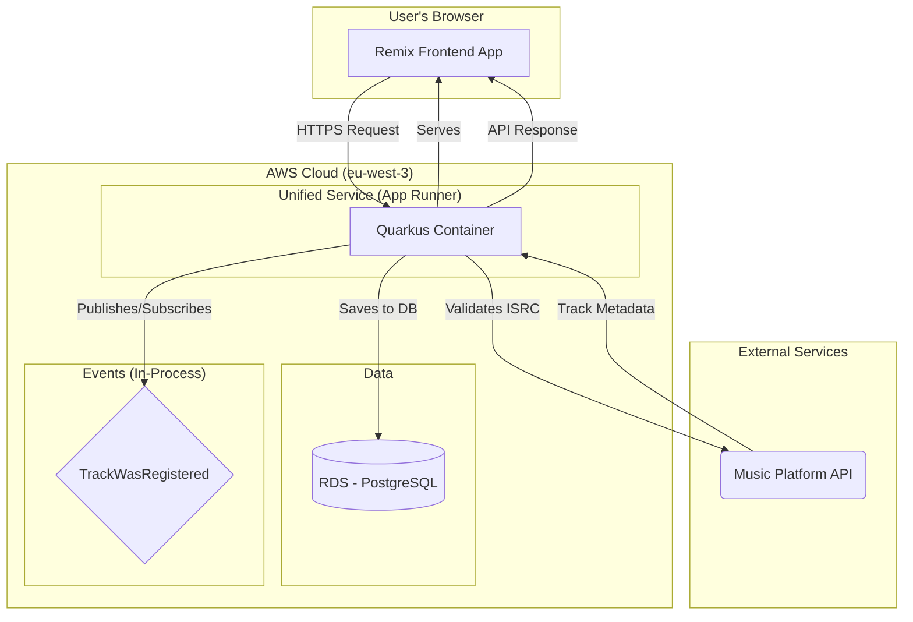

# Music Hub Project - Architecture Fullstack

## Table of Contents

- [Music Hub Project - Architecture Fullstack](#music-hub-project---architecture-fullstack)
  - [Introduction](#introduction)
    - [Starter Template or Existing Project](#starter-template-or-existing-project)
    - [Change Log](#change-log)
  - [High Level Architecture](#high-level-architecture)
    - [Technical Summary](#technical-summary)
    - [Platform and Infrastructure Choice](#platform-and-infrastructure-choice)
    - [Repository Structure](#repository-structure)
    - [High Level Architecture Diagram](#high-level-architecture-diagram)
    - [Architectural Patterns](#architectural-patterns)
  - [Tech Stack](#tech-stack)
    - [Frontend Testing Setup](#frontend-testing-setup)
  - [Data Models](#data-models)
    - [Technical Concerns](#technical-concerns)
    - [ID Generation Strategy](#id-generation-strategy)
    - [Value Objects](#value-objects)
    - [Database Schema Management](#database-schema-management)
    - [Model: Producer](#model-producer)
      - [TypeScript Interface](#typescript-interface)
    - [Model: Track](#model-track)
      - [TypeScript Interface](#typescript-interface-1)
    - [Model: Artist](#model-artist)
      - [TypeScript Interface](#typescript-interface-2)
  - [Unified Project Structure](#unified-project-structure)
    - [Monorepo Root Structure](#monorepo-root-structure)
    - [Backend Modules Structure](#backend-modules-structure-apps)
    - [Frontend Testing Layout](#frontend-testing-layout)
  - [API Specification](#api-specification)
  - [Database Migration with Flyway](#database-migration-with-flyway)
    - [Database Migration Strategy](#1-database-migration-strategy)
    - [Flyway Multi-Module Architecture](#2-flyway-multi-module-architecture)
    - [Versioning Conventions](#3-versioning-conventions)
    - [Migration Development Workflow](#4-migration-development-workflow)
    - [Bounded Context Integration](#5-bounded-context-integration)
    - [Environment-Specific Configuration](#6-environment-specific-configuration)
    - [Best Practices & Anti-patterns](#7-best-practices--anti-patterns)
    - [Troubleshooting & Recovery](#8-troubleshooting--recovery)
  - [Resilience and Observability](#resilience-and-observability)
  - [Logging Best Practices](#logging-best-practices)
    - [Logging Strategy & Philosophy](#1-logging-strategy--philosophy)
    - [Quarkus Logging Framework](#2-quarkus-logging-framework)
    - [Log Levels & Usage Guidelines](#3-log-levels--usage-guidelines)
    - [Structured Logging with JSON](#4-structured-logging-with-json)
    - [Contextual Logging & Correlation](#5-contextual-logging--correlation)
    - [Hexagonal Architecture Logging Patterns](#6-hexagonal-architecture-logging-patterns)
    - [Security & Sensitive Data](#7-security--sensitive-data)
    - [Environment-Specific Configuration](#8-environment-specific-configuration-1)
    - [OpenTelemetry Integration](#9-opentelemetry-integration)
    - [Performance Considerations](#10-performance-considerations)
    - [Business Event Logging](#11-business-event-logging)
    - [Monitoring & Alerting](#12-monitoring--alerting)
  - [Security and Secrets Management](#security-and-secrets-management)
    - [Prerequisite: External API Access](#prerequisite-external-api-access)
    - [Secrets Management Strategy](#secrets-management-strategy)
  - [Development and Deployment with Quinoa](#development-and-deployment-with-quinoa)
  - [Coding Standards](#coding-standards)
    - [Commit Message Format](#commit-message-format)
    - [Critical Full-stack Rules](#critical-full-stack-rules)
    - [Flyway Versioning in Multi-Module Quarkus](#flyway-versioning-in-multi-module-quarkus)
  - [Testing Best Practices](#testing-best-practices)
    - [Testing Philosophy & Principles](#1-testing-philosophy--principles)
    - [Backend Testing Standards](#2-backend-testing-standards)
    - [Frontend Testing Standards](#3-frontend-testing-standards)
    - [AI Agent Guidelines](#4-ai-agent-guidelines)
    - [Templates & Boilerplates](#5-templates--boilerplates)
    - [Performance Standards & Metrics](#6-performance-standards--metrics)
    - [Common Anti-patterns to Avoid](#7-common-anti-patterns-to-avoid)
  - [Maven Multi-Module Best Practices](#maven-multi-module-best-practices)
  - [Naming Conventions](#naming-conventions)

---

## Introduction

This document outlines the complete fullstack architecture for the Music Hub Project, including backend systems, frontend implementation, and their integration. It serves as the single source of truth for AI-driven development, ensuring consistency across the entire technology stack.

This unified approach combines what would traditionally be separate backend and frontend architecture documents, streamlining the development process for modern fullstack applications where these concerns are increasingly intertwined.

### Starter Template or Existing Project

N/A - Greenfield project

### Change Log

| Date | Version | Description | Author |
| --- | --- | --- | --- |
| {{date}} | 1.0 | Initial architecture draft | Winston |

---

## High Level Architecture

### Technical Summary

The architecture for the Music Hub Project is designed as a modern web application deployed on a flexible cloud infrastructure. The front-end is a Single-Page Application (SPA) developed with **Remix (TypeScript)**, communicating via a REST API with a robust back-end based on **Quarkus (Java)**. This event-driven architecture, adhering to Domain-Driven Design (DDD) principles, is designed to meet the PRD goals: rapid ISRC validation, centralized catalog management, and high potential for future scalability.

### Platform and Infrastructure Choice

For the Proof of Concept (PoC), the recommendation is to use **Docker containers** deployed on **AWS**, leveraging managed services to balance flexibility and operational simplicity.

*   **Platform:** AWS
*   **Key Services:**
    *   **Compute:** AWS App Runner (for containerized Quarkus and Remix applications)
    *   **Database:** Amazon RDS for PostgreSQL
    *   **Storage:** Amazon S3 (for potential future file storage needs)
*   **Deployment Host and Regions:** `eu-west-3` (Paris) to be close to potential European users.

**Risk Mitigation:** To manage the complexity and cost of AWS, we will adopt an Infrastructure as Code (IaC) approach with Terraform from the start, utilize budget alerts, and focus on simple, managed services like App Runner. An alternative for the PoC could be a simpler PaaS like Render, with a plan to migrate to AWS later.

### Repository Structure

A monorepo is the chosen approach to streamline development and dependency management.

*   **Structure:** Monorepo
*   **Package Organization:**
    *   `apps/webui`: The Remix application (frontend UI).
    *   `apps/bootstrap`: The Quarkus application runtime hosting REST endpoints and integrating the bounded contexts.
    *   `apps/producer`: Bounded context (multi-module: `producer-domain`, `producer-application`, `producer-adapters/*`).
    *   `apps/artist`: Bounded context (multi-module: `artist-domain`, `artist-application`, `artist-adapters/*`).
    *   `apps/shared-kernel`: Shared kernel (Java) for cross-context domain values and events (e.g., `ISRC`, `TrackWasRegistered`).
    *   `packages/shared-types` (optionnel): Shared **TypeScript types** for API contracts between frontend and backend.

### High Level Architecture Diagram



### Architectural Patterns

The following patterns will guide development:

*   **Hexagonal Architecture (Ports & Adapters) - Backend:** This is a core requirement from the PRD. It will allow us to decouple the business logic (domain) from technical details like the database, REST API, or event bus. This ensures high testability and future flexibility.
*   **Domain-Driven Design (DDD) - Backend:** Also a requirement. We will organize the code around business concepts (Producer, Artist, Track) using aggregates, entities, and value objects. This aligns the code with the business language and helps manage complexity.
*   **Event-Driven Architecture (Internal) - Backend:** As discussed, we will use an in-memory event bus for the PoC. The loose coupling between the `Producer` and `Artist` contexts (via the `TrackWasRegistered` event) is a cornerstone of the design.
*   **Single-Page Application (SPA) - Frontend:** The Remix front-end will behave as a SPA, providing a rich, responsive user experience without full-page reloads for core actions.
*   **Component-Based Architecture - Frontend:** The UI will be built from reusable React components, promoting maintainability and consistency.

---

## Tech Stack

This section defines the definitive list of technologies, libraries, and tools for the project. The choices below are based on the PRD and the decisions made so far.

| Category | Technology | Version | Purpose | Rationale |
| :--- | :--- | :--- | :--- | :--- |
| Frontend Language | TypeScript | ~5.x | Static typing for the frontend | Ensures robustness, self-documentation, and maintainability. |
| Frontend Framework | Remix | latest | Full-stack framework for React | Chosen in the PRD. Enables rich user experiences and optimized performance. |
| UI Component Library | shadcn/ui | latest | Composable and accessible UI components | Provides unstyled, copy-paste components for full control and customizability. Aligns with a modern Tailwind CSS workflow. |
| Backend Language | Java | 21 (LTS) | Core backend language | Specified in the PRD. Robust, performant, and widely used in enterprise. |
| Backend Framework | Quarkus | latest | Cloud-native Java framework | Specified in the PRD. Offers fast startup times and low memory consumption. |
| Code Generation | Lombok | latest | Reduce boilerplate Java code | Keeps domain classes (entities, value objects) clean by auto-generating getters, setters, constructors, etc. |
| API Style | REST | - | Frontend/Backend Communication | The simplest and most standard approach for this type of application. |
| Event Bus (In-Memory) | Quarkus Vert.x Events | - | Manage internal, in-process events | Leverages the built-in, lightweight Vert.x event bus for asynchronous communication between contexts. Event contracts (e.g., `TrackWasRegistered`) are defined in the `shared-events` module. |
| Database | PostgreSQL | 16.x | Relational data storage | Specified in the PRD. Powerful, open-source, and reliable. |
| DB Migration | Flyway | latest | Database schema migrations | Provides version-controlled, automated database schema evolution. Essential for CI/CD. |
| Frontend Testing | Vitest & RTL | latest | Unit/component testing | Specified in the PRD. The standard ecosystem for testing React/Vite applications. |
| Backend Testing | JUnit 5 & Mockito | latest | Unit/integration testing | Specified in the PRD. The standard ecosystem for testing in Java/Quarkus. |
| Code Coverage | Jacoco | latest | Measure backend test coverage | Required by the PRD (NFR3: 80% coverage). Provides a clear metric for code quality and testing thoroughness. |
| Architecture Testing | ArchUnit | latest | Enforce architectural rules | Automatically verifies that our hexagonal architecture rules (e.g., dependencies between modules) are not violated. |
| HTTP Service Mocking | io.quarkiverse.wiremock:quarkus-wiremock | latest | Mock external APIs in tests | Allows for reliable and fast integration tests by simulating external HTTP services (e.g., the Music Platform API). |
| Object Mapping | MapStruct | latest | Map between DTOs and domain objects | Generates type-safe, performant mapping code, keeping conversion logic separate from business logic. |
| Monitoring | io.quarkiverse.micrometer.registry:quarkus-micrometer-registry-otlp | latest | Export application metrics | Industry standard (Micrometer + OpenTelemetry) for maximum observability and compatibility with various backends. |
| Build & Deployment | Docker Containers | latest | Application packaging | Industry standard for deployment. Allows running applications consistently anywhere. |
| IaC (Infra as Code) | Terraform | latest | Managing AWS infrastructure | Enables versioned, reproducible, and automated infrastructure management. |
| CI/CD | GitHub Actions | - | Build/test/deploy automation | Natively integrated with GitHub, easy to set up for a project hosted on the platform. |

### Frontend Testing Setup

- Vitest runs tests in `jsdom` environment with `@testing-library/jest-dom`.
- Setup file: `apps/webui/vitest.setup.ts`.
- Tests are co-located under `apps/webui/app/` (e.g., `apps/webui/app/routes/_index.test.tsx`).
- The Remix plugin is disabled in test mode in `apps/webui/vite.config.ts` if necessary.

---

## Data Models

This section defines the core business entities. It is a conceptual model that will serve as the basis for both the database schema and the shared API types.

### Technical Concerns

`createdAt` and `updatedAt` timestamps are considered technical concerns. They will be handled automatically by the persistence layer (e.g., database default values) and are thus excluded from these domain models.

### ID Generation Strategy

A hybrid approach will be used for primary key generation to combine robustness and idempotence:
*   **Producer:** IDs will be **deterministic UUIDv5**. They will be generated from a constant namespace and the immutable `producerCode`. This guarantees that the same producer code always results in the same ID, simplifying "upsert" logic.
*   **Artist:** IDs will be **random UUIDv4**. The artist's name is mutable, so a random UUID is used to decouple the entity's identity from its data, allowing for name changes without breaking references.

### Value Objects

To increase type safety and encapsulate validation logic within the domain, several attributes will be implemented as Value Objects, not primitive strings. While they are serialized as strings in the API, they are treated as rich objects in the backend code. Any Value Object that is shared between bounded contexts (like `ISRC`) **must** be defined in the `apps/shared-kernel` Maven module.
*   **`ProducerCode`**: A 5-character code identifying a producer.
*   **`ISRC`**: A 12-character International Standard Recording Code.
*   **`TrackTitle`**: A non-empty title for a track.
*   **`ArtistName`**: A non-empty name for an artist.

### Database Schema Management

Database schema changes will be managed through **Flyway**. Migration scripts will be stored in the backend source code (`src/main/resources/db/migration`). This ensures that schema changes are version-controlled, repeatable, and automatically applied upon application startup, which is critical for a reliable CI/CD pipeline.

### Model: Producer

*   **Purpose:** The main aggregate representing a rights holder. It owns and manages a collection of `Track` objects.
*   **Business Attributes:**
    *   `id`: `UUID` (Deterministic v5)
    *   `producerCode`: `ProducerCode`
    *   `name`: `String` (Optional)
    *   `tracks`: `Set<Track>`

#### TypeScript Interface
```typescript
export interface Producer {
  id: string; // UUID
  producerCode: string;
  name?: string;
  tracks: Track[];
}
```

### Model: Track

*   **Purpose:** A child entity within the `Producer` aggregate, identified by its ISRC.
*   **Business Attributes:**
    *   `isrc`: `ISRC`
    *   `title`: `TrackTitle`
    *   `artistNames`: `Array<ArtistName>`
    *   `sources`: `Array<Source>`
    *   `status`: `'Provisional' | 'Verified'`

#### TypeScript Interface
```typescript
export interface Source {
  sourceName: 'Spotify' | 'Tidal' | 'Deezer' | 'Apple Music' | 'Manual';
  sourceId: string;
}

export interface Track {
  isrc: string;
  title: string;
  artistNames: string[];
  sources: Source[];
  status: 'Provisional' | 'Verified';
}
```

### Model: Artist

*   **Purpose:** An aggregate representing an artist in its own bounded context. It holds references to tracks, but does not own them.
*   **Business Attributes:**
    *   `id`: `UUID` (Random v4)
    *   `name`: `ArtistName`
    *   `status`: `'Provisional' | 'Verified'`
    *   `sources`: `Array<Source>`
    *   `trackIds`: `Array<ISRC>`

#### TypeScript Interface
```typescript
export interface Artist {
  id: string; // UUID
  name: string;
  status: 'Provisional' | 'Verified';
  sources: Source[];
  trackIds: string[]; // Set of ISRC codes
}
```

---

## Unified Project Structure

This section outlines the concrete project structure within our monorepo, optimized for our chosen stack (Quarkus + Remix) and architectural decisions. It uses a multi-module Maven setup for the backend to enforce architectural boundaries.

### Monorepo Root Structure

```plaintext
music-hub-project/
 apps/                       # Application packages (frontend + backend modules)
    webui/                  # Remix UI application
    bootstrap/              # Quarkus runtime (assembles contexts + REST)
    producer/               # Producer bounded context (multi-module)
    artist/                 # Artist bounded context (multi-module)
    shared-kernel/          # Shared domain values/events
 docs/                       # Architecture, PRD, stories, specs
 docker-compose.yml          # Local services (e.g., PostgreSQL)
 README.md
```

### Backend Modules Structure (`apps/`)

The backend is organized as a multi-module Maven project to strictly enforce the boundaries of our Hexagonal and Domain-Driven Design. Each context and layer is an independent module with explicitly defined dependencies. Module names are prefixed to ensure clarity and global uniqueness of artifacts. The parent aggregator is `apps/pom.xml`.

```plaintext
apps/
 pom.xml                 # Parent POM declaring all backend modules

 bootstrap/              # Module for application startup and configuration (Quarkus)
    pom.xml
    src/

 shared-kernel/          # SHARED KERNEL: Domain values and event contracts
    pom.xml             # --- e.g., ISRC value object, TrackWasRegistered event

 producer/               # Parent module for the 'producer' bounded context
    pom.xml
    producer-domain/
       pom.xml         # --- CORE DOMAIN: Depends on shared-kernel
    producer-application/
       pom.xml         # --- Depends on: producer-domain, shared-kernel
    producer-adapters/    # Parent module for producer's adapters
        pom.xml
        producer-adapter-messaging/
           pom.xml     # --- Listens for events (secondary adapter)
        producer-adapter-persistence/
           pom.xml     # --- Implements persistence ports
        producer-adapter-rest/
           pom.xml     # --- Implements REST API (primary adapter)
        producer-adapter-spi/
            pom.xml     # --- Implements external service clients (secondary adapter)

 artist/                 # Parent module for the 'artist' bounded context
     pom.xml
     artist-domain/
        pom.xml         # --- CORE DOMAIN: Depends on shared-kernel
     artist-application/
        pom.xml         # --- Depends on: artist-domain, shared-kernel
     artist-adapters/      # Parent module for artist's adapters
         pom.xml
         artist-adapter-persistence/
            pom.xml     # --- Implements persistence ports
         artist-adapter-messaging/
            pom.xml     # --- Listens for events (secondary adapter)
         artist-adapter-rest/
            pom.xml     # --- Implements REST API
         artist-adapter-spi/
             pom.xml     # --- Implements external service clients (secondary adapter)
```

### Frontend Testing Layout

- Frontend tests (Vitest + React Testing Library) are co-located with the Remix code in `apps/webui/app/`.
- Example: `apps/webui/app/routes/_index.test.tsx` for the route `apps/webui/app/routes/_index.tsx`.
- Global test setup is in `apps/webui/vitest.setup.ts`.
- The Vite/Vitest configuration can disable certain Remix plugins in test mode (see `apps/webui/vite.config.ts`).

---

## API Specification

Based on the REST style, this OpenAPI 3.0 specification defines the core endpoints.

```yaml
openapi: 3.0.0
info:
  title: "Music Data Hub API"
  version: "1.0.0"
  description: "API for managing the music catalog."
servers:
  - url: "/api/v1"

paths:
  /producers:
    post:
      summary: "Register a new track"
      description: "Submits an ISRC. The system finds or creates the corresponding Producer, validates the ISRC, and adds the track to the producer's catalog."
      requestBody:
        required: true
        content:
          application/json:
            schema:
              type: object
              properties:
                isrc:
                  type: string
                  example: "FRLA12400001"
              required:
                - isrc
      responses:
        '202':
          description: "Accepted. The track registration is in progress."
          content:
            application/json:
              schema:
                $ref: "#/components/schemas/Producer"
        '400':
          description: "Invalid ISRC format."
        '422':
          description: "Unprocessable ISRC (e.g., valid but not found)."

  /producers/{producerId}:
    get:
      summary: "Get a Producer by ID"
      parameters:
        - in: path
          name: producerId
          required: true
          schema:
            type: string
            format: uuid
      responses:
        '200':
          description: "A Producer object."
          content:
            application/json:
              schema:
                $ref: "#/components/schemas/Producer"
        '404':
          description: "Producer not found."

  /artists:
    get:
      summary: "List all Artists"
      responses:
        '200':
          description: "A list of artists."
          content:
            application/json:
              schema:
                type: array
                items:
                  $ref: "#/components/schemas/Artist"

components:
  schemas:
    Producer:
      type: object
      properties:
        id:
          type: string
          format: uuid
        producerCode:
          type: string
        name:
          type: string
        tracks:
          type: array
          items:
            $ref: "#/components/schemas/Track"

    Track:
      type: object
      properties:
        isrc:
          type: string
        title:
          type: string
        artistNames:
          type: array
          items:
            type: string
        sources:
          type: array
          items:
            $ref: "#/components/schemas/Source"
        status:
          type: string
          enum: [Provisional, Verified]

    Source:
      type: object
      properties:
        sourceName:
          type: string
          enum: [Spotify, Tidal, Deezer, Apple Music, Manual]
        sourceId:
          type: string

    Artist:
      type: object
      properties:
        id:
          type: string
          format: uuid
        name:
          type: string
        status:
          type: string
          enum: [Provisional, Verified]
        sources:
          type: array
          items:
            $ref: "#/components/schemas/Source"
        trackIds:
          type: array
          items:
            type: string
```

### Recent Tracks Endpoint

The API includes a dedicated endpoint for retrieving recent tracks across all producers:

- **Endpoint**: `GET /api/v1/tracks/recent`
- **Purpose**: Provides the 10 most recently submitted tracks for dashboard display
- **Features**:
  - Cross-producer track aggregation
  - Date-ordered results (newest first)
  - Optimized for dashboard performance
  - Consistent with existing Track schema

This endpoint was added to support the dashboard recent tracks functionality, replacing localStorage-based data with backend API integration for consistent user experience.

For complete API specification details, see: [API Specification Document](architecture/api-specification.md)

---

## Database Migration with Flyway

### 1. Database Migration Strategy

Database migrations are managed using **Flyway** integrated with **Quarkus**. This approach ensures:
- **Version-controlled schema evolution**
- **Automated migrations** during application startup
- **Consistent deployment** across all environments
- **Rollback capabilities** for recovery scenarios

### 2. Flyway Multi-Module Architecture

In our multi-module setup, migrations are distributed across bounded contexts while maintaining global version coordination:

```plaintext
apps/
 producer/producer-adapter-persistence/
    src/main/resources/db/migration/
        V1__Create_producer_table.sql
        V2__Add_producer_indexes.sql
        V3__Create_track_table.sql

 artist/artist-adapter-persistence/  
    src/main/resources/db/migration/
        V100__Create_artist_table.sql
        V101__Add_artist_indexes.sql

 bootstrap/
     src/main/resources/application.properties
        # Aggregates all migration locations
```

### 3. Versioning Conventions

- **Producer context**: Versions `V1..V99`
- **Artist context**: Versions `V100..V199`
- **Future contexts**: Allocate distinct 100-version ranges
- **Format**: `V{version}__{description}.sql`

### 4. Migration Development Workflow

1. **Design**: Plan schema changes with domain experts
2. **Implement**: Create migration script in appropriate module
3. **Test**: Validate against local PostgreSQL
4. **Review**: Peer review for breaking changes
5. **Deploy**: Automated execution via CI/CD

### 5. Bounded Context Integration

Each bounded context owns its migrations while respecting shared dependencies:
- **Shared Kernel**: Define cross-context constraints
- **Event Contracts**: Version event schema evolution
- **Foreign Keys**: Coordinate across context boundaries

### 6. Environment-Specific Configuration

```properties
# Development
%dev.quarkus.flyway.migrate-at-start=true
%dev.quarkus.flyway.locations=classpath:db/migration

# Production  
%prod.quarkus.flyway.migrate-at-start=true
%prod.quarkus.flyway.baseline-on-migrate=false
```

### 7. Best Practices & Anti-patterns

** DO:**
- Use descriptive migration names
- Test migrations on production-like data
- Keep migrations idempotent
- Document complex changes

**L DON'T:**
- Modify existing migrations
- Use DDL and DML in same migration
- Create circular dependencies
- Skip version numbers

### 8. Troubleshooting & Recovery

- **Failed Migration**: Check logs, fix script, retry
- **Version Conflicts**: Coordinate team migration versioning
- **Rollback**: Use Flyway undo migrations or database snapshots

---

## Resilience and Observability

_Note: Detailed content available in [resilience-and-observability.md](./architecture/resilience-and-observability.md)_

This section covers resilience patterns, application monitoring, and performance metrics to ensure system robustness in production environments.

---

## Logging Best Practices

### 1. Logging Strategy & Philosophy

Our logging approach follows these principles:
- **Structured Logging**: JSON format for easier analysis
- **Contextual Information**: Correlation IDs for request tracing
- **Performance Awareness**: Asynchronous logging to minimize impact
- **Security First**: Automatic masking of sensitive data

### 2. Quarkus Logging Framework

Centralized configuration using:
- **JBoss Logging** as facade
- **Logback** as implementation
- **JSON Encoder** for structuring
- **OpenTelemetry** for correlation

### 3. Log Levels & Usage Guidelines

| Level | Usage | Examples |
|-------|--------|----------|
| ERROR | System failures, exceptions | Database connection lost, API timeouts |
| WARN | Recoverable issues | Deprecated API usage, configuration warnings |
| INFO | Business events | Track registered, Producer created |
| DEBUG | Development details | SQL queries, method parameters |
| TRACE | Detailed flow | Method entry/exit, loop iterations |

### 4. Structured Logging with JSON

```json
{
  "timestamp": "2024-01-15T10:30:00.123Z",
  "level": "INFO",
  "logger": "com.musichub.producer.application.RegisterTrackService",
  "message": "Track successfully registered",
  "correlation_id": "req-123-456",
  "business_context": {
    "producer_code": "FRLA1",
    "isrc": "FRLA12400001",
    "operation": "track_registration"
  }
}
```

### 5. Contextual Logging & Correlation

- **Request Correlation**: UUID generated per request
- **Business Context**: Business metadata in each log
- **User Context**: User identification (if applicable)
- **Performance Context**: Execution times and metrics

### 6. Hexagonal Architecture Logging Patterns

```java
// Domain Layer - Business Events
log.info("Producer created with code: {}", producerCode.value());

// Application Layer - Use Case Execution  
log.info("Starting track registration for ISRC: {}", isrc.value());

// Adapter Layer - Technical Details
log.debug("Executing SQL query: {}", sql);
```

### 7. Security & Sensitive Data

- **Auto-masking**: Partial ISRCs, user IDs
- **Whitelist Approach**: Only authorized data is logged
- **Audit Trail**: Traceability of sensitive actions
- **Data Classification**: Log marking by sensitivity level

### 8. Environment-Specific Configuration

```properties
# Development - Verbose logging
%dev.quarkus.log.level=DEBUG
%dev.quarkus.log.console.json=false

# Production - Structured JSON
%prod.quarkus.log.level=INFO  
%prod.quarkus.log.console.json=true
%prod.quarkus.log.console.json.pretty-print=false
```

### 9. OpenTelemetry Integration

- **Traces**: Correlation with APM metrics
- **Spans**: Distributed context between services
- **Baggage**: Business metadata propagation
- **Sampling**: Intelligent trace configuration

### 10. Performance Considerations

- **Async Logging**: Non-blocking queue
- **Log Rotation**: Automatic size management
- **Buffer Management**: Memory optimization
- **Network Efficiency**: Compression for remote logs

### 11. Business Event Logging

- **Domain Events**: Business event logging
- **State Changes**: Important state transitions
- **Business Metrics**: KPIs and business indicators
- **Compliance**: Regulatory traceability

### 12. Monitoring & Alerting

- **Error Rate**: Alerts on error spikes
- **Performance**: Latency thresholds
- **Business KPIs**: Critical business metrics
- **Infrastructure**: System health and resources

---

## Security and Secrets Management

### Prerequisite: External API Access

The system requires access to external APIs for ISRC validation and music metadata retrieval.

### Secrets Management Strategy

- **Vault Integration**: HashiCorp Vault for critical secrets
- **Environment Variables**: Configuration per environment
- **Rotation Policy**: Automatic API key rotation
- **Least Privilege**: Minimal necessary access per service

---

## Development and Deployment with Quinoa

_Note: Detailed content available in [development-and-deployment-with-quinoa.md](./architecture/development-and-deployment-with-quinoa.md)_

Quinoa enables seamless integration between the Remix frontend and Quarkus backend, facilitating development and deployment of full-stack applications.

---

## Coding Standards

This section defines the minimal but critical rules that development agents (AI or human) must follow. The goal is to enforce consistency and adhere to the architectural decisions made.

### Commit Message Format

All git commits **must** follow the [Conventional Commits](https://www.conventionalcommits.org/en/v1.0.0/) specification. This creates a clear and machine-readable commit history, which facilitates automated versioning and changelog generation.

*   **Example `feat`:** `feat(producer): allow track registration via ISRC`
*   **Example `fix`:** `fix(api): correct artist name serialization`
*   **Example `docs`:** `docs(architecture): add db migration strategy`

### Critical Full-stack Rules

1.  **Shared Types via `shared-types`**: All interfaces or types used in API DTOs **must** be defined in the `packages/shared-types` package. Both the frontend and backend **must** use this package to ensure contract consistency.
2.  **Domain Immutability**: Domain objects (`domain` layer) **must be** immutable. Any modification to an aggregate must result in a new instance of that aggregate.
3.  **Enforce Value Objects & Shared Kernel**:
    *   In the backend domain, **prefer creating Value Objects** (`ISRC`, `ProducerCode`, `ArtistName`, etc.) over using primitive types like `String` for any data that has intrinsic rules, format, or constraints.
    *   If a Value Object or event contract is used by more than one bounded context, it **must** be placed in the `apps/shared-kernel` module.
    *   This enforces domain invariants and creates a clear, reusable "Shared Kernel".
4.  **No Logic in Adapters**: REST controllers and other adapters **must be** as "thin" as possible. They only convert requests/events into application service calls and map the results. All business logic **must reside** in the `application` and `domain` layers.
5.  **Application Use Case Entry Points**: The frontend (via REST controllers) and other contexts (via events) **must never** interact directly with repositories or the domain. They **must always** go through the application layer's use case interfaces (e.g., `RegisterTrackUseCase.java`). The implementing classes are often called "Application Services".
6.  **Configuration over Environment Variables**: **Never** access environment variables directly (`process.env` or `System.getenv`). Use the configuration mechanisms provided by the frameworks (Quarkus or Remix) for clean dependency injection of configuration.

### Flyway Versioning in Multi-Module Quarkus

- All Flyway migrations across modules share a global, monotonically increasing version space. When using multiple `quarkus.flyway.locations`, versions must be unique globally.
- Convention for this repository:
  - `producer` context: reserve versions `V1..V99`
  - `artist` context: reserve versions `V100..V199`
  - If another context is added, allocate a distinct 100-range.
- In `apps/bootstrap/src/main/resources/application.properties`, set Flyway locations only under the `%dev` profile.

---

## Testing Best Practices

Our testing strategy follows the test pyramid with focus on hexagonal architecture:

### 1. Testing Philosophy & Principles

- **Domain-First Testing**: Start with domain business logic tests
- **Test Behavior, Not Implementation**: Focus on business outcomes
- **Fast Feedback Loops**: Unit tests < 100ms, integration < 5s
- **Test Isolation**: Each test independent and repeatable

### 2. Backend Testing Standards

#### Domain Layer Testing
- Pure unit tests with no framework dependencies
- No mocking of Value Objects
- Given/When/Then structure
- Business-descriptive names

#### Application Layer Testing  
- Mock ports only
- Verify interactions
- Test service orchestration
- Error handling

#### Integration Testing
- Real database (H2 for speed)
- End-to-end HTTP tests
- Complete business scenarios

### 3. Frontend Testing Standards

- **Vitest + React Testing Library**
- Tests co-located with code
- Mock external dependencies only
- Focus on user experience

### 4. AI Agent Guidelines

Strict rules for AI agents:
- Always use descriptive `@DisplayName`
- Never mock Value Objects
- Mandatory Given/When/Then structure
- Explicit assertion messages

### 5. Templates & Boilerplates

Standardized templates for:
- Domain entity tests
- Application service tests
- REST adapter tests
- Bootstrap integration tests

### 6. Performance Standards & Metrics

- **Code Coverage**: 80% minimum (backend), 80% frontend
- **Execution Time**: Unit tests < 100ms, integration < 5s
- **Parallelization**: Parallel execution in CI/CD

### 7. Common Anti-patterns to Avoid

- L Don't mock Value Objects
- L Don't test implementation details  
- L Don't create test dependencies
- L Don't ignore test maintenance

---

## Maven Multi-Module Best Practices

_Note: Detailed content available in [maven-multi-module-best-practices.md](./architecture/maven-multi-module-best-practices.md)_

This section covers Maven module management in our hexagonal architecture, including dependency management, build profiles, and packaging best practices.

---

## Naming Conventions

_Note: Detailed content available in [naming-conventions.md](./architecture/naming-conventions.md)_

Naming standards to ensure consistency across all project components:

- **Java Packages**: Reverse domain convention with business context
- **Classes**: Explicit business names with technical suffixes
- **Variables**: CamelCase with clear business intent  
- **Constants**: UPPER_SNAKE_CASE with contextual prefix
- **API Endpoints**: RESTful with plural resources
- **Database**: snake_case with context-prefixed tables

---

_This architecture.md document has been reconstructed from existing fragments while maintaining the original English language and following BMad standards._