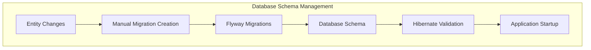

# Database Migration with Flyway - Music Hub Project

## Table of Contents

- [1. Database Migration Strategy](#1-database-migration-strategy)
- [2. Flyway Multi-Module Architecture](#2-flyway-multi-module-architecture)
- [3. Versioning Conventions](#3-versioning-conventions)
- [4. Migration Development Workflow](#4-migration-development-workflow)
- [5. Bounded Context Integration](#5-bounded-context-integration)
- [6. Environment-Specific Configuration](#6-environment-specific-configuration)
- [7. Best Practices & Anti-patterns](#7-best-practices--anti-patterns)
- [8. Troubleshooting & Recovery](#8-troubleshooting--recovery)

---

## 1. Database Migration Strategy

### Philosophy

Our database migration strategy follows **Database First** principles with strict version control and automated schema evolution. We use **Flyway** as the single source of truth for all database changes, with Hibernate in **validate-only** mode to ensure consistency.

### Key Principles

1. **Single Source of Truth**: Flyway migrations are the authoritative schema definition
2. **Version Controlled**: All schema changes tracked in Git with the application code
3. **Automated Application**: Migrations run automatically on application startup
4. **Environment Consistency**: Same migrations across dev/test/production
5. **Rollback Strategy**: Forward-only migrations with compensating changes
6. **Bounded Context Isolation**: Each context manages its own schema subset

### Integration with Hibernate



**Configuration Strategy:**
```properties
# Hibernate validates existing schema (no generation)
quarkus.hibernate-orm.database.generation=validate

# Flyway manages all schema changes
quarkus.flyway.migrate-at-start=true
quarkus.flyway.baseline-on-migrate=true
```

---

## 2. Flyway Multi-Module Architecture

### Project Structure

Our monorepo uses a distributed migration approach where each bounded context manages its own migrations while maintaining global coordination.

```plaintext
apps/
├── bootstrap/                          # Flyway coordination point
│   └── src/main/resources/
│       └── application.properties      # Flyway configuration
├── producer/
│   └── producer-adapters/
│       └── producer-adapter-persistence/
│           └── src/main/resources/
│               └── db/migration/
│                   └── producer/       # Producer context migrations
│                       ├── V1__init_producer.sql
│                       └── V2__add_producer_email.sql
└── artist/
    └── artist-adapters/
        └── artist-adapter-persistence/
            └── src/main/resources/
                └── db/migration/
                    └── artist/         # Artist context migrations
                        ├── V100__init_artist.sql
                        └── V101__add_artist_timestamps.sql
```

### Flyway Configuration Architecture

**Central Configuration (bootstrap/application.properties):**
```properties
# Global Flyway settings
quarkus.flyway.migrate-at-start=true
quarkus.flyway.baseline-on-migrate=true
quarkus.flyway.clean-disabled=true

# Development: Multiple locations for bounded contexts
%dev.quarkus.flyway.locations=classpath:db/migration/producer,classpath:db/migration/artist
%dev.quarkus.flyway.repair-at-start=true

# Test: Same locations as dev for consistency
%test.quarkus.flyway.migrate-at-start=true
%test.quarkus.flyway.clean-disabled=true

# Production: Flyway uses default location detection
# Migrations are bundled in the JAR from all modules
```

### Why This Architecture?

1. **Bounded Context Autonomy**: Each context controls its schema evolution
2. **Deployment Simplicity**: Single JAR contains all migrations
3. **Development Flexibility**: Individual contexts can be developed independently
4. **Global Coordination**: Version ranges prevent conflicts
5. **Testing Consistency**: Same migration paths in all environments

---

## 3. Versioning Conventions

### Global Version Space

All migrations across all bounded contexts share a **global, monotonically increasing version space**. This prevents version conflicts when multiple contexts evolve simultaneously.

#### Version Range Allocation

| Context | Version Range | Example | Purpose |
|---------|---------------|---------|---------|
| **Producer** | `V1` - `V99` | `V1__init_producer.sql` | Producer domain schema |
| **Artist** | `V100` - `V199` | `V100__init_artist.sql` | Artist domain schema |
| **Future Context** | `V200` - `V299` | `V200__init_payments.sql` | Reserved for expansion |

#### Version Numbering Rules

**✅ Correct Versioning:**
```sql
-- Producer context
V1__init_producer.sql
V2__add_producer_email.sql
V3__create_producer_indexes.sql

-- Artist context
V100__init_artist.sql
V101__add_artist_timestamps.sql
V102__add_artist_social_links.sql
```

**❌ Incorrect Versioning:**
```sql
-- WRONG: Version conflicts
V1__init_producer.sql
V1__init_artist.sql  ← CONFLICT!

-- WRONG: Out of range
V150__producer_change.sql  ← Producer should use V1-V99
```

### Migration Naming Convention

**Format:** `V{VERSION}__{DESCRIPTION}.sql`

**Examples:**
```sql
V1__init_producer.sql                    # Initial schema
V2__add_producer_email_column.sql       # Add column
V3__create_producer_email_index.sql     # Add index
V4__migrate_producer_legacy_data.sql    # Data migration
V5__drop_producer_deprecated_table.sql  # Remove table
```

**Naming Guidelines:**
- Use **snake_case** for descriptions
- Be **descriptive** and **specific**
- Include **action** (add, create, drop, migrate)
- Include **object** (table, column, index)
- Keep under **50 characters** when possible

---

## 4. Migration Development Workflow

### Current Challenge

With `hibernate-orm.database.generation=validate`, Hibernate does not generate DDL statements. When you modify JPA entities, you must manually create corresponding Flyway migrations.

### Recommended Development Setup

#### 1. Hibernate Schema Export Plugin

Add to `apps/bootstrap/pom.xml`:

```xml
<plugin>
    <groupId>org.hibernate.orm.tooling</groupId>
    <artifactId>hibernate-enhance-maven-plugin</artifactId>
    <version>${hibernate.version}</version>
    <executions>
        <execution>
            <id>schema-export</id>
            <goals>
                <goal>schema-export</goal>
            </goals>
            <phase>none</phase> <!-- Manual execution only -->
            <configuration>
                <outputFile>target/generated-schema.sql</outputFile>
                <delimiter>;</delimiter>
                <format>true</format>
                <createNamespaces>true</createNamespaces>
            </configuration>
        </execution>
    </executions>
    <dependencies>
        <dependency>
            <groupId>org.postgresql</groupId>
            <artifactId>postgresql</artifactId>
            <version>${postgresql.version}</version>
        </dependency>
    </dependencies>
</plugin>
```

#### 2. Development Profile for Schema Generation

Add to `apps/bootstrap/src/main/resources/application.properties`:

```properties
# Profile for schema generation (development only)
%dev-schema.quarkus.hibernate-orm.database.generation=create
%dev-schema.quarkus.hibernate-orm.log.sql=true
%dev-schema.quarkus.hibernate-orm.sql-load-script=no-file
%dev-schema.quarkus.flyway.migrate-at-start=false
%dev-schema.quarkus.datasource.jdbc.url=jdbc:postgresql://localhost:5433/musichubdata_temp

# Alternative: Use H2 for quick schema generation
%dev-schema-h2.quarkus.datasource.db-kind=h2
%dev-schema-h2.quarkus.datasource.jdbc.url=jdbc:h2:mem:schema-gen;DB_CLOSE_DELAY=-1
%dev-schema-h2.quarkus.hibernate-orm.database.generation=create
%dev-schema-h2.quarkus.flyway.migrate-at-start=false
```

#### 3. Migration Generation Script

Create `scripts/generate-migration.sh`:

```bash
#!/bin/bash
set -e

# Colors for output
RED='\033[0;31m'
GREEN='\033[0;32m'
BLUE='\033[0;34m'
YELLOW='\033[1;33m'
NC='\033[0m' # No Color

# Function to print colored output
print_status() {
    echo -e "${BLUE}🔄 $1${NC}"
}

print_success() {
    echo -e "${GREEN}✅ $1${NC}"
}

print_warning() {
    echo -e "${YELLOW}⚠️  $1${NC}"
}

print_error() {
    echo -e "${RED}❌ $1${NC}"
}

# Parse arguments
MIGRATION_DESC="$1"
CONTEXT="$2"

if [[ -z "$MIGRATION_DESC" || -z "$CONTEXT" ]]; then
    print_error "Missing required arguments"
    echo "Usage: $0 'description' 'producer|artist'"
    echo ""
    echo "Examples:"
    echo "  $0 'add_email_to_producer' 'producer'"
    echo "  $0 'create_artist_social_links' 'artist'"
    echo "  $0 'add_timestamps_to_producer' 'producer'"
    exit 1
fi

# Validate context
case "$CONTEXT" in
    producer)
        VERSION_MIN=1
        VERSION_MAX=99
        MIGRATION_PATH="apps/producer/producer-adapters/producer-adapter-persistence/src/main/resources/db/migration/producer"
        ;;
    artist)
        VERSION_MIN=100
        VERSION_MAX=199
        MIGRATION_PATH="apps/artist/artist-adapters/artist-adapter-persistence/src/main/resources/db/migration/artist"
        ;;
    *)
        print_error "Invalid context: $CONTEXT"
        echo "Context must be 'producer' or 'artist'"
        exit 1
        ;;
esac

# Ensure migration directory exists
mkdir -p "$MIGRATION_PATH"

# Find next version number
print_status "Finding next version number for $CONTEXT context..."
CURRENT_VERSION=0

if [[ -d "$MIGRATION_PATH" ]]; then
    CURRENT_VERSION=$(find "$MIGRATION_PATH" -name "V*.sql" -exec basename {} \; 2>/dev/null | \
                     grep -o '^V[0-9]*' | \
                     sed 's/V//' | \
                     sort -n | \
                     tail -1 || echo "$((VERSION_MIN - 1))")
fi

NEXT_VERSION=$((CURRENT_VERSION + 1))

# Validate version is in range
if [[ $NEXT_VERSION -lt $VERSION_MIN || $NEXT_VERSION -gt $VERSION_MAX ]]; then
    print_error "Version $NEXT_VERSION is outside allowed range for $CONTEXT context ($VERSION_MIN-$VERSION_MAX)"
    print_warning "Consider using a different context or expanding version ranges"
    exit 1
fi

MIGRATION_FILE="${MIGRATION_PATH}/V${NEXT_VERSION}__${MIGRATION_DESC}.sql"

print_status "Generating schema export with Hibernate..."

# Generate current schema for reference
mvn hibernate-enhance:schema-export -f apps/bootstrap/pom.xml -q || {
    print_warning "Schema export failed, continuing without generated schema reference"
}

print_status "Creating migration file: $MIGRATION_FILE"

# Create migration file with helpful template
cat > "$MIGRATION_FILE" << EOF
-- $CONTEXT context: $MIGRATION_DESC
-- Generated on $(date '+%Y-%m-%d %H:%M:%S')
-- Author: $(git config user.name || echo "Unknown")

-- TODO: Replace this template with your actual migration statements

-- Common migration patterns:

-- Add column:
-- ALTER TABLE ${CONTEXT}s ADD COLUMN new_column VARCHAR(255);
-- ALTER TABLE ${CONTEXT}s ADD COLUMN new_column VARCHAR(255) NOT NULL DEFAULT 'default_value';

-- Add index:
-- CREATE INDEX idx_${CONTEXT}s_new_column ON ${CONTEXT}s(new_column);

-- Add constraint:
-- ALTER TABLE ${CONTEXT}s ADD CONSTRAINT chk_${CONTEXT}_new_column 
--     CHECK (new_column IN ('value1', 'value2'));

-- Create table:
-- CREATE TABLE ${CONTEXT}_new_table (
--     id UUID PRIMARY KEY,
--     ${CONTEXT}_id UUID NOT NULL REFERENCES ${CONTEXT}s(id) ON DELETE CASCADE,
--     created_at TIMESTAMP NOT NULL DEFAULT NOW()
-- );

-- Data migration:
-- UPDATE ${CONTEXT}s SET new_column = 'default_value' WHERE new_column IS NULL;

EOF

# Add generated schema reference if available
if [[ -f "apps/bootstrap/target/generated-schema.sql" ]]; then
    echo "" >> "$MIGRATION_FILE"
    echo "-- Generated schema for reference:" >> "$MIGRATION_FILE"
    echo "-- (Review and adapt as needed for your migration)" >> "$MIGRATION_FILE"
    echo "" >> "$MIGRATION_FILE"
    
    # Extract relevant tables for the context
    grep -A 10 -B 2 -i "${CONTEXT}" apps/bootstrap/target/generated-schema.sql >> "$MIGRATION_FILE" 2>/dev/null || {
        echo "-- No generated schema found for $CONTEXT context" >> "$MIGRATION_FILE"
    }
fi

print_success "Migration file created: $MIGRATION_FILE"
print_status "Next steps:"
echo "  1. Edit the migration file to add your actual SQL statements"
echo "  2. Test the migration: mvn quarkus:dev"
echo "  3. Verify the changes in your database"
echo "  4. Commit the migration with your entity changes"
echo ""
print_warning "Remember: Migrations are forward-only. Test thoroughly before committing!"
```

Make the script executable:
```bash
chmod +x scripts/generate-migration.sh
```

### Step-by-Step Development Workflow

#### Step 1: Modify Your JPA Entity

```java
// Example: Adding email field to ProducerEntity
@Entity
@Table(name = "producers")
public class ProducerEntity extends PanacheEntityBase {
    
    @Id
    public UUID id;
    
    @Column(name = "producer_code", unique = true, nullable = false, length = 5)
    public String producerCode;
    
    @Column(name = "name")
    public String name;
    
    // ✅ NEW FIELD
    @Column(name = "email", unique = true)
    @Email
    public String email;
    
    @ElementCollection(fetch = FetchType.EAGER)
    @CollectionTable(name = "producer_tracks", joinColumns = @JoinColumn(name = "producer_id"))
    @Column(name = "isrc", nullable = false, length = 12)
    public Set<String> tracks;
}
```

#### Step 2: Generate Migration Template

```bash
# Generate migration for the new email field
./scripts/generate-migration.sh "add_email_to_producer" "producer"
```

**Output:**
```
🔄 Finding next version number for producer context...
🔄 Generating schema export with Hibernate...
🔄 Creating migration file: apps/producer/.../V2__add_email_to_producer.sql
✅ Migration file created: apps/producer/.../V2__add_email_to_producer.sql
```

#### Step 3: Edit the Generated Migration

```sql
-- producer context: add_email_to_producer
-- Generated on 2025-08-16 14:30:00
-- Author: Developer Name

-- Add email column to producers table
ALTER TABLE producers ADD COLUMN email VARCHAR(255);

-- Add unique constraint for email
ALTER TABLE producers ADD CONSTRAINT uk_producers_email UNIQUE (email);

-- Create index for email lookups
CREATE INDEX idx_producers_email ON producers(email) WHERE email IS NOT NULL;

-- Add check constraint for email format (basic validation)
ALTER TABLE producers ADD CONSTRAINT chk_producers_email_format 
    CHECK (email ~ '^[A-Za-z0-9._%+-]+@[A-Za-z0-9.-]+\.[A-Za-z]{2,}$');
```

#### Step 4: Test the Migration

```bash
# Clean database and test migration
docker-compose down -v
docker-compose up -d postgres

# Run application - Flyway will apply migration automatically
mvn quarkus:dev
```

**Expected Output:**
```
INFO  [org.flywaydb.core.internal.command.DbMigrate] Migrating schema "public" to version "2 - add email to producer"
INFO  [org.flywaydb.core.internal.command.DbMigrate] Successfully applied 1 migration to schema "public"
```

#### Step 5: Verify and Commit

```bash
# Check database state
psql -h localhost -p 5433 -U admin -d musichubdata -c "\d producers"

# Expected: email column present with constraints

# Commit both entity and migration together
git add apps/producer/producer-adapters/producer-adapter-persistence/
git commit -m "feat(producer): add email field to producer entity

- Add email column to ProducerEntity with validation
- Create V2__add_email_to_producer.sql migration
- Add unique constraint and index for email lookups"
```

### Alternative: Quick Schema Generation

For rapid prototyping or complex changes, you can use the schema generation profile:

```bash
# Generate complete schema to see all changes
mvn quarkus:dev -Dquarkus.profile=dev-schema-h2

# Review generated schema in logs, then create manual migration
# Switch back to normal mode
mvn quarkus:dev
```

---

## 5. Bounded Context Integration

### Schema Organization Strategy

Each bounded context manages its own schema subset while maintaining referential integrity and avoiding direct cross-context foreign keys.

#### Producer Context Schema

```sql
-- V1__init_producer.sql
-- Producer aggregate and related tables

CREATE TABLE IF NOT EXISTS producers (
    id UUID PRIMARY KEY,
    producer_code VARCHAR(5) NOT NULL UNIQUE,
    name VARCHAR(255),
    email VARCHAR(255) UNIQUE,
    created_at TIMESTAMP NOT NULL DEFAULT NOW(),
    updated_at TIMESTAMP NOT NULL DEFAULT NOW()
);

-- Producer tracks (aggregate relationship)
CREATE TABLE IF NOT EXISTS producer_tracks (
    producer_id UUID NOT NULL REFERENCES producers(id) ON DELETE CASCADE,
    isrc VARCHAR(12) NOT NULL,
    PRIMARY KEY (producer_id, isrc)
);

-- Indexes for performance
CREATE INDEX idx_producers_name ON producers(name) WHERE name IS NOT NULL;
CREATE INDEX idx_producers_email ON producers(email) WHERE email IS NOT NULL;
CREATE INDEX idx_producer_tracks_isrc ON producer_tracks(isrc);

-- Constraints for data integrity
ALTER TABLE producers ADD CONSTRAINT chk_producer_code_format 
    CHECK (producer_code ~ '^[A-Z]{2}[A-Z0-9]{3}$');

ALTER TABLE producer_tracks ADD CONSTRAINT chk_isrc_format 
    CHECK (isrc ~ '^[A-Z]{2}[A-Z0-9]{3}[0-9]{7}$');
```

#### Artist Context Schema

```sql
-- V100__init_artist.sql  
-- Artist aggregate and related tables

CREATE TABLE IF NOT EXISTS artists (
    id UUID PRIMARY KEY,
    name VARCHAR(255) NOT NULL UNIQUE,
    status VARCHAR(32) NOT NULL,
    created_at TIMESTAMP NOT NULL DEFAULT NOW(),
    updated_at TIMESTAMP NOT NULL DEFAULT NOW()
);

-- Artist track references (no ownership, just references)
CREATE TABLE IF NOT EXISTS artist_track_references (
    artist_id UUID NOT NULL REFERENCES artists(id) ON DELETE CASCADE,
    isrc VARCHAR(12) NOT NULL,
    PRIMARY KEY (artist_id, isrc)
);

-- Indexes for performance
CREATE INDEX idx_artists_name ON artists(name);
CREATE INDEX idx_artists_status ON artists(status);
CREATE INDEX idx_artist_track_references_isrc ON artist_track_references(isrc);

-- Constraints for data integrity
ALTER TABLE artists ADD CONSTRAINT chk_artist_status 
    CHECK (status IN ('Provisional', 'Verified'));

-- Note: ISRC format constraint shared with producer context
ALTER TABLE artist_track_references ADD CONSTRAINT chk_artist_isrc_format 
    CHECK (isrc ~ '^[A-Z]{2}[A-Z0-9]{3}[0-9]{7}$');
```

### Cross-Context Data Integrity

#### Shared Value Objects

**ISRC Value Object** used across contexts:

```sql
-- Both contexts use same ISRC validation
-- This could be extracted to a shared migration in the future

-- Producer context (V1)
ALTER TABLE producer_tracks ADD CONSTRAINT chk_isrc_format 
    CHECK (isrc ~ '^[A-Z]{2}[A-Z0-9]{3}[0-9]{7}$');

-- Artist context (V100) 
ALTER TABLE artist_track_references ADD CONSTRAINT chk_artist_isrc_format 
    CHECK (isrc ~ '^[A-Z]{2}[A-Z0-9]{3}[0-9]{7}$');
```

#### Event-Driven Data Consistency

Rather than foreign keys between contexts, use event-driven updates:

```sql
-- Artist context receives TrackWasRegistered events
-- and creates/updates artist records accordingly

-- No direct FK to producer.tracks table
-- Instead: event-driven synchronization via application layer
```

### Migration Coordination

#### Shared Schema Elements

For truly shared elements (like reference data), consider a separate migration range:

```sql
-- Future: V1000+ for shared/reference data
-- V1000__create_shared_reference_data.sql

CREATE TABLE IF NOT EXISTS countries (
    code CHAR(2) PRIMARY KEY,
    name VARCHAR(100) NOT NULL
);

INSERT INTO countries (code, name) VALUES 
    ('FR', 'France'),
    ('GB', 'United Kingdom'),
    ('US', 'United States');
```

#### Cross-Context Migration Dependencies

Sometimes contexts depend on each other's schema changes:

```sql
-- Example: Artist context needs to reference producer codes
-- V101__add_artist_producer_references.sql

-- Only reference by value, not by foreign key
ALTER TABLE artists ADD COLUMN primary_producer_code VARCHAR(5);
ALTER TABLE artists ADD CONSTRAINT chk_artist_producer_code_format 
    CHECK (primary_producer_code ~ '^[A-Z]{2}[A-Z0-9]{3}$');

-- Note: No FK to producers table (different bounded context)
-- Consistency maintained by application layer and events
```

---

## 6. Environment-Specific Configuration

### Development Environment

**Configuration:**
```properties
%dev.quarkus.datasource.db-kind=postgresql
%dev.quarkus.datasource.jdbc.url=jdbc:postgresql://localhost:5433/musichubdata
%dev.quarkus.datasource.username=admin
%dev.quarkus.datasource.password=admin

# Flyway development settings
%dev.quarkus.flyway.migrate-at-start=true
%dev.quarkus.flyway.baseline-on-migrate=true
%dev.quarkus.flyway.clean-disabled=false                    # Allow clean in dev
%dev.quarkus.flyway.repair-at-start=true                    # Auto-repair in dev
%dev.quarkus.flyway.locations=classpath:db/migration/producer,classpath:db/migration/artist

# Enhanced logging for development
%dev.quarkus.hibernate-orm.log.sql=true
%dev.quarkus.log.category."org.flywaydb".level=DEBUG
```

**Development Workflow:**
- ✅ Auto-migration on startup
- ✅ Repair corrupted migration state
- ✅ Clean database allowed for testing
- ✅ Detailed SQL logging
- ✅ All contexts loaded

### Test Environment

**Configuration:**
```properties
# Use Quarkus Dev Services for automatic PostgreSQL setup
%test.quarkus.datasource.db-kind=postgresql
%test.quarkus.datasource.devservices.enabled=true
%test.quarkus.datasource.devservices.image-name=postgres:16

# Flyway test settings
%test.quarkus.flyway.migrate-at-start=true
%test.quarkus.flyway.clean-disabled=true                    # Prevent accidental clean
%test.quarkus.hibernate-orm.database.generation=validate

# Disable expensive logging in tests
%test.quarkus.log.category."org.flywaydb".level=INFO
```

**Test Migration Strategy:**
- ✅ Fresh database per test class
- ✅ All migrations applied automatically
- ✅ Same migration path as production
- ✅ Fast startup with Dev Services

### Production Environment

**Configuration:**
```properties
# Production database connection
quarkus.datasource.db-kind=postgresql
quarkus.datasource.jdbc.url=${DATABASE_URL}
quarkus.datasource.username=${DATABASE_USERNAME}
quarkus.datasource.password=${DATABASE_PASSWORD}
quarkus.datasource.jdbc.max-size=20
quarkus.datasource.jdbc.min-size=5

# Flyway production settings
quarkus.flyway.migrate-at-start=true
quarkus.flyway.baseline-on-migrate=true
quarkus.flyway.clean-disabled=true                          # NEVER allow clean
quarkus.flyway.validate-on-migrate=true                     # Strict validation
quarkus.flyway.out-of-order=false                           # Strict ordering

# Hibernate production settings
quarkus.hibernate-orm.database.generation=validate
quarkus.hibernate-orm.log.sql=false                         # No SQL logging
```

**Production Deployment:**
```bash
# Pre-deployment validation
./scripts/validate-migrations.sh

# Deploy with migration
java -jar app.jar

# Expected output:
# INFO [org.flywaydb.core.internal.command.DbValidate] Successfully validated 5 migrations
# INFO [org.flywaydb.core.internal.command.DbMigrate] Current version of schema "public": 4
# INFO [org.flywaydb.core.internal.command.DbMigrate] Migrating schema "public" to version "5 - ..."
```

### Docker Compose for Development

```yaml
# docker-compose.yml
services:
  postgres:
    image: postgres:16
    environment:
      POSTGRES_DB: musichubdata
      POSTGRES_USER: admin
      POSTGRES_PASSWORD: admin
    ports:
      - "5433:5432"
    volumes:
      - postgres_data:/var/lib/postgresql/data
      - ./scripts/sql:/docker-entrypoint-initdb.d  # Optional init scripts

  postgres-test:
    image: postgres:16
    environment:
      POSTGRES_DB: musichubdata_test
      POSTGRES_USER: admin
      POSTGRES_PASSWORD: admin
    ports:
      - "5434:5432"
    tmpfs:
      - /var/lib/postgresql/data  # In-memory for faster tests

volumes:
  postgres_data:
```

### Migration Validation Script

Create `scripts/validate-migrations.sh`:

```bash
#!/bin/bash
set -e

print_status() {
    echo "🔄 $1"
}

print_success() {
    echo "✅ $1"
}

print_error() {
    echo "❌ $1"
}

print_status "Validating Flyway migrations..."

# Check for version conflicts
print_status "Checking for version conflicts..."
VERSIONS=$(find apps -name "V*.sql" -exec basename {} \; | grep -o '^V[0-9]*' | sort)
UNIQUE_VERSIONS=$(echo "$VERSIONS" | uniq)

if [ "$(echo "$VERSIONS" | wc -l)" != "$(echo "$UNIQUE_VERSIONS" | wc -l)" ]; then
    print_error "Duplicate migration versions found:"
    echo "$VERSIONS" | uniq -d
    exit 1
fi

# Check version ranges
print_status "Validating version ranges..."
PRODUCER_VERSIONS=$(find apps/producer -name "V*.sql" -exec basename {} \; | grep -o '^V[0-9]*' | sed 's/V//' | sort -n)
ARTIST_VERSIONS=$(find apps/artist -name "V*.sql" -exec basename {} \; | grep -o '^V[0-9]*' | sed 's/V//' | sort -n)

# Validate producer range (1-99)
for version in $PRODUCER_VERSIONS; do
    if [ "$version" -lt 1 ] || [ "$version" -gt 99 ]; then
        print_error "Producer version $version is outside allowed range (1-99)"
        exit 1
    fi
done

# Validate artist range (100-199)  
for version in $ARTIST_VERSIONS; do
    if [ "$version" -lt 100 ] || [ "$version" -gt 199 ]; then
        print_error "Artist version $version is outside allowed range (100-199)"
        exit 1
    fi
done

# Validate migration file naming
print_status "Validating migration file naming..."
INVALID_NAMES=$(find apps -name "V*.sql" | grep -v -E 'V[0-9]+__[a-z0-9_]+\.sql$' || true)

if [ ! -z "$INVALID_NAMES" ]; then
    print_error "Invalid migration file names found:"
    echo "$INVALID_NAMES"
    echo "Expected format: V{number}__{description}.sql"
    exit 1
fi

# Check for SQL syntax errors (basic)
print_status "Basic SQL syntax validation..."
for migration in $(find apps -name "V*.sql"); do
    if ! grep -q ";" "$migration"; then
        print_error "Migration $migration appears to have no SQL statements"
        exit 1
    fi
done

print_success "All migration validations passed!"
print_status "Total migrations found: $(find apps -name "V*.sql" | wc -l)"
print_status "Producer migrations: $(echo "$PRODUCER_VERSIONS" | wc -w)"  
print_status "Artist migrations: $(echo "$ARTIST_VERSIONS" | wc -w)"
```

---

## 7. Best Practices & Anti-patterns

### Migration Best Practices

#### ✅ DO: Write Idempotent Migrations

```sql
-- ✅ GOOD: Idempotent column addition
ALTER TABLE producers ADD COLUMN IF NOT EXISTS email VARCHAR(255);

-- ✅ GOOD: Conditional index creation
CREATE INDEX IF NOT EXISTS idx_producers_email ON producers(email);

-- ✅ GOOD: Safe constraint addition
DO $$
BEGIN
    IF NOT EXISTS (
        SELECT 1 FROM pg_constraint 
        WHERE conname = 'chk_producer_email_format'
    ) THEN
        ALTER TABLE producers ADD CONSTRAINT chk_producer_email_format 
            CHECK (email ~ '^[A-Za-z0-9._%+-]+@[A-Za-z0-9.-]+\.[A-Za-z]{2,}$');
    END IF;
END $$;
```

#### ✅ DO: Include Rollback Information

```sql
-- V5__add_producer_social_links.sql
-- 
-- ROLLBACK INSTRUCTIONS:
-- To rollback this migration, create a new migration with:
-- ALTER TABLE producers DROP COLUMN twitter_handle;
-- ALTER TABLE producers DROP COLUMN linkedin_url;
-- DROP INDEX idx_producers_twitter_handle;

ALTER TABLE producers ADD COLUMN twitter_handle VARCHAR(100);
ALTER TABLE producers ADD COLUMN linkedin_url VARCHAR(500);

CREATE INDEX idx_producers_twitter_handle ON producers(twitter_handle) 
WHERE twitter_handle IS NOT NULL;
```

#### ✅ DO: Use Transactions Appropriately

```sql
-- ✅ GOOD: Complex migration in transaction
BEGIN;

-- Add new column
ALTER TABLE producers ADD COLUMN status VARCHAR(20) DEFAULT 'active';

-- Migrate existing data
UPDATE producers SET status = 'verified' WHERE email IS NOT NULL;
UPDATE producers SET status = 'pending' WHERE email IS NULL;

-- Add constraint after data migration
ALTER TABLE producers ALTER COLUMN status SET NOT NULL;
ALTER TABLE producers ADD CONSTRAINT chk_producer_status 
    CHECK (status IN ('active', 'verified', 'pending', 'suspended'));

COMMIT;
```

#### ✅ DO: Document Migration Purpose

```sql
-- V3__normalize_producer_codes.sql
--
-- PURPOSE: Normalize all existing producer codes to uppercase
-- CONTEXT: Some legacy data has lowercase producer codes
-- IMPACT: Updates existing data, adds validation constraint
-- DEPENDENCIES: Requires V1 (init_producer) to be applied
-- ESTIMATED TIME: ~500ms for 10K producers
--
-- Author: John Doe <john.doe@company.com>
-- Date: 2025-08-16
-- Ticket: MUSIC-123

-- Normalize existing data
UPDATE producers SET producer_code = UPPER(producer_code) 
WHERE producer_code != UPPER(producer_code);

-- Add constraint to prevent future issues
ALTER TABLE producers ADD CONSTRAINT chk_producer_code_uppercase 
    CHECK (producer_code = UPPER(producer_code));
```

#### ✅ DO: Handle Large Data Migrations Carefully

```sql
-- V6__migrate_large_producer_dataset.sql
--
-- WARNING: This migration processes large amounts of data
-- Consider running during maintenance window
--

-- Process in batches to avoid lock contention
DO $$
DECLARE
    batch_size INTEGER := 1000;
    processed INTEGER := 0;
    total_count INTEGER;
BEGIN
    SELECT COUNT(*) INTO total_count FROM producers WHERE legacy_field IS NOT NULL;
    
    WHILE processed < total_count LOOP
        -- Process batch
        UPDATE producers SET 
            new_field = CONCAT('PROD_', legacy_field)
        WHERE id IN (
            SELECT id FROM producers 
            WHERE legacy_field IS NOT NULL 
            AND new_field IS NULL
            LIMIT batch_size
        );
        
        processed := processed + batch_size;
        
        -- Log progress
        RAISE NOTICE 'Processed % of % producers', processed, total_count;
        
        -- Small delay to reduce system load
        PERFORM pg_sleep(0.1);
    END LOOP;
END $$;
```

### Anti-patterns to Avoid

#### ❌ DON'T: Make Breaking Changes Without Migration Path

```sql
-- ❌ BAD: Dropping column without migration path
ALTER TABLE producers DROP COLUMN deprecated_field;

-- ✅ GOOD: Phased approach
-- Migration 1: Add new field, populate from old field
-- Migration 2 (later): Drop old field after validation
```

#### ❌ DON'T: Modify Existing Migrations

```sql
-- ❌ NEVER modify existing migrations after they've been applied
-- This breaks Flyway checksums and causes deployment failures

-- Instead: Create new migration to make changes
```

#### ❌ DON'T: Use Database-Specific Features Without Consideration

```sql
-- ❌ BAD: PostgreSQL-only syntax without documentation
CREATE TABLE producers (
    id UUID PRIMARY KEY DEFAULT gen_random_uuid(),  -- PostgreSQL-specific
    data JSONB                                        -- PostgreSQL-specific
);

-- ✅ GOOD: Document database dependencies
-- This migration requires PostgreSQL 13+ for gen_random_uuid()
-- For other databases, use application-generated UUIDs
```

#### ❌ DON'T: Mix DDL and DML Without Careful Planning

```sql
-- ❌ BAD: Mixed DDL/DML without transaction control
ALTER TABLE producers ADD COLUMN status VARCHAR(20);
UPDATE producers SET status = 'active';  -- Might fail if DDL not committed

-- ✅ GOOD: Clear transaction boundaries
BEGIN;
ALTER TABLE producers ADD COLUMN status VARCHAR(20) DEFAULT 'active';
COMMIT;

-- Separate migration for complex data updates if needed
```

#### ❌ DON'T: Ignore Migration Performance

```sql
-- ❌ BAD: Creating index on large table without considering downtime
CREATE INDEX idx_producers_complex ON producers(name, email, created_at);

-- ✅ GOOD: Consider concurrent index creation for large tables
CREATE INDEX CONCURRENTLY idx_producers_complex ON producers(name, email, created_at);
```

### Migration Templates

#### Template: Add Column

```sql
-- V{N}__add_{column}_to_{table}.sql
-- Add {column} to {table} for {business_reason}

-- Add column with appropriate default if needed
ALTER TABLE {table} ADD COLUMN {column} {type};

-- Add index if column will be queried
CREATE INDEX IF NOT EXISTS idx_{table}_{column} ON {table}({column})
WHERE {column} IS NOT NULL;  -- Partial index for nullable columns

-- Add constraints if needed
ALTER TABLE {table} ADD CONSTRAINT chk_{table}_{column}_format 
    CHECK ({validation_condition});
```

#### Template: Create Table

```sql
-- V{N}__create_{table}.sql  
-- Create {table} for {business_purpose}

CREATE TABLE IF NOT EXISTS {table} (
    id UUID PRIMARY KEY DEFAULT gen_random_uuid(),
    
    -- Business columns
    {business_columns},
    
    -- Audit columns
    created_at TIMESTAMP NOT NULL DEFAULT NOW(),
    updated_at TIMESTAMP NOT NULL DEFAULT NOW(),
    
    -- Constraints
    CONSTRAINT uk_{table}_{unique_field} UNIQUE ({unique_field})
);

-- Indexes for performance
CREATE INDEX idx_{table}_{indexed_field} ON {table}({indexed_field});

-- Comments for documentation
COMMENT ON TABLE {table} IS 'Table storing {business_description}';
COMMENT ON COLUMN {table}.{important_column} IS 'Description of business meaning';
```

#### Template: Data Migration

```sql
-- V{N}__migrate_{description}.sql
-- Migrate {old_structure} to {new_structure}
-- ESTIMATED TIME: {time_estimate} for {data_volume}

-- Backup recommendation
-- CREATE TABLE {table}_backup AS SELECT * FROM {table};

BEGIN;

-- Step 1: Validate preconditions
DO $$
BEGIN
    IF NOT EXISTS (SELECT 1 FROM information_schema.columns 
                   WHERE table_name = '{table}' AND column_name = '{required_column}') THEN
        RAISE EXCEPTION 'Prerequisite migration not applied: {required_column} column missing';
    END IF;
END $$;

-- Step 2: Perform migration
UPDATE {table} SET 
    {new_field} = {transformation_logic}
WHERE {condition};

-- Step 3: Validate results
DO $$
DECLARE
    invalid_count INTEGER;
BEGIN
    SELECT COUNT(*) INTO invalid_count 
    FROM {table} 
    WHERE {validation_condition};
    
    IF invalid_count > 0 THEN
        RAISE EXCEPTION 'Data migration validation failed: % invalid records', invalid_count;
    END IF;
END $$;

COMMIT;
```

---

## 8. Troubleshooting & Recovery

### Common Issues and Solutions

#### Issue: Migration Checksum Mismatch

**Symptom:**
```
FlywayException: Validate failed: Migration checksum mismatch for migration version 2
-> Applied to database : 1234567890
-> Resolved locally    : 0987654321
```

**Cause:** Migration file was modified after being applied to database.

**Solution:**
```bash
# 1. NEVER modify existing migrations in production
# 2. For development, use repair command

# Option A: Repair the flyway schema history
mvn flyway:repair -Dflyway.url=jdbc:postgresql://localhost:5433/musichubdata

# Option B: Clean and re-migrate (DEVELOPMENT ONLY!)
docker-compose down -v
docker-compose up -d postgres
mvn quarkus:dev  # Will apply all migrations fresh
```

#### Issue: Migration Failed Mid-Execution  

**Symptom:**
```
Migration V3__add_producer_constraints.sql failed
SQL State  : 23505
Error Code : 0
Message    : ERROR: duplicate key value violates unique constraint
```

**Solution:**
```sql
-- 1. Check current database state
SELECT version, description, success FROM flyway_schema_history ORDER BY version;

-- 2. Manually fix data issues
-- Fix the underlying data problem that caused migration failure

-- 3. Mark failed migration as resolved
-- Option A: Delete failed entry and re-run
DELETE FROM flyway_schema_history WHERE version = '3' AND success = false;

-- Option B: Use Flyway repair
mvn flyway:repair
```

#### Issue: Out-of-Order Migrations

**Symptom:**
```
FlywayException: Detected resolved migration not applied to database: 2.1
To ignore this migration, set ignoreIgnoredMigrations to true
```

**Solution:**
```properties
# Temporary fix - allow out of order (NOT recommended for production)
%dev.quarkus.flyway.out-of-order=true

# Better solution: Fix version numbering
# Rename migration file to use next available version number
```

#### Issue: Version Range Conflicts

**Symptom:**
```
Two migrations with same version found:
- V50__producer_change.sql
- V150__artist_change.sql (out of range)
```

**Solution:**
```bash
# Check current version usage
./scripts/validate-migrations.sh

# Fix version ranges:
# Producer: V1-V99
# Artist: V100-V199

# Rename conflicting migrations
mv V150__artist_change.sql V101__artist_change.sql
```

### Recovery Procedures

#### Recovery: Corrupted Migration State

```bash
#!/bin/bash
# scripts/recover-flyway-state.sh

echo "🚨 EMERGENCY FLYWAY RECOVERY PROCEDURE"
echo "⚠️  Use only for development environments!"

# 1. Backup current database
pg_dump -h localhost -p 5433 -U admin musichubdata > backup_$(date +%Y%m%d_%H%M%S).sql

# 2. Check current flyway state
psql -h localhost -p 5433 -U admin -d musichubdata -c "
SELECT version, description, success, checksum 
FROM flyway_schema_history 
ORDER BY version;"

# 3. Clean corrupted entries
psql -h localhost -p 5433 -U admin -d musichubdata -c "
DELETE FROM flyway_schema_history WHERE success = false;"

# 4. Re-run migrations
mvn quarkus:dev

echo "✅ Recovery complete. Check application startup logs."
```

#### Recovery: Production Migration Failure

```bash
#!/bin/bash
# scripts/production-recovery.sh

echo "🚨 PRODUCTION MIGRATION FAILURE RECOVERY"
echo "⚠️  Follow incident response procedures"

# 1. Stop application immediately
# kubectl scale deployment music-hub --replicas=0

# 2. Assess damage
psql $DATABASE_URL -c "
SELECT version, description, success, installed_on 
FROM flyway_schema_history 
WHERE success = false
ORDER BY installed_on DESC
LIMIT 5;"

# 3. Check data consistency
psql $DATABASE_URL -c "
-- Run your data integrity checks here
SELECT COUNT(*) FROM producers;
SELECT COUNT(*) FROM artists;"

# 4. Apply manual fix if needed
# psql $DATABASE_URL -f recovery_scripts/fix_migration_3.sql

# 5. Mark migration as successful if manually fixed
psql $DATABASE_URL -c "
UPDATE flyway_schema_history 
SET success = true 
WHERE version = '3' AND success = false;"

# 6. Restart application
# kubectl scale deployment music-hub --replicas=1

echo "✅ Production recovery complete. Monitor application health."
```

### Monitoring and Alerting

#### Health Check for Migration Status

```java
// Add to apps/bootstrap/src/main/java/.../health/
@ApplicationScoped
@Readiness
public class FlywayMigrationHealthCheck implements HealthCheck {
    
    @Inject
    Flyway flyway;
    
    @Override
    public HealthCheckResponse call() {
        try {
            MigrationInfo[] pending = flyway.info().pending();
            MigrationInfo[] failed = Arrays.stream(flyway.info().all())
                .filter(info -> info.getState() == MigrationState.FAILED)
                .toArray(MigrationInfo[]::new);
            
            if (failed.length > 0) {
                return HealthCheckResponse.down("flyway-migrations")
                    .withData("failed_migrations", failed.length)
                    .withData("failed_versions", 
                        Arrays.stream(failed)
                            .map(info -> info.getVersion().toString())
                            .collect(Collectors.joining(", ")))
                    .build();
            }
            
            if (pending.length > 0) {
                return HealthCheckResponse.down("flyway-migrations")
                    .withData("pending_migrations", pending.length)
                    .withData("pending_versions",
                        Arrays.stream(pending)
                            .map(info -> info.getVersion().toString())
                            .collect(Collectors.joining(", ")))
                    .build();
            }
            
            MigrationInfo current = flyway.info().current();
            return HealthCheckResponse.up("flyway-migrations")
                .withData("current_version", current != null ? current.getVersion().toString() : "none")
                .withData("applied_migrations", flyway.info().applied().length)
                .build();
                
        } catch (Exception e) {
            return HealthCheckResponse.down("flyway-migrations")
                .withData("error", e.getMessage())
                .build();
        }
    }
}
```

#### CI/CD Migration Validation

```yaml
# .github/workflows/validate-migrations.yml
name: Validate Database Migrations

on:
  pull_request:
    paths:
      - 'apps/**/db/migration/**'
      - 'apps/**/*Entity.java'

jobs:
  validate-migrations:
    runs-on: ubuntu-latest
    
    services:
      postgres:
        image: postgres:16
        env:
          POSTGRES_PASSWORD: admin
          POSTGRES_USER: admin
          POSTGRES_DB: musichubdata
        options: >-
          --health-cmd pg_isready
          --health-interval 10s
          --health-timeout 5s
          --health-retries 5

    steps:
    - uses: actions/checkout@v4
    
    - name: Setup Java
      uses: actions/setup-java@v4
      with:
        java-version: '21'
        distribution: 'temurin'
    
    - name: Validate migration files
      run: ./scripts/validate-migrations.sh
    
    - name: Test migrations apply cleanly
      run: |
        mvn quarkus:dev -Dquarkus.profile=test &
        sleep 30
        curl -f http://localhost:8080/q/health/ready
    
    - name: Test migration rollback plan
      run: |
        echo "Migration rollback validation would go here"
        # Add your rollback validation logic
```

---

## Conclusion

This comprehensive Flyway guide establishes robust database migration practices for the Music Hub project. The combination of automated tooling, clear conventions, and thorough documentation ensures that database schema evolution remains controlled, predictable, and safe across all environments.

### Key Takeaways:

1. **Structured Versioning**: Global version space with context-specific ranges prevents conflicts
2. **Automated Tooling**: Scripts and templates accelerate migration development
3. **Multi-Module Support**: Each bounded context manages its schema independently
4. **Environment Consistency**: Same migration paths across dev/test/production
5. **Recovery Procedures**: Clear steps for handling migration failures
6. **Monitoring Integration**: Health checks and CI/CD validation ensure reliability

### Quick Reference:

- **Producer Migrations**: V1-V99 in `apps/producer/.../db/migration/producer/`
- **Artist Migrations**: V100-V199 in `apps/artist/.../db/migration/artist/`
- **Generate Migration**: `./scripts/generate-migration.sh "description" "context"`
- **Validate Migrations**: `./scripts/validate-migrations.sh`
- **Recovery**: `./scripts/recover-flyway-state.sh` (dev only)

For specific examples and troubleshooting, refer to the relevant sections above. Remember: migrations are forward-only, test thoroughly, and always maintain backward compatibility during deployment windows.