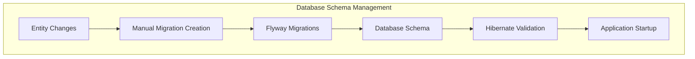

# Database Migration with Flyway

## Table of Contents

- [1. Database Migration Strategy](https://www.google.com/search?q=%231-database-migration-strategy)
- [2. Flyway Multi-Module Architecture](https://www.google.com/search?q=%232-flyway-multi-module-architecture)
- [3. Versioning Conventions](https://www.google.com/search?q=%233-versioning-conventions)
- [4. Migration Development Workflow](https://www.google.com/search?q=%234-migration-development-workflow)
- [5. Bounded Context Integration](https://www.google.com/search?q=%235-bounded-context-integration)
- [6. Environment-Specific Configuration](https://www.google.com/search?q=%236-environment-specific-configuration)
- [7. Best Practices & Anti-patterns](https://www.google.com/search?q=%237-best-practices--anti-patterns)
- [8. Troubleshooting & Recovery](https://www.google.com/search?q=%238-troubleshooting--recovery)

-----

## Database Migration Strategy

### Philosophy

Our database migration strategy follows **Database First** principles with strict version control and automated schema evolution. We use **Flyway** as the single source of truth for all database changes, with Hibernate in **validate-only** mode to ensure consistency.

### Key Principles

1.  **Single Source of Truth**: Flyway migrations are the authoritative schema definition
2.  **Version Controlled**: All schema changes tracked in Git with the application code
3.  **Automated Application**: Migrations run automatically on application startup
4.  **Environment Consistency**: Same migrations across dev/test/production
5.  **Rollback Strategy**: Forward-only migrations with compensating changes
6.  **Bounded Context Isolation**: Each context manages its own schema subset

### Integration with Hibernate



**Configuration Strategy:**

```properties