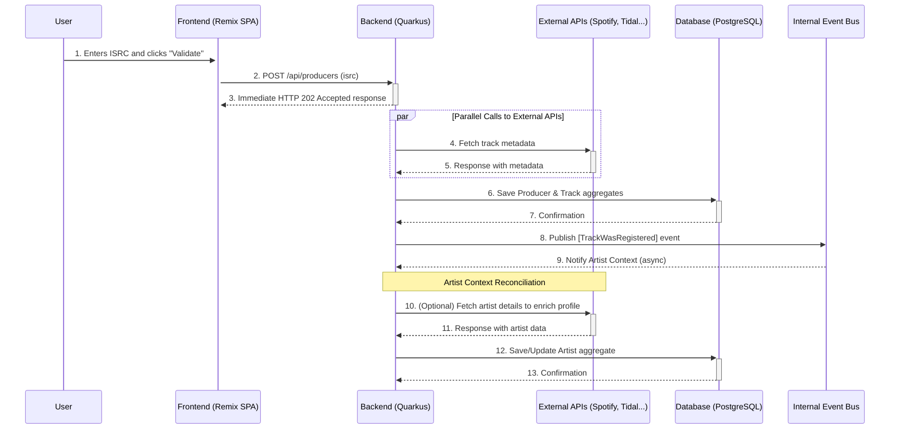

# High-Level Architecture

## Technical Summary

The project's architecture is designed as a **full-stack monorepo** deployed as a single artifact. The backend is a **Quarkus (Java)** application built on the principles of **Hexagonal Architecture**, **Domain-Driven Design (DDD)**, and internal **Event-Driven** communication. It exposes a versionless REST API (`/api/*`). The frontend is a **Single-Page Application (SPA) in Remix (TypeScript)** that is integrated and served by the backend via **Quarkus Quinoa**.

## Platform and Infrastructure Choice

The target platform for the PoC deployment is a **containerized IaaS/PaaS (e.g., Scaleway, DigitalOcean)**. This option offers the best balance of cost, management simplicity for a single container, and performance. The application will be deployed as a single Docker container with a managed PostgreSQL database from the same provider.

## High-Level Architecture Diagram

-----
