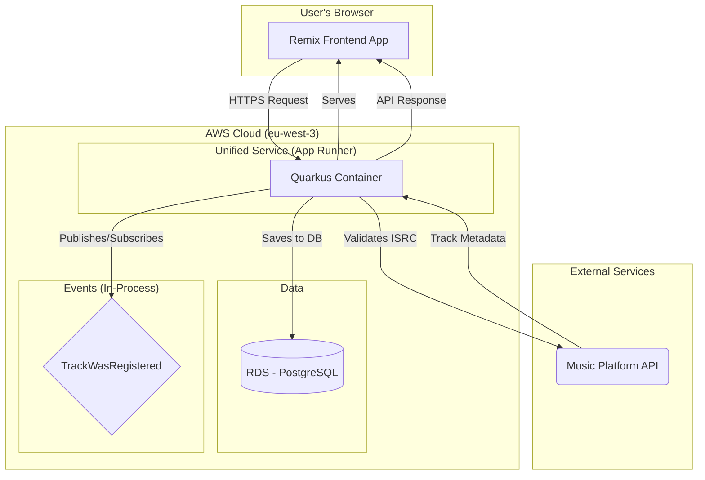

# High Level Architecture

## Technical Summary

The architecture for "music-data-hub" is designed as a modern web application deployed on a flexible cloud infrastructure. The front-end will be a Single-Page Application (SPA) developed with **Remix (TypeScript)**, communicating via a REST API with a robust back-end based on **Quarkus (Java)**. This event-driven architecture, adhering to Domain-Driven Design (DDD) principles, is designed to meet the PRD goals: rapid ISRC validation, centralized catalog management, and high potential for future scalability.

## Platform and Infrastructure Choice

For the Proof of Concept (PoC), the recommendation is to use **Docker containers** deployed on **AWS**, leveraging managed services to balance flexibility and operational simplicity.

*   **Platform:** AWS
*   **Key Services:**
    *   **Compute:** AWS App Runner (for containerized Quarkus and Remix applications)
    *   **Database:** Amazon RDS for PostgreSQL
    *   **Storage:** Amazon S3 (for potential future file storage needs)
*   **Deployment Host and Regions:** `eu-west-3` (Paris) to be close to potential European users.

**Risk Mitigation:** To manage the complexity and cost of AWS, we will adopt an Infrastructure as Code (IaC) approach with Terraform from the start, utilize budget alerts, and focus on simple, managed services like App Runner. An alternative for the PoC could be a simpler PaaS like Render, with a plan to migrate to AWS later.

## Repository Structure

A monorepo is the chosen approach to streamline development and dependency management.

*   **Structure:** Monorepo
*   **Monorepo Tool:** Start with `pnpm` workspaces for the front-end and shared packages. Avoid more complex tools like Nx or Turborepo until a clear need arises.
*   **Package Organization:**
    *   `apps/frontend`: The Remix application.
    *   `apps/backend`: The Quarkus application.
    *   `packages/shared-types`: Shared TypeScript types for API contracts.

## High Level Architecture Diagram

## Architectural Patterns

The following patterns will guide development:

*   **Hexagonal Architecture (Ports & Adapters) - Backend:** This is a core requirement from the PRD. It will allow us to decouple the business logic (domain) from technical details like the database, REST API, or event bus. This ensures high testability and future flexibility.
*   **Domain-Driven Design (DDD) - Backend:** Also a requirement. We will organize the code around business concepts (Producer, Artist, Track) using aggregates, entities, and value objects. This aligns the code with the business language and helps manage complexity.
*   **Event-Driven Architecture (Internal) - Backend:** As discussed, we will use an in-memory event bus for the PoC. The loose coupling between the `Producer` and `Artist` contexts (via the `TrackWasRegistered` event) is a cornerstone of the design.
*   **Single-Page Application (SPA) - Frontend:** The Remix front-end will behave as a SPA, providing a rich, responsive user experience without full-page reloads for core actions.
*   **Component-Based Architecture - Frontend:** The UI will be built from reusable React components, promoting maintainability and consistency.
