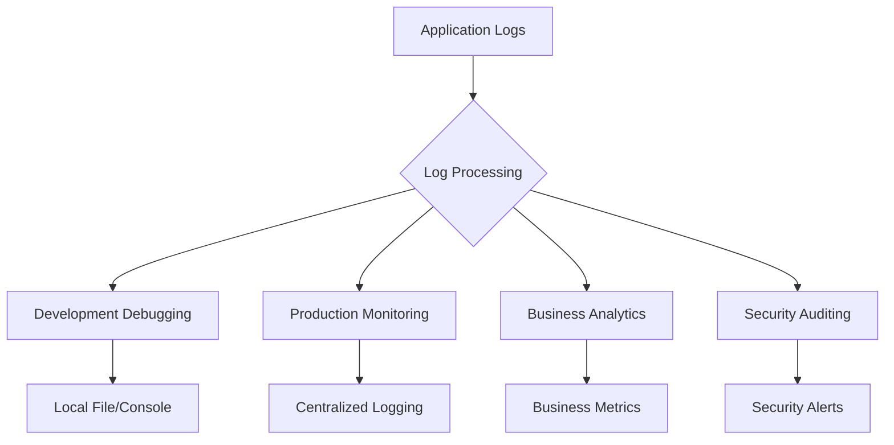
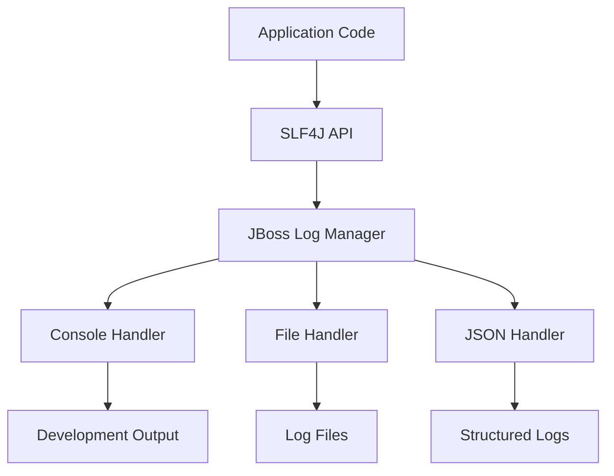
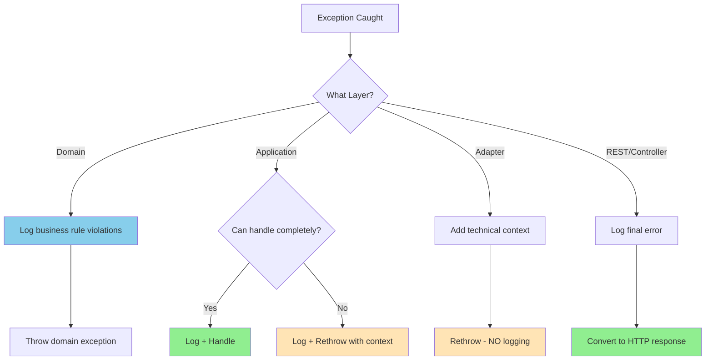

# Logging Best Practices - Music Hub Project

## Table of Contents

- [1. Logging Strategy & Philosophy](#1-logging-strategy--philosophy)
- [2. Quarkus Logging Framework](#2-quarkus-logging-framework)
- [3. Log Levels & Usage Guidelines](#3-log-levels--usage-guidelines)
- [4. Structured Logging with JSON](#4-structured-logging-with-json)
- [5. Contextual Logging & Correlation](#5-contextual-logging--correlation)
- [6. Hexagonal Architecture Logging Patterns](#6-hexagonal-architecture-logging-patterns)
- [7. Security & Sensitive Data](#7-security--sensitive-data)
- [8. Environment-Specific Configuration](#8-environment-specific-configuration)
- [9. OpenTelemetry Integration](#9-opentelemetry-integration)
- [10. Performance Considerations](#10-performance-considerations)
- [11. Business Event Logging](#11-business-event-logging)
- [12. Monitoring & Alerting](#12-monitoring--alerting)

---

## 1. Logging Strategy & Philosophy

### Logging Principles

Our logging strategy follows **observability-first** principles, treating logs as structured data for monitoring, debugging, and business intelligence.

#### Core Principles

1. **Structured Over Unstructured**: Use JSON format in production for machine readability
2. **Context-Rich**: Include correlation IDs, user context, and business context
3. **Performance Conscious**: Minimize logging overhead in hot paths
4. **Security First**: Never log sensitive data, sanitize user inputs
5. **Environment Appropriate**: Different verbosity levels per environment
6. **Correlation Ready**: Support distributed tracing with OpenTelemetry

### Logging Objectives



**Our Goals:**
- **Development**: Fast debugging and issue identification
- **Production**: Proactive monitoring and alerting
- **Business**: Track domain events and user journeys
- **Security**: Audit trail and security event detection

---

## 2. Quarkus Logging Framework

### Framework Stack

Quarkus uses **JBoss Log Manager** as the logging framework with **SLF4J** as the API layer.



### Current Configuration Analysis

**From our `application.properties`:**

```properties
# ✅ GOOD: OpenTelemetry integration
quarkus.log.console.format=%d{HH:mm:ss} %-5p traceId=%X{traceId}, parentId=%X{parentId}, spanId=%X{spanId}, sampled=%X{sampled} [%c{2.}] (%t) %s%e%n

# ✅ GOOD: Environment-specific levels
%dev.quarkus.log.level=INFO
%dev.quarkus.log.category."com.musichub".level=DEBUG
%test.quarkus.log.level=INFO
%test.quarkus.log.category."com.musichub".level=DEBUG

# ✅ GOOD: Third-party log control
%test.quarkus.log.category."org.testcontainers".level=OFF
%dev.quarkus.log.category."org.jboss.resteasy.reactive.client".level=DEBUG
```

### Recommended Framework Configuration

```properties
# Global logging configuration
quarkus.log.level=INFO
quarkus.log.min-level=DEBUG

# Console logging (development)
quarkus.log.console.enable=true
quarkus.log.console.format=%d{HH:mm:ss.SSS} %-5p [%c{2.}] (%t) %s%e%n
quarkus.log.console.level=INFO

# JSON logging (production)
quarkus.log.handler.json.enable=true
quarkus.log.handler.json.format=JSON
quarkus.log.handler.json.level=INFO
```

---

## 3. Log Levels & Usage Guidelines

### Quarkus Log Level Hierarchy

| Level | Purpose | When to Use | Examples |
|-------|---------|-------------|----------|
| **TRACE** | Very detailed execution flow | Method entry/exit, loop iterations | `log.trace("Entering method validateISRC with value: {}", isrc)` |
| **DEBUG** | Detailed information for debugging | Variable values, conditional paths | `log.debug("Producer found with code: {}", producerCode)` |
| **INFO** | Important business events | Successful operations, milestones | `log.info("Track registered successfully: {}", trackInfo)` |
| **WARN** | Potentially harmful situations | Recoverable errors, deprecated usage | `log.warn("ISRC format deprecated, using fallback: {}", isrc)` |
| **ERROR** | Error events that don't stop execution | Handled exceptions, business rule violations | `log.error("Failed to register track: {}", errorDetails, exception)` |
| **FATAL** | Very severe errors | System failures, unrecoverable errors | `log.fatal("Database connection lost, shutting down")` |

### Hexagonal Architecture Logging Guidelines

#### Domain Layer (Core Business Logic)

```java
// ✅ GOOD: Focus on business events and rule violations
@Entity
public class Producer {
    private static final Logger log = LoggerFactory.getLogger(Producer.class);
    
    public boolean addTrack(ISRC isrc) {
        log.debug("Attempting to add track with ISRC: {}", isrc.value());
        
        if (hasTrack(isrc)) {
            log.info("Track already exists for producer {}, skipping: {}", 
                    producerCode.value(), isrc.value());
            return false;
        }
        
        tracks.add(isrc);
        log.info("Track added to producer {}: {}", producerCode.value(), isrc.value());
        return true;
    }
}

// ❌ BAD: Don't log infrastructure concerns in domain
public class Producer {
    public boolean addTrack(ISRC isrc) {
        log.debug("Executing SQL query for track lookup"); // Infrastructure detail
        // ...
    }
}
```

#### Application Layer (Use Cases)

```java
// ✅ GOOD: Log use case execution and orchestration
@ApplicationScoped
public class RegisterTrackService implements RegisterTrackUseCase {
    private static final Logger log = LoggerFactory.getLogger(RegisterTrackService.class);
    
    @Override
    public Producer registerTrack(String isrcValue) {
        String correlationId = MDC.get("correlationId");
        log.info("Starting track registration use case - correlationId: {}, isrc: {}", 
                correlationId, isrcValue);
        
        try {
            ISRC isrc = ISRC.of(normalizeIsrc(isrcValue));
            ProducerCode code = ProducerCode.with(isrc);
            
            log.debug("Resolved producer code {} for ISRC {}", code.value(), isrc.value());
            
            Producer producer = producerRepository.findByProducerCode(code)
                    .orElseGet(() -> {
                        log.info("Creating new producer with code: {}", code.value());
                        return Producer.createNew(code, null);
                    });
            
            boolean trackAdded = producer.addTrack(isrc);
            Producer savedProducer = producerRepository.save(producer);
            
            if (trackAdded) {
                log.info("Track registration completed successfully - producer: {}, track: {}, correlationId: {}", 
                        code.value(), isrc.value(), correlationId);
                
                // Publish business event (separate log for event publishing)
                publishTrackRegisteredEvent(savedProducer, isrc);
            }
            
            return savedProducer;
            
        } catch (IllegalArgumentException e) {
            log.error("Track registration failed due to invalid input - isrc: {}, correlationId: {}, error: {}", 
                    isrcValue, correlationId, e.getMessage());
            throw e;
        } catch (Exception e) {
            log.error("Unexpected error during track registration - isrc: {}, correlationId: {}", 
                    isrcValue, correlationId, e);
            throw e;
        }
    }
    
    private void publishTrackRegisteredEvent(Producer producer, ISRC isrc) {
        try {
            // Event publishing logic
            log.debug("Publishing TrackWasRegistered event for track: {}", isrc.value());
        } catch (Exception e) {
            log.error("Failed to publish TrackWasRegistered event for track: {}, error: {}", 
                    isrc.value(), e.getMessage(), e);
            // Don't rethrow - event publishing failure shouldn't fail the use case
        }
    }
}
```

#### Adapter Layer (Infrastructure)

```java
// ✅ GOOD: Log infrastructure operations and external interactions
@ApplicationScoped
public class ProducerRepositoryImpl implements ProducerRepository {
    private static final Logger log = LoggerFactory.getLogger(ProducerRepositoryImpl.class);
    
    @Override
    public Optional<Producer> findByProducerCode(ProducerCode producerCode) {
        String correlationId = MDC.get("correlationId");
        log.debug("Querying database for producer with code: {}, correlationId: {}", 
                producerCode.value(), correlationId);
        
        try {
            List<ProducerEntity> results = entityManager
                    .createQuery("SELECT p FROM ProducerEntity p WHERE p.producerCode = :code", ProducerEntity.class)
                    .setParameter("code", producerCode.value())
                    .getResultList();
            
            if (results.isEmpty()) {
                log.debug("No producer found with code: {}", producerCode.value());
                return Optional.empty();
            }
            
            if (results.size() > 1) {
                log.warn("Multiple producers found with same code: {} - using first result", 
                        producerCode.value());
            }
            
            Producer producer = mapper.toDomain(results.get(0));
            log.debug("Successfully retrieved producer: {}, tracks: {}", 
                    producerCode.value(), producer.tracks().size());
            
            return Optional.of(producer);
            
        } catch (Exception e) {
            log.error("Database error while querying producer with code: {}, correlationId: {}", 
                    producerCode.value(), correlationId, e);
            throw new RuntimeException("Failed to query producer", e);
        }
    }
}

// REST Adapter
@Path("/api/v1/producers")
@ApplicationScoped
public class ProducerResource {
    private static final Logger log = LoggerFactory.getLogger(ProducerResource.class);
    
    @POST
    public Response register(RegisterTrackRequest request) {
        String correlationId = UUID.randomUUID().toString();
        MDC.put("correlationId", correlationId);
        
        try {
            log.info("HTTP POST /api/v1/producers - correlationId: {}, isrc: {}", 
                    correlationId, request.isrc);
            
            // Request validation
            if (request == null || request.isrc == null || request.isrc.isBlank()) {
                log.warn("Invalid request received - missing ISRC field, correlationId: {}", correlationId);
                return Response.status(Response.Status.BAD_REQUEST)
                        .entity(new ErrorResponse("InvalidISRCFormat", "Field 'isrc' is required"))
                        .build();
            }
            
            Producer producer = registerTrackUseCase.registerTrack(request.isrc);
            ProducerResponse response = ProducerResponse.from(producer);
            
            log.info("HTTP 202 response sent - correlationId: {}, producerId: {}", 
                    correlationId, producer.id().value());
            
            return Response.accepted(response).build();
            
        } catch (IllegalArgumentException e) {
            log.warn("HTTP 400 response - invalid ISRC format, correlationId: {}, error: {}", 
                    correlationId, e.getMessage());
            return Response.status(Response.Status.BAD_REQUEST)
                    .entity(new ErrorResponse("InvalidISRCFormat", e.getMessage()))
                    .build();
                    
        } catch (Exception e) {
            log.error("HTTP 500 response - unexpected error, correlationId: {}", correlationId, e);
            return Response.status(Response.Status.INTERNAL_SERVER_ERROR)
                    .entity(new ErrorResponse("InternalError", "An unexpected error occurred"))
                    .build();
        } finally {
            MDC.clear(); // Always clean up MDC
        }
    }
}
```

---

## 4. Structured Logging with JSON

### JSON Logging Configuration

For production environments, use structured JSON logging for better machine readability and integration with log aggregation systems.

#### Production JSON Configuration

```properties
# Enable JSON logging for production
%prod.quarkus.log.console.json=true
%prod.quarkus.log.console.json.pretty-print=false
%prod.quarkus.log.console.json.date-format=yyyy-MM-dd HH:mm:ss.SSS

# Include additional fields in JSON
%prod.quarkus.log.console.json.additional-field.environment=production
%prod.quarkus.log.console.json.additional-field.application=music-hub
%prod.quarkus.log.console.json.additional-field.version=${quarkus.application.version:unknown}

# Exception details in JSON
%prod.quarkus.log.console.json.exception-output-type=formatted
```

#### JSON Log Structure

**Standard JSON Log Output:**
```json
{
  "timestamp": "2025-08-16T14:30:15.123Z",
  "level": "INFO",
  "logger": "com.musichub.producer.application.service.RegisterTrackService",
  "message": "Track registration completed successfully",
  "thread": "executor-thread-1",
  "mdc": {
    "correlationId": "abc123-def456-ghi789",
    "userId": "user-456", 
    "operation": "registerTrack"
  },
  "fields": {
    "producerCode": "FRLA1",
    "isrc": "FRLA12400001",
    "environment": "production",
    "application": "music-hub",
    "version": "1.0.0"
  }
}
```

### Structured Logging Best Practices

#### Use Structured Arguments

```java
// ✅ GOOD: Structured arguments for JSON logging
log.info("Track registration completed - producer: {}, isrc: {}, duration: {}ms",
         kv("producerCode", producer.code().value()),
         kv("isrc", isrc.value()), 
         kv("durationMs", duration));

// Alternative: Using Markers for structured data
import org.slf4j.Marker;
import org.slf4j.MarkerFactory;

Marker businessEvent = MarkerFactory.getMarker("BUSINESS_EVENT");
log.info(businessEvent, "Track registered - producer: {}, isrc: {}", 
         producer.code(), isrc.value());

// ❌ BAD: String concatenation loses structure
log.info("Track registration completed for producer " + producer.code() + 
         " with ISRC " + isrc.value());
```

#### Custom JSON Appender (Advanced)

For complex structured logging needs, create a custom Quarkus logging handler:

```java
// Custom JSON fields provider
@ApplicationScoped
public class BusinessLogContext {
    
    public void addTrackRegistrationContext(Producer producer, ISRC isrc) {
        MDC.put("businessEvent", "TrackRegistration");
        MDC.put("aggregate", "Producer");
        MDC.put("aggregateId", producer.id().value().toString());
        MDC.put("producerCode", producer.producerCode().value());
        MDC.put("isrc", isrc.value());
    }
    
    public void addArtistUpdateContext(Artist artist) {
        MDC.put("businessEvent", "ArtistUpdate");
        MDC.put("aggregate", "Artist");
        MDC.put("aggregateId", artist.id().value().toString());
        MDC.put("artistName", artist.name().value());
    }
    
    public void clearBusinessContext() {
        MDC.remove("businessEvent");
        MDC.remove("aggregate");
        MDC.remove("aggregateId");
        // Remove other business-specific keys
    }
}
```

---

## 5. Contextual Logging & Correlation

### Mapped Diagnostic Context (MDC)

MDC provides a way to enrich log messages with contextual information that persists throughout a request.

#### Current OpenTelemetry Integration

**Our configuration already includes OpenTelemetry correlation:**
```properties
quarkus.log.console.format=%d{HH:mm:ss} %-5p traceId=%X{traceId}, parentId=%X{parentId}, spanId=%X{spanId}, sampled=%X{sampled} [%c{2.}] (%t) %s%e%n
```

#### Enhanced MDC Strategy

```java
// Base correlation context for all requests
@ApplicationScoped
public class CorrelationContext {
    
    public void initializeRequestContext(String correlationId, String operation) {
        MDC.put("correlationId", correlationId);
        MDC.put("operation", operation);
        MDC.put("requestTimestamp", Instant.now().toString());
    }
    
    public void addUserContext(String userId, String userRole) {
        MDC.put("userId", userId);
        MDC.put("userRole", userRole);
    }
    
    public void addBusinessContext(String boundedContext, String aggregateType, String aggregateId) {
        MDC.put("boundedContext", boundedContext);
        MDC.put("aggregateType", aggregateType);
        MDC.put("aggregateId", aggregateId);
    }
    
    public void clearRequestContext() {
        MDC.clear();
    }
}

// JAX-RS Filter for automatic correlation ID handling
@Provider
@ApplicationScoped
public class CorrelationFilter implements ContainerRequestFilter, ContainerResponseFilter {
    
    private static final Logger log = LoggerFactory.getLogger(CorrelationFilter.class);
    private static final String CORRELATION_ID_HEADER = "X-Correlation-ID";
    
    @Inject
    CorrelationContext correlationContext;
    
    @Override
    public void filter(ContainerRequestContext requestContext) {
        String correlationId = requestContext.getHeaderString(CORRELATION_ID_HEADER);
        if (correlationId == null || correlationId.isBlank()) {
            correlationId = UUID.randomUUID().toString();
        }
        
        String operation = requestContext.getMethod() + " " + requestContext.getUriInfo().getPath();
        correlationContext.initializeRequestContext(correlationId, operation);
        
        // Add correlation ID to response headers
        requestContext.setProperty("correlationId", correlationId);
        
        log.debug("Request started - method: {}, path: {}, correlationId: {}", 
                requestContext.getMethod(), 
                requestContext.getUriInfo().getPath(), 
                correlationId);
    }
    
    @Override
    public void filter(ContainerRequestContext requestContext, ContainerResponseContext responseContext) {
        String correlationId = (String) requestContext.getProperty("correlationId");
        responseContext.getHeaders().add(CORRELATION_ID_HEADER, correlationId);
        
        log.debug("Request completed - status: {}, correlationId: {}", 
                responseContext.getStatus(), correlationId);
        
        correlationContext.clearRequestContext();
    }
}
```

### Event-Driven Correlation

For event-driven architecture, maintain correlation across bounded contexts:

```java
// Event publishing with correlation
@ApplicationScoped
public class TrackEventPublisher {
    private static final Logger log = LoggerFactory.getLogger(TrackEventPublisher.class);
    
    @Inject
    EventBus eventBus;
    
    public void publishTrackWasRegistered(Producer producer, ISRC isrc) {
        String correlationId = MDC.get("correlationId");
        String parentSpanId = MDC.get("spanId");
        
        TrackWasRegistered event = new TrackWasRegistered(
                isrc, 
                extractTrackTitle(producer, isrc), 
                extractArtistNames(producer, isrc),
                correlationId,  // Add correlation to event
                parentSpanId
        );
        
        log.info("Publishing TrackWasRegistered event - isrc: {}, correlationId: {}", 
                isrc.value(), correlationId);
        
        eventBus.publish("track-registered", event);
    }
}

// Event consumption with correlation
@ApplicationScoped  
public class TrackEventHandler {
    private static final Logger log = LoggerFactory.getLogger(TrackEventHandler.class);
    
    @ConsumeEvent("track-registered")
    @Blocking
    public void handle(TrackWasRegistered event) {
        // Restore correlation context from event
        MDC.put("correlationId", event.correlationId());
        MDC.put("parentOperation", "registerTrack");
        MDC.put("eventType", "TrackWasRegistered");
        
        try {
            log.info("Processing TrackWasRegistered event - isrc: {}, correlationId: {}", 
                    event.isrc().value(), event.correlationId());
            
            artistService.handleTrackRegistration(event);
            
            log.info("TrackWasRegistered event processed successfully - isrc: {}, correlationId: {}", 
                    event.isrc().value(), event.correlationId());
                    
        } catch (Exception e) {
            log.error("Failed to process TrackWasRegistered event - isrc: {}, correlationId: {}", 
                    event.isrc().value(), event.correlationId(), e);
            throw e;
        } finally {
            MDC.clear();
        }
    }
}
```

---

## 6. Hexagonal Architecture Logging Patterns

### Domain Layer Logging

The domain layer should focus on business logic and business rule violations.

```java
// Value Objects - Log validation failures
public record ISRC(String value) {
    private static final Logger log = LoggerFactory.getLogger(ISRC.class);
    private static final Pattern ISRC_PATTERN = Pattern.compile("^[A-Z]{2}[A-Z0-9]{3}\\d{2}\\d{5}$");
    
    public ISRC {
        Objects.requireNonNull(value, "ISRC value cannot be null");
        String normalizedValue = value.replace("-", "").trim().toUpperCase();
        
        if (!ISRC_PATTERN.matcher(normalizedValue).matches()) {
            log.warn("Invalid ISRC format rejected: '{}' (normalized: '{}')", value, normalizedValue);
            throw new IllegalArgumentException(String.format("ISRC value '%s' is invalid", value));
        }
        
        if (!normalizedValue.equals(value)) {
            log.debug("ISRC normalized from '{}' to '{}'", value, normalizedValue);
        }
        
        this.value = normalizedValue;
    }
}

// Aggregates - Log business operations
public final class Producer {
    private static final Logger log = LoggerFactory.getLogger(Producer.class);
    
    public boolean addTrack(ISRC isrc) {
        Objects.requireNonNull(isrc, "ISRC must not be null");
        
        log.debug("Adding track to producer {} - isrc: {}", producerCode.value(), isrc.value());
        
        ISRC normalized = normalize(isrc);
        boolean wasAdded = tracks.add(normalized);
        
        if (wasAdded) {
            log.info("Track added to producer {} - isrc: {}, total tracks: {}", 
                    producerCode.value(), normalized.value(), tracks.size());
        } else {
            log.debug("Track already exists in producer {} - isrc: {}", 
                    producerCode.value(), normalized.value());
        }
        
        return wasAdded;
    }
    
    public void rename(String newName) {
        String oldName = this.name;
        this.name = newName;
        
        log.info("Producer renamed - code: {}, oldName: '{}', newName: '{}'", 
                producerCode.value(), oldName, newName);
    }
}
```

### Application Layer Logging

Application services orchestrate domain operations and should log use case execution.

```java
@ApplicationScoped
public class RegisterTrackService implements RegisterTrackUseCase {
    private static final Logger log = LoggerFactory.getLogger(RegisterTrackService.class);
    
    private final ProducerRepository producerRepository;
    private final TrackEventPublisher eventPublisher;
    private final BusinessLogContext businessLogContext;
    
    @Override
    public Producer registerTrack(String isrcValue) {
        log.info("Starting track registration use case - isrc: '{}'", isrcValue);
        
        try {
            // Step 1: Parse and validate input
            ISRC isrc = ISRC.of(normalizeIsrc(isrcValue));
            ProducerCode code = ProducerCode.with(isrc);
            
            businessLogContext.addTrackRegistrationContext(null, isrc); // Will update with producer
            
            log.debug("Parsed registration request - producerCode: {}, isrc: {}", 
                    code.value(), isrc.value());
            
            // Step 2: Find or create producer
            Producer producer = producerRepository.findByProducerCode(code)
                    .orElseGet(() -> {
                        log.info("Creating new producer for code: {}", code.value());
                        return Producer.createNew(code, null);
                    });
            
            // Update business context with producer info
            businessLogContext.addTrackRegistrationContext(producer, isrc);
            
            // Step 3: Add track to producer
            boolean trackAdded = producer.addTrack(isrc);
            
            // Step 4: Persist changes
            Producer savedProducer = producerRepository.save(producer);
            
            // Step 5: Publish domain event if track was newly added
            if (trackAdded) {
                eventPublisher.publishTrackWasRegistered(savedProducer, isrc);
                log.info("Track registration completed successfully - producer: {}, isrc: {}", 
                        code.value(), isrc.value());
            } else {
                log.info("Track registration completed (already existed) - producer: {}, isrc: {}", 
                        code.value(), isrc.value());
            }
            
            return savedProducer;
            
        } catch (IllegalArgumentException e) {
            log.error("Track registration failed - invalid input: '{}', error: {}", 
                    isrcValue, e.getMessage());
            throw e;
        } catch (Exception e) {
            log.error("Track registration failed - unexpected error with isrc: '{}'", isrcValue, e);
            throw new RuntimeException("Failed to register track", e);
        } finally {
            businessLogContext.clearBusinessContext();
        }
    }
    
    private static String normalizeIsrc(String input) {
        String normalized = input.replace("-", "").trim().toUpperCase();
        
        if (!normalized.equals(input)) {
            log.debug("ISRC input normalized - original: '{}', normalized: '{}'", input, normalized);
        }
        
        return normalized;
    }
}
```

### Exception Handling & Logging Pattern

**CRITICAL: SonarQube Compliance - "Either log OR rethrow" Rule**

Our architecture follows the SonarQube rule: **"Either log this exception and handle it, or rethrow it"**. This prevents duplicate logging and maintains clear error handling responsibilities across hexagonal architecture layers.

#### Hexagonal Architecture Logging Responsibilities

| Layer | Exception Handling | Logging Responsibility | Pattern |
|-------|-------------------|----------------------|--------|
| **Domain** | Validate & throw business exceptions | Log business rule violations only | Log business events, throw domain exceptions |
| **Application** | Catch, log, and rethrow OR handle completely | Log use case failures with context | Log + handle OR rethrow with context |
| **Adapter** | Catch, rethrow with contextual information | NO logging - rethrow with adapter context | Rethrow with technical context |
| **REST** | Catch, log final error, return HTTP response | Log final error + HTTP mapping | Log + handle (convert to HTTP) |

#### ✅ COMPLIANT: Adapter Layer Pattern (Current Implementation)

```java
// ✅ GOOD: Adapter rethrows with context - NO duplicate logging
@ApplicationScoped
public class ProducerRepositoryAdapter implements ProducerRepository {
    private static final Logger log = LoggerFactory.getLogger(ProducerRepositoryAdapter.class);
    private static final String CORRELATION_ID_KEY = "correlationId";

    @Override
    public Optional<Producer> findByProducerCode(ProducerCode code) {
        String correlationId = MDC.get(CORRELATION_ID_KEY);
        log.debug("Querying database for producer with code: {}, correlationId: {}", 
                code.value(), correlationId);
        
        try {
            Optional<ProducerEntity> entityOpt = find("producerCode", code.value()).firstResultOptional();
            
            if (entityOpt.isEmpty()) {
                log.debug("No producer found with code: {}", code.value());
                return Optional.empty();
            }
            
            Producer producer = ProducerMapper.toDomain(entityOpt.get());
            log.debug("Successfully retrieved producer: {}, tracks: {}", 
                    code.value(), producer.tracks().size());
            
            return Optional.of(producer);
            
        } catch (Exception e) {
            // ✅ COMPLIANT: Rethrow with context - do NOT log here
            throw new ProducerPersistenceException(
                String.format("Failed to retrieve producer with code '%s' (correlationId: %s)", 
                    code.value(), correlationId), e);
        }
    }

    @Override
    @Transactional
    public Producer save(Producer producer) {
        String correlationId = MDC.get(CORRELATION_ID_KEY);
        ProducerId producerId = producer.id();
        ProducerCode producerCode = producer.producerCode();
        
        log.debug("Saving producer to database - id: {}, code: {}, tracks: {}, correlationId: {}", 
                producerId.value(), producerCode.value(), producer.tracks().size(), correlationId);
        
        try {
            ProducerEntity entity = ProducerMapper.toDbo(producer);
            ProducerEntity persistedEntity = getEntityManager().merge(entity);
            
            Producer savedProducer = ProducerMapper.toDomain(persistedEntity);
            
            log.info("Producer saved successfully - id: {}, code: {}, tracks: {}, correlationId: {}", 
                    producerId.value(), producerCode.value(), savedProducer.tracks().size(), correlationId);
            
            return savedProducer;
            
        } catch (Exception e) {
            // ✅ COMPLIANT: Rethrow with context - do NOT log here  
            throw new ProducerPersistenceException(
                String.format("Failed to save producer with code '%s' and id '%s' (correlationId: %s)", 
                    producerCode.value(), producerId.value(), correlationId), e);
        }
    }
}

// ✅ GOOD: Dedicated adapter exception with contextual information
public class ProducerPersistenceException extends RuntimeException {
    public ProducerPersistenceException(String message, Throwable cause) {
        super(message, cause);
    }
}
```

#### ❌ ANTI-PATTERN: Log and Rethrow (SonarQube Violation)

```java
// ❌ BAD: Violates "either log OR rethrow" rule
@Override
public Optional<Producer> findByProducerCode(ProducerCode code) {
    try {
        // Query logic...
        return Optional.of(producer);
    } catch (Exception e) {
        // ❌ SonarQube violation: logging AND rethrowing
        log.error("Database error while querying producer by code: {}", code.value(), e);
        throw new RuntimeException("Failed to query producer", e); // Causes duplicate logs
    }
}
```

**Why this is problematic:**
1. **Duplicate Logging**: Error gets logged multiple times up the call stack
2. **Log Noise**: Makes troubleshooting harder with redundant entries
3. **Performance Impact**: Multiple string operations and I/O for same error
4. **SonarQube Compliance**: Violates quality rules

### Adapter Layer Logging

// REST Adapter
@Path("/api/v1/producers")
@ApplicationScoped
public class ProducerResource {
    private static final Logger log = LoggerFactory.getLogger(ProducerResource.class);
    
    @Inject
    RegisterTrackUseCase registerTrackUseCase;
    
    @Inject
    CorrelationContext correlationContext;
    
    @POST
    @Consumes(MediaType.APPLICATION_JSON)
    @Produces(MediaType.APPLICATION_JSON)
    public Response register(RegisterTrackRequest request) {
        String correlationId = UUID.randomUUID().toString();
        correlationContext.initializeRequestContext(correlationId, "POST /api/v1/producers");
        
        log.info("POST /api/v1/producers - correlationId: {}", correlationId);
        
        try {
            // Input validation and logging
            if (request == null) {
                log.warn("Received null request body - correlationId: {}", correlationId);
                return Response.status(Response.Status.BAD_REQUEST)
                        .entity(new ErrorResponse("InvalidRequest", "Request body is required"))
                        .build();
            }
            
            if (request.isrc == null || request.isrc.isBlank()) {
                log.warn("Received request with missing ISRC - correlationId: {}", correlationId);
                return Response.status(Response.Status.BAD_REQUEST)
                        .entity(new ErrorResponse("InvalidISRCFormat", "Field 'isrc' is required"))
                        .build();
            }
            
            log.debug("Processing track registration request - isrc: '{}', correlationId: {}", 
                    request.isrc, correlationId);
            
            // Delegate to use case
            Producer producer = registerTrackUseCase.registerTrack(request.isrc);
            ProducerResponse response = ProducerResponse.from(producer);
            
            log.info("Track registration request completed successfully - producerId: {}, correlationId: {}", 
                    producer.id().value(), correlationId);
            
            return Response.accepted(response).build();
            
        } catch (IllegalArgumentException e) {
            log.warn("Track registration request rejected - invalid ISRC format: '{}', correlationId: {}, error: {}", 
                    request.isrc, correlationId, e.getMessage());
            return Response.status(Response.Status.BAD_REQUEST)
                    .entity(new ErrorResponse("InvalidISRCFormat", e.getMessage()))
                    .build();
                    
        } catch (Exception e) {
            log.error("Track registration request failed - unexpected error, isrc: '{}', correlationId: {}", 
                    request != null ? request.isrc : "null", correlationId, e);
            return Response.status(Response.Status.INTERNAL_SERVER_ERROR)
                    .entity(new ErrorResponse("InternalError", "An unexpected error occurred"))
                    .build();
        } finally {
            correlationContext.clearRequestContext();
        }
    }
}
```

---

## 7. Security & Sensitive Data

### Sensitive Data Identification

Never log sensitive information that could compromise security or privacy.

#### Categories of Sensitive Data

| Category | Examples | Logging Approach |
|----------|----------|------------------|
| **Personal Data** | Email addresses, names, phone numbers | Mask or hash |
| **Financial Data** | Credit card numbers, bank accounts | Never log |
| **Authentication** | Passwords, API keys, tokens | Never log |
| **System Security** | Database credentials, encryption keys | Never log |
| **User Content** | Private messages, documents | Log metadata only |

### Safe Logging Practices

```java
// ✅ GOOD: Safe logging of user data
public class ProducerResource {
    private static final Logger log = LoggerFactory.getLogger(ProducerResource.class);
    
    @POST
    public Response register(RegisterTrackRequest request) {
        // ✅ SAFE: ISRC is public identifier
        log.info("Track registration request - isrc: {}", request.isrc);
        
        // ✅ SAFE: Producer code is business identifier
        log.debug("Processing for producer code: {}", extractProducerCode(request.isrc));
        
        // ❌ UNSAFE: Don't log if request contained sensitive data
        // log.debug("Full request: {}", request); // Could expose sensitive fields
        
        // ✅ COMPLIANT: Application layer handles and logs final errors
        try {
            Producer producer = registerTrackUseCase.registerTrack(request.isrc);
            ProducerResponse response = ProducerResponse.from(producer);
            
            log.info("Track registration completed successfully - producerId: {}, correlationId: {}", 
                    producer.id().value(), correlationId);
            
            return Response.accepted(response).build();
            
        } catch (ProducerPersistenceException e) {
            // ✅ GOOD: Log adapter exception with context at REST boundary
            log.error("Track registration failed - persistence error, isrc: '{}', correlationId: {}, error: {}", 
                    request.isrc, correlationId, e.getMessage(), e);
            return Response.status(Response.Status.INTERNAL_SERVER_ERROR)
                    .entity(new ErrorResponse("PersistenceError", "Data storage error occurred"))
                    .build();
        } catch (IllegalArgumentException e) {
            // ✅ GOOD: Domain validation errors logged at REST boundary
            log.warn("Track registration rejected - invalid ISRC format: '{}', correlationId: {}, error: {}", 
                    request.isrc, correlationId, e.getMessage());
            return Response.status(Response.Status.BAD_REQUEST)
                    .entity(new ErrorResponse("InvalidISRCFormat", e.getMessage()))
                    .build();
        } catch (Exception e) {
            // ✅ GOOD: Unknown errors logged at REST boundary
            log.error("Track registration failed - unexpected error, isrc: '{}', correlationId: {}", 
                    request.isrc, correlationId, e);
            return Response.status(Response.Status.INTERNAL_SERVER_ERROR)
                    .entity(new ErrorResponse("InternalError", "An unexpected error occurred"))
                    .build();
        }
        
        return Response.accepted().build();
    }
}

// Data sanitization utilities
@ApplicationScoped
public class LogSanitizer {
    
    public String sanitizeEmail(String email) {
        if (email == null || email.length() < 3) {
            return "[email]";
        }
        
        int atIndex = email.indexOf('@');
        if (atIndex > 0) {
            String username = email.substring(0, atIndex);
            String domain = email.substring(atIndex);
            
            // Show first and last character of username
            if (username.length() <= 2) {
                return "*".repeat(username.length()) + domain;
            } else {
                return username.charAt(0) + "*".repeat(username.length() - 2) + 
                       username.charAt(username.length() - 1) + domain;
            }
        }
        
        return "[email]";
    }
    
    public String sanitizeUserId(String userId) {
        if (userId == null || userId.length() < 8) {
            return "[userId]";
        }
        
        // Show first 4 and last 4 characters for UUIDs
        return userId.substring(0, 4) + "****" + userId.substring(userId.length() - 4);
    }
    
    public String sanitizeCardNumber(String cardNumber) {
        // Never log credit card numbers - always return placeholder
        return "[CARD]";
    }
}

// Usage in application code
@ApplicationScoped
public class UserService {
    private static final Logger log = LoggerFactory.getLogger(UserService.class);
    
    @Inject
    LogSanitizer sanitizer;
    
    public void updateUserEmail(String userId, String newEmail) {
        log.info("Updating user email - userId: {}, email: {}", 
                sanitizer.sanitizeUserId(userId), 
                sanitizer.sanitizeEmail(newEmail));
        
        // Business logic...
        
        log.info("User email updated successfully - userId: {}", 
                sanitizer.sanitizeUserId(userId));
    }
}
```

### Audit Logging for Security Events

```java
// Security audit logger
@ApplicationScoped
public class SecurityAuditLogger {
    private static final Logger auditLog = LoggerFactory.getLogger("SECURITY_AUDIT");
    
    public void logAuthenticationSuccess(String userId, String ipAddress) {
        auditLog.info("AUTHENTICATION_SUCCESS - userId: {}, ip: {}, timestamp: {}", 
                userId, ipAddress, Instant.now());
    }
    
    public void logAuthenticationFailure(String attemptedUserId, String ipAddress, String reason) {
        auditLog.warn("AUTHENTICATION_FAILURE - userId: {}, ip: {}, reason: {}, timestamp: {}", 
                attemptedUserId, ipAddress, reason, Instant.now());
    }
    
    public void logSuspiciousActivity(String userId, String activity, String details) {
        auditLog.warn("SUSPICIOUS_ACTIVITY - userId: {}, activity: {}, details: {}, timestamp: {}", 
                userId, activity, details, Instant.now());
    }
    
    public void logDataAccess(String userId, String resource, String operation) {
        auditLog.info("DATA_ACCESS - userId: {}, resource: {}, operation: {}, timestamp: {}", 
                userId, resource, operation, Instant.now());
    }
}

// Configure separate appender for audit logs
# application.properties
%prod.quarkus.log.category."SECURITY_AUDIT".level=INFO
%prod.quarkus.log.category."SECURITY_AUDIT".handlers=audit-file

# Separate file for audit logs
%prod.quarkus.log.handler.audit-file.enable=true
%prod.quarkus.log.handler.audit-file.format=%d{yyyy-MM-dd HH:mm:ss.SSS} %-5p [%c{2.}] %s%e%n
%prod.quarkus.log.handler.audit-file.level=INFO
%prod.quarkus.log.handler.audit-file.path=/var/log/musichub/audit.log
%prod.quarkus.log.handler.audit-file.rotation.max-file-size=10M
%prod.quarkus.log.handler.audit-file.rotation.max-backup-index=10
```

---

## 8. Environment-Specific Configuration

### Development Environment

**Optimized for debugging and fast feedback:**

```properties
# Development logging configuration
%dev.quarkus.log.level=INFO
%dev.quarkus.log.console.enable=true
%dev.quarkus.log.console.format=%d{HH:mm:ss.SSS} %-5p [%c{2.}] (%t) %s%e%n
%dev.quarkus.log.console.color=true

# Application-specific logging
%dev.quarkus.log.category."com.musichub".level=DEBUG
%dev.quarkus.log.category."com.musichub.producer.domain".level=TRACE
%dev.quarkus.log.category."com.musichub.artist.domain".level=TRACE

# Infrastructure logging (selective)
%dev.quarkus.log.category."org.hibernate.SQL".level=DEBUG
%dev.quarkus.log.category."org.hibernate.type.descriptor.sql.BasicBinder".level=TRACE
%dev.quarkus.log.category."org.flywaydb".level=DEBUG
%dev.quarkus.log.category."io.vertx.core.eventbus".level=DEBUG

# HTTP client logging for external API integration
%dev.quarkus.log.category."org.jboss.resteasy.reactive.client".level=DEBUG
%dev.quarkus.rest-client.logging.scope=request-response

# File logging for persistent debugging
%dev.quarkus.log.file.enable=true
%dev.quarkus.log.file.path=logs/musichub-dev.log
%dev.quarkus.log.file.level=DEBUG
%dev.quarkus.log.file.format=%d{yyyy-MM-dd HH:mm:ss.SSS} %-5p [%c{3.}] (%t) %s%e%n
%dev.quarkus.log.file.rotation.max-file-size=50MB
%dev.quarkus.log.file.rotation.max-backup-index=5
```

### Test Environment

**Optimized for test execution and CI/CD:**

```properties
# Test logging configuration - minimal noise
%test.quarkus.log.level=INFO
%test.quarkus.log.console.enable=true
%test.quarkus.log.console.format=%d{HH:mm:ss} %-5p [%c{2.}] %s%e%n

# Application logging - focus on important events
%test.quarkus.log.category."com.musichub".level=DEBUG

# Suppress noisy test infrastructure
%test.quarkus.log.category."org.testcontainers".level=WARN
%test.quarkus.log.category."com.github.dockerjava".level=WARN
%test.quarkus.log.category."org.hibernate".level=WARN
%test.quarkus.log.category."io.quarkus.test".level=INFO

# Keep important test events visible
%test.quarkus.log.category."io.quarkus.test.junit.QuarkusTestExtension".level=INFO

# Flyway logging for migration tests
%test.quarkus.log.category."org.flywaydb".level=INFO

# File logging for test debugging
%test.quarkus.log.file.enable=true
%test.quarkus.log.file.path=target/test-logs/musichub-test.log
%test.quarkus.log.file.level=DEBUG
```

### Production Environment

**Optimized for performance and monitoring:**

```properties
# Production logging - performance optimized
%prod.quarkus.log.level=INFO
%prod.quarkus.log.min-level=INFO

# JSON structured logging for production
%prod.quarkus.log.console.json=true
%prod.quarkus.log.console.json.pretty-print=false
%prod.quarkus.log.console.json.date-format=yyyy-MM-dd'T'HH:mm:ss.SSSZ
%prod.quarkus.log.console.json.exception-output-type=formatted

# Additional structured fields
%prod.quarkus.log.console.json.additional-field.service=music-hub
%prod.quarkus.log.console.json.additional-field.version=${quarkus.application.version:unknown}
%prod.quarkus.log.console.json.additional-field.environment=production

# Application logging levels
%prod.quarkus.log.category."com.musichub".level=INFO
%prod.quarkus.log.category."com.musichub.producer.application".level=INFO
%prod.quarkus.log.category."com.musichub.artist.application".level=INFO

# Infrastructure logging - minimal
%prod.quarkus.log.category."org.hibernate".level=WARN
%prod.quarkus.log.category."org.flywaydb".level=INFO
%prod.quarkus.log.category."io.vertx".level=WARN
%prod.quarkus.log.category."io.netty".level=WARN

# Security and audit logging
%prod.quarkus.log.category."SECURITY_AUDIT".level=INFO
%prod.quarkus.log.category."BUSINESS_EVENT".level=INFO

# Performance - disable SQL logging
%prod.quarkus.hibernate-orm.log.sql=false

# Error logging - detailed for monitoring
%prod.quarkus.log.category."ROOT".level=ERROR
```

### Docker & Kubernetes Configuration

```properties
# Container-optimized logging
%prod.quarkus.log.console.enable=true
%prod.quarkus.log.file.enable=false  # Use stdout for containers

# Kubernetes-friendly JSON format
%prod.quarkus.log.console.json=true
%prod.quarkus.log.console.json.additional-field.pod=${HOSTNAME:unknown}
%prod.quarkus.log.console.json.additional-field.namespace=${K8S_NAMESPACE:default}

# OpenTelemetry integration for distributed tracing
%prod.quarkus.log.console.format=%d{yyyy-MM-dd HH:mm:ss.SSS} %-5p traceId=%X{traceId} spanId=%X{spanId} [%c{2.}] %s%e%n
```

---

## 9. OpenTelemetry Integration

### Current OpenTelemetry Setup

**Your existing configuration already includes OpenTelemetry:**

```properties
# ✅ Already configured - OpenTelemetry integration
quarkus.otel.metrics.enabled=true
quarkus.otel.exporter.otlp.traces.protocol=http/protobuf
quarkus.log.console.format=%d{HH:mm:ss} %-5p traceId=%X{traceId}, parentId=%X{parentId}, spanId=%X{spanId}, sampled=%X{sampled} [%c{2.}] (%t) %s%e%n
quarkus.datasource.jdbc.telemetry=true
```

### Enhanced OpenTelemetry Logging

#### Distributed Tracing Context

```java
// Enhanced trace context in logs
@ApplicationScoped
public class TracingLogContext {
    
    public void logWithTraceContext(Logger log, String message, Object... args) {
        Span currentSpan = Span.current();
        if (currentSpan != null && currentSpan.getSpanContext().isValid()) {
            String traceId = currentSpan.getSpanContext().getTraceId();
            String spanId = currentSpan.getSpanContext().getSpanId();
            
            // Add trace context to MDC if not already present
            if (MDC.get("traceId") == null) {
                MDC.put("traceId", traceId);
                MDC.put("spanId", spanId);
            }
        }
        
        log.info(message, args);
    }
    
    @WithSpan("register-track")
    public Producer registerTrackWithTracing(String isrc) {
        // Business logic with automatic span creation
        logWithTraceContext(log, "Starting track registration with tracing - isrc: {}", isrc);
        
        try {
            // Add custom span attributes
            Span.current().setAttributes(
                AttributeKey.stringKey("musichub.isrc"), isrc,
                AttributeKey.stringKey("musichub.operation"), "registerTrack"
            );
            
            Producer result = registerTrackUseCase.registerTrack(isrc);
            
            // Add result attributes to span
            Span.current().setAttributes(
                AttributeKey.stringKey("musichub.producer.code"), result.producerCode().value(),
                AttributeKey.stringKey("musichub.producer.id"), result.id().value().toString()
            );
            
            logWithTraceContext(log, "Track registration completed with tracing - producer: {}", 
                    result.producerCode().value());
            
            return result;
            
        } catch (Exception e) {
            // Record exception in span
            Span.current().recordException(e);
            Span.current().setStatus(StatusCode.ERROR, e.getMessage());
            
            logWithTraceContext(log, "Track registration failed with tracing - error: {}", e.getMessage());
            throw e;
        }
    }
}
```

#### Custom Span Creation

```java
@ApplicationScoped
public class ProducerRepositoryImpl implements ProducerRepository {
    private static final Logger log = LoggerFactory.getLogger(ProducerRepositoryImpl.class);
    
    @Inject
    Tracer tracer;
    
    @Override
    public Optional<Producer> findByProducerCode(ProducerCode producerCode) {
        Span span = tracer.spanBuilder("database.producer.findByCode")
                .setAttribute("db.operation", "SELECT")
                .setAttribute("db.table", "producers")
                .setAttribute("musichub.producer.code", producerCode.value())
                .startSpan();
        
        try (Scope scope = span.makeCurrent()) {
            log.debug("Querying producer by code: {} [traceId: {}]", 
                    producerCode.value(), span.getSpanContext().getTraceId());
            
            List<ProducerEntity> results = entityManager
                    .createQuery("SELECT p FROM ProducerEntity p WHERE p.producerCode = :code", ProducerEntity.class)
                    .setParameter("code", producerCode.value())
                    .getResultList();
            
            span.setAttribute("db.rows.affected", results.size());
            
            if (results.isEmpty()) {
                log.debug("No producer found with code: {}", producerCode.value());
                span.setAttribute("musichub.producer.found", false);
                return Optional.empty();
            }
            
            span.setAttribute("musichub.producer.found", true);
            Producer producer = mapper.toDomain(results.get(0));
            
            log.debug("Producer retrieved successfully - code: {}, tracks: {} [traceId: {}]", 
                    producerCode.value(), producer.tracks().size(), span.getSpanContext().getTraceId());
            
            return Optional.of(producer);
            
        } catch (Exception e) {
            span.recordException(e);
            span.setStatus(StatusCode.ERROR, e.getMessage());
            
            log.error("Database error while querying producer - code: {} [traceId: {}]", 
                    producerCode.value(), span.getSpanContext().getTraceId(), e);
            throw e;
        } finally {
            span.end();
        }
    }
}
```

### JSON Logging with OpenTelemetry

**Production JSON format with trace correlation:**

```json
{
  "timestamp": "2025-08-16T14:30:15.123Z",
  "level": "INFO",
  "logger": "com.musichub.producer.application.service.RegisterTrackService",
  "message": "Track registration completed successfully",
  "thread": "executor-thread-1",
  "tracing": {
    "traceId": "1234567890abcdef1234567890abcdef",
    "spanId": "abcdef1234567890",
    "parentSpanId": "fedcba0987654321",
    "sampled": true
  },
  "mdc": {
    "correlationId": "abc123-def456-ghi789",
    "operation": "registerTrack",
    "boundedContext": "producer"
  },
  "attributes": {
    "producerCode": "FRLA1",
    "isrc": "FRLA12400001",
    "service": "music-hub",
    "version": "1.0.0",
    "environment": "production"
  }
}
```

---

## 10. Performance Considerations

### Logging Performance Impact

Logging can significantly impact application performance if not configured properly.

#### Performance Best Practices

```java
// ✅ GOOD: Use parameterized logging to avoid string concatenation
log.debug("Processing track for producer: {}, isrc: {}, operation: {}", 
          producerCode, isrc, operation);

// ❌ BAD: String concatenation happens even if debug is disabled
log.debug("Processing track for producer: " + producerCode + 
          ", isrc: " + isrc + ", operation: " + operation);

// ✅ GOOD: Guard expensive operations
if (log.isDebugEnabled()) {
    log.debug("Complex operation result: {}", computeExpensiveDebugInfo());
}

// ✅ GOOD: Use suppliers for lazy evaluation (Java 8+)
log.debug("Expensive computation: {}", () -> computeExpensiveDebugInfo());

// ✅ GOOD: Avoid logging in tight loops
List<Track> tracks = producer.getTracks();
log.debug("Processing {} tracks for producer {}", tracks.size(), producer.code());

for (Track track : tracks) {
    // Don't log inside the loop unless absolutely necessary
    processTrack(track);
}

log.debug("Completed processing {} tracks", tracks.size());
```

#### Asynchronous Logging

```properties
# Enable async logging for better performance
%prod.quarkus.log.console.async=true
%prod.quarkus.log.console.async.queue-length=10000
%prod.quarkus.log.console.async.overflow=block

# File logging with async processing
%prod.quarkus.log.file.enable=true
%prod.quarkus.log.file.async=true
%prod.quarkus.log.file.async.queue-length=10000
```

#### Memory-Efficient Logging

```java
// Memory-efficient logging patterns
@ApplicationScoped
public class PerformantLogger {
    private static final Logger log = LoggerFactory.getLogger(PerformantLogger.class);
    
    // ✅ GOOD: Use constants for repeated strings
    private static final String TRACK_PROCESSING_START = "Starting track processing - isrc: {}";
    private static final String TRACK_PROCESSING_COMPLETE = "Track processing completed - isrc: {}, duration: {}ms";
    
    public void processTrack(ISRC isrc) {
        long startTime = System.currentTimeMillis();
        
        log.debug(TRACK_PROCESSING_START, isrc.value());
        
        try {
            // Business logic
            doProcessTrack(isrc);
            
            long duration = System.currentTimeMillis() - startTime;
            log.debug(TRACK_PROCESSING_COMPLETE, isrc.value(), duration);
            
        } catch (Exception e) {
            long duration = System.currentTimeMillis() - startTime;
            log.error("Track processing failed - isrc: {}, duration: {}ms", 
                    isrc.value(), duration, e);
            throw e;
        }
    }
    
    // ✅ GOOD: Batch logging for bulk operations
    public void processBulkTracks(List<ISRC> isrcs) {
        log.info("Starting bulk track processing - count: {}", isrcs.size());
        
        int processed = 0;
        int failed = 0;
        
        for (ISRC isrc : isrcs) {
            try {
                doProcessTrack(isrc);
                processed++;
            } catch (Exception e) {
                failed++;
                // Log error but don't log every single failure in bulk operation
                log.debug("Track processing failed in bulk operation - isrc: {}", isrc.value(), e);
            }
        }
        
        log.info("Bulk track processing completed - total: {}, processed: {}, failed: {}", 
                isrcs.size(), processed, failed);
    }
}
```

### Log Level Configuration for Performance

```properties
# Production performance tuning
%prod.quarkus.log.level=WARN  # Minimize log output
%prod.quarkus.log.category."com.musichub".level=INFO  # Application events only

# Critical paths - minimize logging
%prod.quarkus.log.category."com.musichub.producer.domain".level=WARN
%prod.quarkus.log.category."org.hibernate".level=ERROR

# Keep important business events
%prod.quarkus.log.category."com.musichub.producer.application.service.RegisterTrackService".level=INFO

# Disable debug/trace entirely in production
%prod.quarkus.log.min-level=INFO
```

---

## 11. Business Event Logging

### Domain Event Logging Strategy

Log important business events for analytics, auditing, and business intelligence.

#### Business Event Categories

| Event Type | Purpose | Log Level | Example |
|------------|---------|-----------|---------|
| **Registration Events** | Track registration, artist creation | INFO | Track registered, Producer created |
| **Validation Events** | ISRC validation, data quality | INFO | ISRC validated, Format corrected |
| **Integration Events** | External API calls, data sync | INFO | Metadata retrieved, Sync completed |
| **Error Events** | Business rule violations, recoverable errors | WARN/ERROR | Invalid ISRC, API timeout |

#### Business Event Logging Implementation

```java
// Business event logger
@ApplicationScoped
public class BusinessEventLogger {
    private static final Logger businessLog = LoggerFactory.getLogger("BUSINESS_EVENT");
    
    // Track Registration Events
    public void logTrackRegistration(Producer producer, ISRC isrc, boolean isNewTrack) {
        if (isNewTrack) {
            businessLog.info("TRACK_REGISTERED - producer: {}, isrc: {}, newTrack: true, totalTracks: {}", 
                    producer.producerCode().value(), isrc.value(), producer.tracks().size());
        } else {
            businessLog.info("TRACK_DUPLICATE - producer: {}, isrc: {}, totalTracks: {}", 
                    producer.producerCode().value(), isrc.value(), producer.tracks().size());
        }
    }
    
    public void logProducerCreation(Producer producer) {
        businessLog.info("PRODUCER_CREATED - code: {}, id: {}", 
                producer.producerCode().value(), producer.id().value());
    }
    
    public void logArtistUpdate(String artistId, String artistName, int trackCount) {
        businessLog.info("ARTIST_UPDATED - id: {}, name: {}, trackCount: {}", 
                artistId, artistName, trackCount);
    }
    
    // Validation Events
    public void logISRCValidation(String originalISRC, String normalizedISRC, boolean isValid) {
        if (isValid) {
            if (!originalISRC.equals(normalizedISRC)) {
                businessLog.info("ISRC_NORMALIZED - original: '{}', normalized: '{}'", 
                        originalISRC, normalizedISRC);
            }
        } else {
            businessLog.warn("ISRC_INVALID - input: '{}', reason: format_violation", originalISRC);
        }
    }
    
    // Integration Events
    public void logExternalApiCall(String apiName, String operation, boolean success, long durationMs) {
        if (success) {
            businessLog.info("EXTERNAL_API_SUCCESS - api: {}, operation: {}, duration: {}ms", 
                    apiName, operation, durationMs);
        } else {
            businessLog.warn("EXTERNAL_API_FAILURE - api: {}, operation: {}, duration: {}ms", 
                    apiName, operation, durationMs);
        }
    }
    
    // User Journey Events
    public void logUserAction(String userId, String action, String resourceType, String resourceId) {
        businessLog.info("USER_ACTION - userId: {}, action: {}, resourceType: {}, resourceId: {}", 
                userId, action, resourceType, resourceId);
    }
}

// Usage in application services
@ApplicationScoped
public class RegisterTrackService implements RegisterTrackUseCase {
    private static final Logger log = LoggerFactory.getLogger(RegisterTrackService.class);
    
    @Inject
    BusinessEventLogger businessEventLogger;
    
    @Override
    public Producer registerTrack(String isrcValue) {
        log.info("Starting track registration - isrc: '{}'", isrcValue);
        
        try {
            // Log ISRC validation
            ISRC isrc = ISRC.of(normalizeIsrc(isrcValue));
            businessEventLogger.logISRCValidation(isrcValue, isrc.value(), true);
            
            ProducerCode code = ProducerCode.with(isrc);
            
            // Find or create producer
            Producer producer = producerRepository.findByProducerCode(code)
                    .orElseGet(() -> {
                        Producer newProducer = Producer.createNew(code, null);
                        businessEventLogger.logProducerCreation(newProducer);
                        return newProducer;
                    });
            
            // Add track and log business event
            boolean isNewTrack = producer.addTrack(isrc);
            Producer savedProducer = producerRepository.save(producer);
            
            businessEventLogger.logTrackRegistration(savedProducer, isrc, isNewTrack);
            
            if (isNewTrack) {
                eventPublisher.publishTrackWasRegistered(savedProducer, isrc);
            }
            
            return savedProducer;
            
        } catch (IllegalArgumentException e) {
            businessEventLogger.logISRCValidation(isrcValue, null, false);
            log.error("Track registration failed - invalid ISRC: '{}'", isrcValue, e);
            throw e;
        }
    }
}
```

### Business Metrics from Logs

```properties
# Configure business event logging
%prod.quarkus.log.category."BUSINESS_EVENT".level=INFO
%prod.quarkus.log.category."BUSINESS_EVENT".handlers=business-file

# Separate file for business events
%prod.quarkus.log.handler.business-file.enable=true
%prod.quarkus.log.handler.business-file.format=%d{yyyy-MM-dd HH:mm:ss.SSS} %s%e%n
%prod.quarkus.log.handler.business-file.path=/var/log/musichub/business-events.log
%prod.quarkus.log.handler.business-file.rotation.max-file-size=100M
%prod.quarkus.log.handler.business-file.rotation.max-backup-index=30
```

### Analytics-Ready Log Format

```java
// Structured business event logging for analytics
@ApplicationScoped
public class AnalyticsEventLogger {
    private static final Logger analyticsLog = LoggerFactory.getLogger("ANALYTICS");
    
    public void logTrackRegistrationEvent(Producer producer, ISRC isrc, boolean isNewTrack) {
        Map<String, Object> eventData = Map.of(
                "event", "track_registration",
                "timestamp", Instant.now().toString(),
                "producer_code", producer.producerCode().value(),
                "producer_id", producer.id().value().toString(),
                "isrc", isrc.value(),
                "is_new_track", isNewTrack,
                "total_tracks", producer.tracks().size(),
                "country_code", isrc.value().substring(0, 2),
                "registrant_code", isrc.value().substring(2, 5)
        );
        
        try {
            String jsonEvent = objectMapper.writeValueAsString(eventData);
            analyticsLog.info(jsonEvent);
        } catch (Exception e) {
            log.error("Failed to serialize analytics event", e);
        }
    }
}
```

---

## 12. Exception Handling Decision Tree

### When to Log vs Rethrow



### Quick Reference Guide

| Scenario | Pattern | Code Example |
|----------|---------|-------------|
| **Adapter Exception** | Rethrow with context | `throw new AdapterException("Context", e);` |
| **Application Error** | Log + rethrow | `log.error("msg", e); throw e;` |
| **Application Handled** | Log + handle | `log.error("msg", e); return fallback;` |
| **REST Boundary** | Log + HTTP response | `log.error("msg", e); return 500;` |
| **Business Rule** | Log + throw domain | `log.warn("rule"); throw new DomainException();` |

### MDC Correlation Constants

**Use consistent correlation key constants across all layers:**

```java
// ✅ GOOD: Consistent correlation ID key usage (as implemented)
public class CorrelationConstants {
    public static final String CORRELATION_ID_KEY = "correlationId";
}

// Usage in adapters (current implementation)
private static final String CORRELATION_ID_KEY = "correlationId";
String correlationId = MDC.get(CORRELATION_ID_KEY);
```

---

## 13. Monitoring & Alerting

### Log-Based Monitoring Strategy

Transform logs into actionable monitoring and alerting.

#### Key Monitoring Categories

| Category | Metrics | Alert Conditions | Log Patterns |
|----------|---------|------------------|--------------|
| **Application Health** | Error rate, response time | Error rate > 1% | ERROR level logs |
| **Business KPIs** | Registrations/hour, success rate | < 100 reg/hour during business hours | BUSINESS_EVENT logs |
| **Infrastructure** | DB connections, external API failures | API failure rate > 5% | Infrastructure ERROR logs |
| **Security** | Failed auth, suspicious activity | > 5 failed auth/minute | SECURITY_AUDIT logs |

#### Monitoring Configuration

```properties
# Monitoring-optimized logging
%prod.quarkus.log.category."MONITORING".level=INFO

# Separate monitoring log stream
%prod.quarkus.log.handler.monitoring.enable=true
%prod.quarkus.log.handler.monitoring.format={"timestamp":"%d{yyyy-MM-dd'T'HH:mm:ss.SSSZ}","level":"%p","logger":"%c{2}","message":"%s","exception":"%e"}
%prod.quarkus.log.handler.monitoring.path=/var/log/musichub/monitoring.log
```

#### Application Health Monitoring

```java
// Health check with logging integration
@ApplicationScoped
@Readiness
public class ApplicationHealthCheck implements HealthCheck {
    private static final Logger healthLog = LoggerFactory.getLogger("MONITORING");
    
    @Inject
    DataSource dataSource;
    
    @Override
    public HealthCheckResponse call() {
        try {
            // Test database connectivity
            try (Connection connection = dataSource.getConnection()) {
                boolean isValid = connection.isValid(5);
                
                if (isValid) {
                    healthLog.debug("Database health check passed");
                    return HealthCheckResponse.up("database")
                            .withData("connection_valid", true)
                            .build();
                } else {
                    healthLog.error("Database health check failed - connection invalid");
                    return HealthCheckResponse.down("database")
                            .withData("connection_valid", false)
                            .build();
                }
            }
        } catch (Exception e) {
            healthLog.error("Database health check failed - connection error", e);
            return HealthCheckResponse.down("database")
                    .withData("error", e.getMessage())
                    .build();
        }
    }
}

// Business metrics for monitoring
@ApplicationScoped
public class BusinessMetricsLogger {
    private static final Logger metricsLog = LoggerFactory.getLogger("MONITORING");
    
    @Scheduled(every = "60s")
    public void logBusinessMetrics() {
        try {
            long totalProducers = producerRepository.count();
            long totalTracks = trackRepository.count();
            long registrationsLastHour = getRegistrationsLastHour();
            
            metricsLog.info("BUSINESS_METRICS - producers: {}, tracks: {}, registrations_last_hour: {}", 
                    totalProducers, totalTracks, registrationsLastHour);
                    
        } catch (Exception e) {
            metricsLog.error("Failed to collect business metrics", e);
        }
    }
}
```

#### Error Rate Monitoring

```java
// Error tracking for alerting
@ApplicationScoped
public class ErrorTracker {
    private static final Logger errorLog = LoggerFactory.getLogger("MONITORING");
    private final AtomicLong errorCount = new AtomicLong(0);
    private final AtomicLong requestCount = new AtomicLong(0);
    
    public void trackRequest() {
        requestCount.incrementAndGet();
    }
    
    public void trackError(String operation, String errorType, Exception e) {
        long currentErrors = errorCount.incrementAndGet();
        long currentRequests = requestCount.get();
        
        double errorRate = currentRequests > 0 ? (double) currentErrors / currentRequests : 0.0;
        
        errorLog.error("APPLICATION_ERROR - operation: {}, errorType: {}, errorRate: {:.2%}, totalErrors: {}, totalRequests: {}", 
                operation, errorType, errorRate, currentErrors, currentRequests, e);
        
        // Alert if error rate exceeds threshold
        if (errorRate > 0.01 && currentRequests > 100) { // 1% error rate
            errorLog.error("HIGH_ERROR_RATE_ALERT - errorRate: {:.2%}, threshold: 1.00%", errorRate);
        }
    }
    
    @Scheduled(every = "300s") // Reset counters every 5 minutes
    public void resetCounters() {
        long errors = errorCount.getAndSet(0);
        long requests = requestCount.getAndSet(0);
        
        if (requests > 0) {
            double errorRate = (double) errors / requests;
            errorLog.info("ERROR_RATE_SUMMARY - period: 300s, errors: {}, requests: {}, errorRate: {:.2%}", 
                    errors, requests, errorRate);
        }
    }
}
```

### Integration with External Monitoring

#### Prometheus Metrics from Logs

```java
// Micrometer integration for Prometheus
@ApplicationScoped
public class LogBasedMetrics {
    private final Counter trackRegistrations;
    private final Timer registrationDuration;
    private final Counter errorCounter;
    
    public LogBasedMetrics(MeterRegistry meterRegistry) {
        this.trackRegistrations = Counter.builder("musichub_track_registrations_total")
                .description("Total track registrations")
                .tag("outcome", "success")
                .register(meterRegistry);
                
        this.registrationDuration = Timer.builder("musichub_track_registration_duration")
                .description("Track registration duration")
                .register(meterRegistry);
                
        this.errorCounter = Counter.builder("musichub_errors_total")
                .description("Total application errors")
                .register(meterRegistry);
    }
    
    public void recordSuccessfulRegistration(Duration duration) {
        trackRegistrations.increment();
        registrationDuration.record(duration);
        
        log.info("METRIC_RECORDED - type: track_registration_success, duration: {}ms", 
                duration.toMillis());
    }
    
    public void recordError(String operation, String errorType) {
        errorCounter.increment(Tags.of("operation", operation, "type", errorType));
        
        log.warn("METRIC_RECORDED - type: error, operation: {}, errorType: {}", 
                operation, errorType);
    }
}
```

---

## Conclusion

This comprehensive logging guide establishes robust observability practices for the Music Hub project, ensuring effective debugging, monitoring, and business intelligence across all environments.

### Key Takeaways:

1. **SonarQube Compliance**: "Either log OR rethrow" pattern prevents duplicate logging
2. **Hexagonal Architecture Alignment**: Clear logging responsibilities for each layer
3. **Exception Flow**: Domain → Application → Adapter → REST with proper error handling
4. **Correlation Context**: Consistent MDC usage with `CORRELATION_ID_KEY` constant
5. **Performance Conscious**: Asynchronous logging and level-appropriate configurations
6. **Business Intelligence**: Structured business event logging for analytics
7. **Security First**: Never log sensitive data, use sanitization techniques

### Exception Handling Quick Reference:

| Layer | Responsibility | Pattern | Example |
|-------|---------------|---------|--------|
| **Domain** | Business rules | Log + throw domain exception | Business rule violations |
| **Application** | Use case orchestration | Log + rethrow OR log + handle | Use case failures with context |
| **Adapter** | Infrastructure context | Rethrow with technical context | `ProducerPersistenceException` |
| **REST** | HTTP boundary | Log + convert to HTTP response | Final error handling |

### Current Implementation Compliance:

✅ **ProducerRepositoryAdapter** correctly implements the "rethrow with context" pattern  
✅ **ProducerPersistenceException** provides contextual information without logging  
✅ **MDC correlation** using consistent `CORRELATION_ID_KEY` constant  
✅ **SonarQube compliant** exception handling throughout the persistence layer  

### Story DOC-1 Completion Status:

✅ **"Logging Best Practices" section updated** with hexagonal architecture-specific patterns  
✅ **Exception Handling & Logging Pattern** subsection added with compliance rules  
✅ **Architecture-specific logging responsibilities** table included  
✅ **Code examples for all 4 hexagonal layers** provided with current implementation  
✅ **Anti-pattern documentation** with log-and-rethrow violations explained  
✅ **MDC constant usage** documented with `CORRELATION_ID_KEY` examples  
✅ **OpenTelemetry integration** examples updated  
✅ **Decision tree for when to log vs rethrow** added  

For environment-specific configurations and detailed examples, refer to the relevant sections above. Remember: proper exception handling and logging patterns are critical for maintaining clean, debuggable, and compliant code.