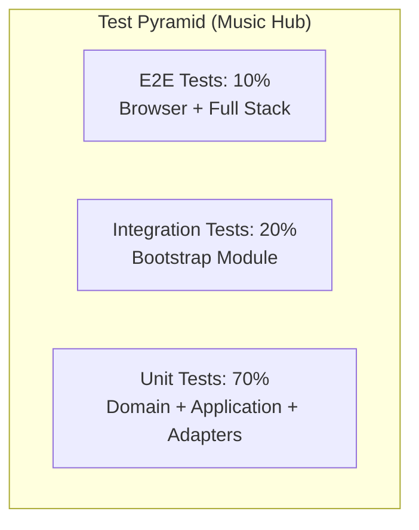
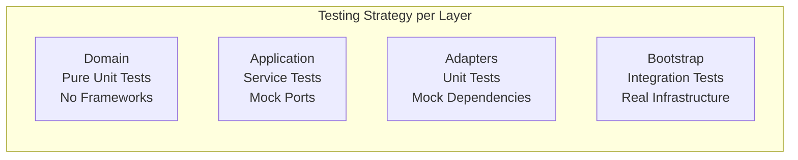

# Testing Best Practices

## Table of Contents

- [1. Testing Philosophy & Principles](#testing-philosophy--principles)
- [2. Backend Testing Standards](#backend-testing-standards)
- [3. Frontend Testing Standards](#frontend-testing-standards)
- [4. AI Agent Guidelines](#ai-agent-guidelines)
- [5. Templates & Boilerplates](#templates--boilerplates)
- [6. Performance Standards & Metrics](#performance-standards--metrics)
- [7. Common Anti-patterns to Avoid](#common-anti-patterns-to-avoid)

-----

## Testing Philosophy & Principles

### Testing Strategy Overview

Our testing approach follows the **Test Pyramid** with a focus on **Hexagonal Architecture** testing patterns:



### Core Testing Principles

1.  **Domain-First Testing**: Start with domain logic tests - they provide the highest ROI
2.  **Test Behavior, Not Implementation**: Focus on business outcomes, not internal mechanisms
3.  **Fast Feedback Loops**: Unit tests < 100ms, Integration tests < 5s
4.  **Test Isolation**: Each test should be independent and repeatable
5.  **Clear Test Intent**: Use descriptive names and Given/When/Then structure

### Hexagonal Architecture Testing Approach



-----

## Backend Testing Standards

### Domain Layer Testing

**Philosophy**: Domain tests are pure unit tests with no framework dependencies. They test business logic in isolation.

#### ✅ Excellent Example from Our Codebase

```java
// From: apps/producer/producer-domain/src/test/java/.../ProducerTest.java
@DisplayName("Producer Domain Model Tests")
class ProducerTest {

    @Nested
    @DisplayName("Track Management")
    class TrackManagement {

        @Test
        @DisplayName("Should add tracks with idempotent behavior and normalize ISRC input")
        void addTrack_isIdempotent_andNormalizesInput() {
            // Given
            Producer producer = Producer.createNew(ProducerCode.of("FRLA1"), null);
            
            // When & Then
            assertTrue(producer.addTrack("fr-la1-24-00001"), "First add should return true");
            assertFalse(producer.addTrack("FRLA12400001"), "Duplicate add should return false after normalization");
            assertTrue(producer.hasTrack(ISRC.of("FRLA12400001")), "Track should be present regardless of input format");
        }

        @Test
        @DisplayName("Should normalize and store canonical ISRC representation in tracks set")
        void addTrack_normalizesAndStoresCanonicalValue() {
            // Given
            Producer producer = Producer.createNew(ProducerCode.of("FRLA1"), null);

            // When
            assertTrue(producer.addTrack("fr-la1-24-00001"));

            // Then
            assertTrue(producer.tracks().contains(ISRC.of("FRLA12400001")));
        }
    }
}
```

#### Domain Testing Standards

- **Test Structure**: Use `@Nested` classes for logical grouping
- **Naming Convention**: `[MethodName]_should[ExpectedBehavior]_when[Condition]`
- **DisplayName**: Business-readable descriptions
- **No Mocking**: Test real domain objects, no frameworks
- **Value Objects**: Create real instances, never mock them
- **Defensive Programming**: Test null guards and edge cases

#### Maven Configuration for Domain Tests

```xml
<dependencies>
    <dependency>
        <groupId>org.junit.jupiter</groupId>
        <artifactId>junit-jupiter</artifactId>
        <scope>test</scope>
    </dependency>
    <dependency>
        <groupId>org.assertj</groupId>
        <artifactId>assertj-core</artifactId>
        <scope>test</scope>
    </dependency>
</dependencies>
```

### Application Layer Testing

**Philosophy**: Test application services with mocked ports to verify orchestration logic.

#### ✅ Excellent Example from Our Codebase

```java
// From: apps/producer/producer-application/src/test/java/.../RegisterTrackServiceTest.java
@ExtendWith(MockitoExtension.class)
@DisplayName("RegisterTrackService Application Layer Tests")
class RegisterTrackServiceTest {

    private RegisterTrackService service;

    @Mock
    private ProducerRepository repository;

    @BeforeEach
    void setUp() {
        repository = mock(ProducerRepository.class);
        service = new RegisterTrackService(repository);
    }

    @Test
    @DisplayName("Should create new producer when absent, add track, and ensure idempotent behavior")
    void handle_createsProducerWhenAbsent_andAddsTrack_idempotent() {
        // Given
        String input = "fr-la1-24-00001";
        ProducerCode code = ProducerCode.of("FRLA1");
        
        when(repository.findByProducerCode(code)).thenReturn(Optional.empty());
        when(repository.save(any())).thenAnswer(inv -> inv.getArgument(0));

        // When
        Producer result = service.registerTrack(input);

        // Then
        verify(repository).findByProducerCode(code);
        verify(repository).save(any());
        assertTrue(result.hasTrack(ISRC.of("FRLA12400001")), 
                  "Producer should contain the normalized track");
    }
}
```

#### Application Testing Standards

- **Mock Only Ports**: Mock repository interfaces, not domain objects
- **Verify Interactions**: Check that ports are called correctly
- **Test Orchestration**: Focus on how services coordinate domain + infrastructure
- **Business Scenarios**: Test complete use case flows
- **Error Handling**: Verify exception propagation and handling

### Adapter Testing (Unit Level)

**Philosophy**: Adapters are tested in isolation with all dependencies mocked.

#### REST Adapter Testing Standards

```java
// Template based on producer-adapter-rest tests
@ExtendWith(MockitoExtension.class)
@DisplayName("[Resource Name] REST Adapter Tests")
class ProducerResourceTest {

    @Mock
    private RegisterTrackUseCase registerTrackUseCase;
    
    private ProducerResource resource;

    @BeforeEach
    void setUp() {
        resource = new ProducerResource();
        resource.registerTrackUseCase = registerTrackUseCase;
    }

    @Test
    @DisplayName("Should return 202 when track registration succeeds")
    void register_shouldReturn202_whenTrackRegistrationSucceeds() {
        // Given
        Producer mockProducer = Producer.createNew(ProducerCode.of("FRLA1"), null);
        when(registerTrackUseCase.registerTrack("FRLA12400001")).thenReturn(mockProducer);
        
        var request = new ProducerResource.RegisterTrackRequest();
        request.isrc = "FRLA12400001";

        // When
        Response response = resource.register(request);

        // Then
        assertThat(response.getStatus()).isEqualTo(202);
        verify(registerTrackUseCase).registerTrack("FRLA12400001");
    }
}
```

#### Persistence Adapter Testing Standards

```java
// Template for persistence adapters
@ExtendWith(MockitoExtension.class)
class ProducerRepositoryImplTest {

    @Mock
    private EntityManager entityManager;
    
    @Mock
    private ProducerMapper mapper;
    
    private ProducerRepositoryImpl repository;

    @Test
    @DisplayName("Should find producer by code using correct query")
    void findByProducerCode_shouldUseCorrectQuery() {
        // Given
        ProducerCode code = ProducerCode.of("FRLA1");
        ProducerEntity entity = new ProducerEntity();
        Producer domain = Producer.createNew(code, null);
        
        when(entityManager.createQuery(any(String.class), eq(ProducerEntity.class)))
            .thenReturn(mockQuery);
        when(mockQuery.getResultList()).thenReturn(List.of(entity));
        when(mapper.toDomain(entity)).thenReturn(domain);

        // When
        Optional<Producer> result = repository.findByProducerCode(code);

        // Then
        assertThat(result).isPresent();
        verify(entityManager).createQuery(contains("SELECT p FROM ProducerEntity p WHERE p.producerCode = :code"), 
                                        eq(ProducerEntity.class));
    }
}
```

### Bootstrap Integration Testing

**Philosophy**: End-to-end tests with real infrastructure to verify complete flows.

#### ✅ Excellent Example from Our Codebase

```java
// From: apps/bootstrap/src/test/java/.../ProducerRegistrationIntegrationTest.java
@QuarkusTest
@DisplayName("Producer Registration Integration Tests")
class ProducerRegistrationIntegrationTest {
    
    @Inject
    EntityManager entityManager;

    @BeforeEach
    @Transactional
    void cleanDatabase() {
        entityManager.createQuery("DELETE FROM ProducerEntity").executeUpdate();
        entityManager.flush();
    }

    @Test
    @TestTransaction
    @DisplayName("Should register track successfully end-to-end")
    void shouldRegisterTrackEndToEnd() {
        given()
                .contentType(ContentType.JSON)
                .body("{\"isrc\":\"FRLA12400001\"}")
                .when()
                .post("/api/v1/producers")
                .then()
                .statusCode(202)
                .body("producerCode", equalTo("FRLA1"))
                .body("id", notNullValue())
                .body("tracks", hasSize(1))
                .body("tracks[0]", equalTo("FRLA12400001"));
    }

    @Test
    @TestTransaction
    @DisplayName("Should be idempotent when registering same track twice")
    void shouldBeIdempotentWhenRegisteringSameTrackTwice() {
        // First registration
        given().body("{\"isrc\":\"FRLA12400001\"}")
              .post("/api/v1/producers")
              .then().statusCode(202);

        // Second registration of same track - should be idempotent
        given().body("{\"isrc\":\"FRLA12400001\"}")
              .post("/api/v1/producers")
              .then()
              .statusCode(202)
              .body("tracks", hasSize(1)); // Still only one track
    }
}
```

### Bootstrap Integration Standards

- **Real Infrastructure**: Use `@QuarkusTest` with real database
- **Clean State**: Reset database in `@BeforeEach` with `@Transactional`
- **Complete Flows**: Test from HTTP request to database persistence
- **Business Scenarios**: Focus on user-facing functionality
- **Error Conditions**: Test 400, 422, 500 responses
- **Data Verification**: Check both HTTP response and database state

### Quarkus Test Configuration

```properties