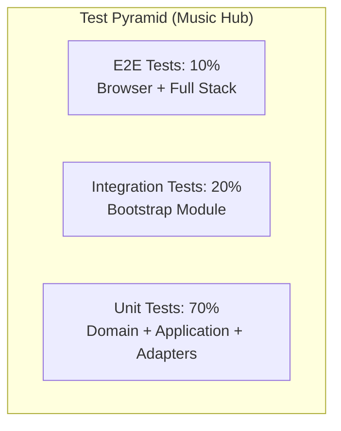
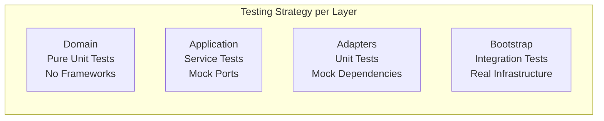

# Testing Best Practices - Music Hub Project

## Table of Contents

- [1. Testing Philosophy & Principles](#1-testing-philosophy--principles)
- [2. Backend Testing Standards](#2-backend-testing-standards)
- [3. Frontend Testing Standards](#3-frontend-testing-standards)
- [4. AI Agent Guidelines](#4-ai-agent-guidelines)
- [5. Templates & Boilerplates](#5-templates--boilerplates)
- [6. Performance Standards & Metrics](#6-performance-standards--metrics)
- [7. Common Anti-patterns to Avoid](#7-common-anti-patterns-to-avoid)

---

## 1. Testing Philosophy & Principles

### Testing Strategy Overview

Our testing approach follows the **Test Pyramid** with a focus on **Hexagonal Architecture** testing patterns:



### Core Testing Principles

1. **Domain-First Testing**: Start with domain logic tests - they provide the highest ROI
2. **Test Behavior, Not Implementation**: Focus on business outcomes, not internal mechanisms
3. **Fast Feedback Loops**: Unit tests < 100ms, Integration tests < 5s
4. **Test Isolation**: Each test should be independent and repeatable
5. **Clear Test Intent**: Use descriptive names and Given/When/Then structure

### Hexagonal Architecture Testing Approach



---

## 2. Backend Testing Standards

### 2.1 Domain Layer Testing

**Philosophy**: Domain tests are pure unit tests with no framework dependencies. They test business logic in isolation.

#### ✅ Excellent Example from Our Codebase

```java
// From: apps/producer/producer-domain/src/test/java/.../ProducerTest.java
@DisplayName("Producer Domain Model Tests")
class ProducerTest {

    @Nested
    @DisplayName("Track Management")
    class TrackManagement {

        @Test
        @DisplayName("Should add tracks with idempotent behavior and normalize ISRC input")
        void addTrack_isIdempotent_andNormalizesInput() {
            // Given
            Producer producer = Producer.createNew(ProducerCode.of("FRLA1"), null);
            
            // When & Then
            assertTrue(producer.addTrack("fr-la1-24-00001"), "First add should return true");
            assertFalse(producer.addTrack("FRLA12400001"), "Duplicate add should return false after normalization");
            assertTrue(producer.hasTrack(ISRC.of("FRLA12400001")), "Track should be present regardless of input format");
        }

        @Test
        @DisplayName("Should normalize and store canonical ISRC representation in tracks set")
        void addTrack_normalizesAndStoresCanonicalValue() {
            // Given
            Producer producer = Producer.createNew(ProducerCode.of("FRLA1"), null);

            // When
            assertTrue(producer.addTrack("fr-la1-24-00001"));

            // Then
            assertTrue(producer.tracks().contains(ISRC.of("FRLA12400001")));
        }
    }
}
```

#### Domain Testing Standards

- **Test Structure**: Use `@Nested` classes for logical grouping
- **Naming Convention**: `[MethodName]_should[ExpectedBehavior]_when[Condition]`
- **DisplayName**: Business-readable descriptions
- **No Mocking**: Test real domain objects, no frameworks
- **Value Objects**: Create real instances, never mock them
- **Defensive Programming**: Test null guards and edge cases

#### Maven Configuration for Domain Tests

```xml
<!-- In producer-domain/pom.xml -->
<dependencies>
    <!-- Only JUnit and AssertJ - NO Quarkus, NO Mockito -->
    <dependency>
        <groupId>org.junit.jupiter</groupId>
        <artifactId>junit-jupiter</artifactId>
        <scope>test</scope>
    </dependency>
    <dependency>
        <groupId>org.assertj</groupId>
        <artifactId>assertj-core</artifactId>
        <scope>test</scope>
    </dependency>
</dependencies>
```

### 2.2 Application Layer Testing

**Philosophy**: Test application services with mocked ports to verify orchestration logic.

#### ✅ Excellent Example from Our Codebase

```java
// From: apps/producer/producer-application/src/test/java/.../RegisterTrackServiceTest.java
@ExtendWith(MockitoExtension.class)
@DisplayName("RegisterTrackService Application Layer Tests")
class RegisterTrackServiceTest {

    private RegisterTrackService service;

    @Mock
    private ProducerRepository repository;

    @BeforeEach
    void setUp() {
        repository = mock(ProducerRepository.class);
        service = new RegisterTrackService(repository);
    }

    @Test
    @DisplayName("Should create new producer when absent, add track, and ensure idempotent behavior")
    void handle_createsProducerWhenAbsent_andAddsTrack_idempotent() {
        // Given
        String input = "fr-la1-24-00001";
        ProducerCode code = ProducerCode.of("FRLA1");
        
        when(repository.findByProducerCode(code)).thenReturn(Optional.empty());
        when(repository.save(any())).thenAnswer(inv -> inv.getArgument(0));

        // When
        Producer result = service.registerTrack(input);

        // Then
        verify(repository).findByProducerCode(code);
        verify(repository).save(any());
        assertTrue(result.hasTrack(ISRC.of("FRLA12400001")), 
                  "Producer should contain the normalized track");
    }
}
```

#### Application Testing Standards

- **Mock Only Ports**: Mock repository interfaces, not domain objects
- **Verify Interactions**: Check that ports are called correctly
- **Test Orchestration**: Focus on how services coordinate domain + infrastructure
- **Business Scenarios**: Test complete use case flows
- **Error Handling**: Verify exception propagation and handling

### 2.3 Adapter Testing (Unit Level)

**Philosophy**: Adapters are tested in isolation with all dependencies mocked.

#### REST Adapter Testing Standards

```java
// Template based on producer-adapter-rest tests
@ExtendWith(MockitoExtension.class)
@DisplayName("[Resource Name] REST Adapter Tests")
class ProducerResourceTest {

    @Mock
    private RegisterTrackUseCase registerTrackUseCase;
    
    private ProducerResource resource;

    @BeforeEach
    void setUp() {
        resource = new ProducerResource();
        resource.registerTrackUseCase = registerTrackUseCase;
    }

    @Test
    @DisplayName("Should return 202 when track registration succeeds")
    void register_shouldReturn202_whenTrackRegistrationSucceeds() {
        // Given
        Producer mockProducer = Producer.createNew(ProducerCode.of("FRLA1"), null);
        when(registerTrackUseCase.registerTrack("FRLA12400001")).thenReturn(mockProducer);
        
        var request = new ProducerResource.RegisterTrackRequest();
        request.isrc = "FRLA12400001";

        // When
        Response response = resource.register(request);

        // Then
        assertThat(response.getStatus()).isEqualTo(202);
        verify(registerTrackUseCase).registerTrack("FRLA12400001");
    }
}
```

#### Persistence Adapter Testing Standards

```java
// Template for persistence adapters
@ExtendWith(MockitoExtension.class)
class ProducerRepositoryImplTest {

    @Mock
    private EntityManager entityManager;
    
    @Mock
    private ProducerMapper mapper;
    
    private ProducerRepositoryImpl repository;

    @Test
    @DisplayName("Should find producer by code using correct query")
    void findByProducerCode_shouldUseCorrectQuery() {
        // Given
        ProducerCode code = ProducerCode.of("FRLA1");
        ProducerEntity entity = new ProducerEntity();
        Producer domain = Producer.createNew(code, null);
        
        when(entityManager.createQuery(any(String.class), eq(ProducerEntity.class)))
            .thenReturn(mockQuery);
        when(mockQuery.getResultList()).thenReturn(List.of(entity));
        when(mapper.toDomain(entity)).thenReturn(domain);

        // When
        Optional<Producer> result = repository.findByProducerCode(code);

        // Then
        assertThat(result).isPresent();
        verify(entityManager).createQuery(contains("SELECT p FROM ProducerEntity p WHERE p.producerCode = :code"), 
                                        eq(ProducerEntity.class));
    }
}
```

### 2.4 Bootstrap Integration Testing

**Philosophy**: End-to-end tests with real infrastructure to verify complete flows.

#### ✅ Excellent Example from Our Codebase

```java
// From: apps/bootstrap/src/test/java/.../ProducerRegistrationIntegrationTest.java
@QuarkusTest
@DisplayName("Producer Registration Integration Tests")
class ProducerRegistrationIntegrationTest {
    
    @Inject
    EntityManager entityManager;

    @BeforeEach
    @Transactional
    void cleanDatabase() {
        entityManager.createQuery("DELETE FROM ProducerEntity").executeUpdate();
        entityManager.flush();
    }

    @Test
    @TestTransaction
    @DisplayName("Should register track successfully end-to-end")
    void shouldRegisterTrackEndToEnd() {
        given()
                .contentType(ContentType.JSON)
                .body("{\"isrc\":\"FRLA12400001\"}")
                .when()
                .post("/api/v1/producers")
                .then()
                .statusCode(202)
                .body("producerCode", equalTo("FRLA1"))
                .body("id", notNullValue())
                .body("tracks", hasSize(1))
                .body("tracks[0]", equalTo("FRLA12400001"));
    }

    @Test
    @TestTransaction
    @DisplayName("Should be idempotent when registering same track twice")
    void shouldBeIdempotentWhenRegisteringSameTrackTwice() {
        // First registration
        given().body("{\"isrc\":\"FRLA12400001\"}")
              .post("/api/v1/producers")
              .then().statusCode(202);

        // Second registration of same track - should be idempotent
        given().body("{\"isrc\":\"FRLA12400001\"}")
              .post("/api/v1/producers")
              .then()
              .statusCode(202)
              .body("tracks", hasSize(1)); // Still only one track
    }
}
```

#### Bootstrap Integration Standards

- **Real Infrastructure**: Use `@QuarkusTest` with real database
- **Clean State**: Reset database in `@BeforeEach` with `@Transactional`
- **Complete Flows**: Test from HTTP request to database persistence
- **Business Scenarios**: Focus on user-facing functionality
- **Error Conditions**: Test 400, 422, 500 responses
- **Data Verification**: Check both HTTP response and database state

#### Quarkus Test Configuration

```properties
# apps/bootstrap/src/test/resources/application.properties
quarkus.datasource.db-kind=h2
quarkus.datasource.username=sa
quarkus.datasource.password=
quarkus.datasource.jdbc.url=jdbc:h2:mem:testdb;DB_CLOSE_DELAY=-1
quarkus.hibernate-orm.database.generation=drop-and-create
quarkus.hibernate-orm.log.sql=true
```

---

## 3. Frontend Testing Standards

### 3.1 Vitest Configuration

Our frontend uses **Vitest** + **React Testing Library** for component testing.

#### Current Configuration

```typescript
// apps/webui/vite.config.ts
export default defineConfig(({ mode }) => {
  const isTest = process.env.VITEST === "true" || mode === "test";
  return {
    plugins: [
      // Remix plugin interferes with Vitest; disable in test mode
      ...(isTest ? [] : [remix()]),
      tsconfigPaths(),
    ],
    test: {
      environment: "jsdom",
      setupFiles: "./vitest.setup.ts",
      globals: true,
      css: true,
      exclude: [...configDefaults.exclude, "e2e/**"],
    },
  };
});
```

```typescript
// apps/webui/vitest.setup.ts
import { expect, afterEach } from "vitest";
import { cleanup } from "@testing-library/react";
import * as matchers from "@testing-library/jest-dom/matchers";

afterEach(() => {
  cleanup();
});

expect.extend(matchers as any);
```

### 3.2 Component Testing Standards

#### ✅ Excellent Example from Our Codebase

```typescript
// From: apps/webui/tests/_index.test.tsx
import { render, screen, fireEvent, waitFor } from "@testing-library/react";
import React from "react";
import Index from "~/routes/_index";
import { ToastProvider } from "~/components/ui/toast";

// Mock registerTrack to control responses
vi.mock("~/lib/utils", async (orig) => {
  const actual = await (orig as any)();
  return {
    ...actual,
    registerTrack: vi.fn(async (_isrc: string) => ({ ok: true, status: 202 })),
  };
});

function typeIsrc(value: string) {
  const input = screen.getByLabelText(/isrc/i) as HTMLInputElement;
  fireEvent.change(input, { target: { value } });
  return input;
}

function renderWithProviders(ui: React.ReactElement) {
  return render(<ToastProvider>{ui}</ToastProvider>);
}

describe("Index route (ISRC form)", () => {
  it("disables button when ISRC invalid and enables when valid", () => {
    renderWithProviders(<Index />);
    const button = screen.getByRole("button", { name: /validate/i });

    typeIsrc("INVALID");
    expect(button).toBeDisabled();

    typeIsrc("FR-LA1-24-00001"); // normalizes to FRLA12400001
    expect(button).not.toBeDisabled();
  });

  it("shows spinner while submitting and emits success toast on 202", async () => {
    renderWithProviders(<Index />);
    typeIsrc("FRLA12400001");

    const button = screen.getByRole("button", { name: /validate/i });
    fireEvent.click(button);

    await waitFor(() => {
      expect(screen.getByText(/Accepted \(202\)/i)).toBeInTheDocument();
    });
  });
});
```

#### Frontend Testing Standards

- **Component Isolation**: Test components in isolation with mocked dependencies
- **User Interactions**: Use `fireEvent` and `userEvent` for realistic interactions
- **Accessibility**: Query by role, label, and accessible names
- **Async Operations**: Use `waitFor` for asynchronous updates
- **Provider Wrapping**: Wrap components with necessary providers (Toast, Router, etc.)
- **Mock External Calls**: Mock API utilities, not internal component logic

### 3.3 API Mocking Strategy

```typescript
// Mock strategy for API calls
vi.mock("~/lib/utils", async (orig) => {
  const actual = await (orig as any)();
  return {
    ...actual,
    registerTrack: vi.fn(),
  };
});

// In test, control the mock behavior
const { registerTrack } = await import("~/lib/utils");
(registerTrack as any).mockResolvedValueOnce({ ok: false, status: 400 });
```

### 3.4 Package.json Scripts

```json
{
  "scripts": {
    "test": "vitest run",
    "test:watch": "vitest",
    "test:coverage": "vitest run --coverage"
  }
}
```

---

## 4. AI Agent Guidelines

### 4.1 Test Creation Rules for AI Agents

#### CRITICAL RULES - ALWAYS FOLLOW

1. **ALWAYS use @DisplayName with descriptive business language**
   ```java
   // ✅ GOOD
   @DisplayName("Should create producer when ISRC submitted for unknown registrant code")
   
   // ❌ BAD
   @Test
   void testCreateProducer()
   ```

2. **NEVER mock Value Objects - create real instances**
   ```java
   // ✅ GOOD
   ISRC isrc = ISRC.of("FRLA12400001");
   
   // ❌ BAD
   @Mock ISRC mockIsrc;
   ```

3. **ALWAYS follow Given/When/Then structure**
   ```java
   @Test
   void shouldDoSomething() {
       // Given - Arrange test data
       
       // When - Execute the action
       
       // Then - Verify the outcome
   }
   ```

4. **USE specific assertion messages**
   ```java
   // ✅ GOOD
   assertTrue(result.hasTrack(isrc), "Producer should contain the registered track");
   
   // ❌ BAD
   assertTrue(result.hasTrack(isrc));
   ```

#### AI Test Generation Patterns

**Domain Tests Pattern:**
```java
// Pattern for AI to follow when creating domain tests
@DisplayName("[AggregateRoot] Domain Model Tests")
class [AggregateRoot]Test {
    
    @Nested
    @DisplayName("[BusinessConcept] Management")
    class [BusinessConcept]Management {
        
        @Test
        @DisplayName("Should [businessBehavior] when [businessCondition]")
        void [methodName]_should[Behavior]_when[Condition]() {
            // Given
            [AggregateRoot] [aggregate] = [AggregateRoot].createNew([params]);
            
            // When
            [Type] result = [aggregate].[method]([params]);
            
            // Then
            assertThat(result).[assertion]("[business meaningful message]");
        }
    }
}
```

**Application Service Tests Pattern:**
```java
@ExtendWith(MockitoExtension.class)
@DisplayName("[ServiceName] Application Layer Tests")
class [ServiceName]Test {
    
    @Mock
    private [PortInterface] [portName];
    
    private [ServiceName] service;
    
    @BeforeEach
    void setUp() {
        service = new [ServiceName]([portName]);
    }
    
    @Test
    @DisplayName("Should [businessOutcome] when [businessScenario]")
    void [useCase]_should[Outcome]_when[Scenario]() {
        // Given
        when([portName].[method]([params])).thenReturn([expectedValue]);
        
        // When
        [ReturnType] result = service.[useCaseMethod]([params]);
        
        // Then
        verify([portName]).[method]([expectedParams]);
        assertThat(result).[assertion]();
    }
}
```

### 4.2 Test Naming Conventions for AI

#### Method Naming Pattern:
`[methodUnderTest]_should[ExpectedBehavior]_when[InputCondition]`

**Examples:**
```java
// Domain tests
addTrack_shouldReturnTrue_whenTrackIsNew()
addTrack_shouldReturnFalse_whenTrackAlreadyExists()
hasTrack_shouldReturnFalse_whenTrackNotPresent()

// Application tests
registerTrack_shouldCreateProducer_whenProducerCodeUnknown()
registerTrack_shouldReuseProducer_whenProducerCodeExists()
registerTrack_shouldThrowException_whenISRCInvalid()

// Integration tests
shouldReturn202_whenValidISRCSubmitted()
shouldReturn400_whenISRCFormatInvalid()
shouldReturn422_whenISRCValidButUnresolvable()
```

### 4.3 Common AI Mistakes to Avoid

#### ❌ DON'T Mock Value Objects
```java
// ❌ WRONG - Never mock value objects
@Mock ISRC mockIsrc;
@Mock ProducerCode mockCode;

// ✅ CORRECT - Create real instances
ISRC isrc = ISRC.of("FRLA12400001");
ProducerCode code = ProducerCode.of("FRLA1");
```

#### ❌ DON'T Test Implementation Details
```java
// ❌ WRONG - Testing internal implementation
verify(producer).validateTrack(any()); // private method

// ✅ CORRECT - Testing public behavior
assertTrue(producer.hasTrack(isrc));
```

#### ❌ DON'T Use Overly Complex Mocking
```java
// ❌ WRONG - Complex mock setup
when(repository.findByProducerCode(any()))
    .thenAnswer(invocation -> {
        ProducerCode code = invocation.getArgument(0);
        // Complex logic here
    });

// ✅ CORRECT - Simple, focused mocking
when(repository.findByProducerCode(code)).thenReturn(Optional.of(producer));
```

---

## 5. Templates & Boilerplates

### 5.1 Domain Entity Test Template

```java
package com.musichub.[context].domain.model;

import org.junit.jupiter.api.DisplayName;
import org.junit.jupiter.api.Nested;
import org.junit.jupiter.api.Test;
import static org.junit.jupiter.api.Assertions.*;

@DisplayName("[EntityName] Domain Model Tests")
class [EntityName]Test {

    @Nested
    @DisplayName("Factory Methods")
    class FactoryMethods {
        
        @Test
        @DisplayName("Should create valid [entity] with required fields")
        void createNew_shouldCreateValidEntity_withRequiredFields() {
            // Given
            [ValueObjectType] [param] = [ValueObjectType].of("[validValue]");
            
            // When
            [EntityName] [entity] = [EntityName].createNew([param], [optionalParam]);
            
            // Then
            assertNotNull([entity].[param](), "[param] should not be null");
            assertEquals([param], [entity].[param](), "[param] should be preserved");
        }
        
        @Test
        @DisplayName("Should throw exception when required field is null")
        void createNew_shouldThrowException_whenRequiredFieldNull() {
            // When & Then
            assertThrows(NullPointerException.class, 
                       () -> [EntityName].createNew(null, [optionalParam]),
                       "[param] must not be null");
        }
    }

    @Nested
    @DisplayName("[BusinessConcept] Management")
    class [BusinessConcept]Management {
        
        @Test
        @DisplayName("Should [behavior] when [condition]")
        void [method]_should[Behavior]_when[Condition]() {
            // Given
            [EntityName] [entity] = [EntityName].createNew([validParams]);
            
            // When
            [ReturnType] result = [entity].[method]([params]);
            
            // Then
            [assertions with meaningful messages]
        }
    }
}
```

### 5.2 Application Service Test Template

```java
package com.musichub.[context].application;

import org.junit.jupiter.api.BeforeEach;
import org.junit.jupiter.api.DisplayName;
import org.junit.jupiter.api.Nested;
import org.junit.jupiter.api.Test;
import org.junit.jupiter.api.extension.ExtendWith;
import org.mockito.Mock;
import org.mockito.junit.jupiter.MockitoExtension;
import static org.mockito.ArgumentMatchers.*;
import static org.mockito.Mockito.*;
import static org.junit.jupiter.api.Assertions.*;

@ExtendWith(MockitoExtension.class)
@DisplayName("[ServiceName] Application Layer Tests")
class [ServiceName]Test {

    private [ServiceName] service;

    @Mock
    private [RepositoryPort] [repositoryMock];
    
    @Mock
    private [ServicePort] [serviceMock];

    @BeforeEach
    void setUp() {
        service = new [ServiceName]([repositoryMock], [serviceMock]);
    }

    @Nested
    @DisplayName("[UseCase] Processing")
    class [UseCase]Processing {

        @Test
        @DisplayName("Should [businessOutcome] when [businessScenario]")
        void [useCaseMethod]_should[Outcome]_when[Scenario]() {
            // Given
            [InputType] input = [createTestInput];
            [EntityType] [entity] = [createTestEntity];
            
            when([repositoryMock].[repositoryMethod](any())).thenReturn([expectedValue]);
            when([serviceMock].[serviceMethod](any())).thenReturn([expectedValue]);

            // When
            [ReturnType] result = service.[useCaseMethod](input);

            // Then
            verify([repositoryMock]).[repositoryMethod]([expectedParams]);
            verify([serviceMock]).[serviceMethod]([expectedParams]);
            [assertions with business meaning]
        }

        @Test
        @DisplayName("Should handle exception when [errorCondition]")
        void [useCaseMethod]_shouldHandleException_when[ErrorCondition]() {
            // Given
            [InputType] input = [createInvalidInput];
            when([repositoryMock].[method](any())).thenThrow(new [ExceptionType]("[message]"));

            // When & Then
            [ExceptionType] exception = assertThrows([ExceptionType].class, 
                                                   () -> service.[useCaseMethod](input));
            assertEquals("[expectedMessage]", exception.getMessage());
        }
    }
}
```

### 5.3 REST Adapter Test Template

```java
package com.musichub.[context].adapter.rest;

import org.junit.jupiter.api.BeforeEach;
import org.junit.jupiter.api.DisplayName;
import org.junit.jupiter.api.Test;
import org.junit.jupiter.api.extension.ExtendWith;
import org.mockito.Mock;
import org.mockito.junit.jupiter.MockitoExtension;
import jakarta.ws.rs.core.Response;
import static org.mockito.ArgumentMatchers.*;
import static org.mockito.Mockito.*;
import static org.assertj.core.api.Assertions.*;

@ExtendWith(MockitoExtension.class)
@DisplayName("[ResourceName] REST Adapter Tests")
class [ResourceName]Test {

    @Mock
    private [UseCasePort] [useCaseMock];
    
    private [ResourceName] resource;

    @BeforeEach
    void setUp() {
        resource = new [ResourceName]();
        resource.[useCaseField] = [useCaseMock];
    }

    @Test
    @DisplayName("Should return [statusCode] when [condition]")
    void [endpoint]_shouldReturn[StatusCode]_when[Condition]() {
        // Given
        [RequestType] request = new [RequestType]();
        request.[field] = "[validValue]";
        
        [DomainType] [domainObject] = [createDomainObject];
        when([useCaseMock].[method](any())).thenReturn([domainObject]);

        // When
        Response response = resource.[endpointMethod](request);

        // Then
        assertThat(response.getStatus()).isEqualTo([expectedStatusCode]);
        verify([useCaseMock]).[method]("[expectedValue]");
        
        // Verify response body if needed
        [ResponseType] responseBody = ([ResponseType]) response.getEntity();
        assertThat(responseBody.[field]).isEqualTo("[expectedValue]");
    }

    @Test
    @DisplayName("Should return 400 when request validation fails")
    void [endpoint]_shouldReturn400_whenRequestValidationFails() {
        // Given
        [RequestType] request = new [RequestType]();
        request.[field] = null; // or invalid value

        // When
        Response response = resource.[endpointMethod](request);

        // Then
        assertThat(response.getStatus()).isEqualTo(400);
        verifyNoInteractions([useCaseMock]);
        
        [ErrorResponseType] errorBody = ([ErrorResponseType]) response.getEntity();
        assertThat(errorBody.error).isEqualTo("[expectedErrorCode]");
        assertThat(errorBody.message).contains("[expectedMessagePart]");
    }
}
```

### 5.4 Integration Test Template (Bootstrap)

```java
package com.musichub.bootstrap.[context];

import io.quarkus.test.TestTransaction;
import io.quarkus.test.junit.QuarkusTest;
import io.restassured.http.ContentType;
import jakarta.inject.Inject;
import jakarta.persistence.EntityManager;
import jakarta.transaction.Transactional;
import org.junit.jupiter.api.BeforeEach;
import org.junit.jupiter.api.DisplayName;
import org.junit.jupiter.api.Test;

import static io.restassured.RestAssured.given;
import static org.hamcrest.Matchers.*;

@QuarkusTest
@DisplayName("[FeatureName] Integration Tests")
class [FeatureName]IntegrationTest {
    
    @Inject
    EntityManager entityManager;

    @BeforeEach
    @Transactional
    void cleanDatabase() {
        // Clean in correct order (respect foreign keys)
        entityManager.createQuery("DELETE FROM [ChildEntity]").executeUpdate();
        entityManager.createQuery("DELETE FROM [ParentEntity]").executeUpdate();
        entityManager.flush();
    }

    @Test
    @TestTransaction
    @DisplayName("Should [businessOutcome] end-to-end")
    void should[BusinessOutcome]EndToEnd() {
        given()
                .contentType(ContentType.JSON)
                .body("[validJsonRequest]")
                .when()
                .post("[endpoint]")
                .then()
                .statusCode([expectedStatus])
                .body("[field]", equalTo("[expectedValue]"))
                .body("[collection]", hasSize([expectedSize]));
    }

    @Test
    @TestTransaction
    @DisplayName("Should handle [businessScenario] correctly")
    void shouldHandle[BusinessScenario]Correctly() {
        // Given - setup initial state if needed
        given().body("[setupRequest]").post("[endpoint]");

        // When & Then - test the actual scenario
        given()
                .contentType(ContentType.JSON)
                .body("[testRequest]")
                .when()
                .post("[endpoint]")
                .then()
                .statusCode([expectedStatus])
                .[additionalAssertions];
    }

    @Test
    @DisplayName("Should return [errorStatus] when [errorCondition]")
    void shouldReturn[ErrorStatus]When[ErrorCondition]() {
        given()
                .contentType(ContentType.JSON)
                .body("[invalidRequest]")
                .when()
                .post("[endpoint]")
                .then()
                .statusCode([errorStatus])
                .body("error", equalTo("[errorCode]"))
                .body("message", containsString("[errorMessagePart]"));
    }
}
```

### 5.5 Frontend Component Test Template

```typescript
// Template for component tests
import { render, screen, fireEvent, waitFor } from "@testing-library/react";
import { userEvent } from "@testing-library/user-event";
import { vi } from "vitest";
import React from "react";
import [ComponentName] from "~/components/[ComponentName]";

// Mock external dependencies
vi.mock("~/lib/[utilModule]", () => ({
  [utilFunction]: vi.fn(),
}));

// Helper functions
function render[ComponentName]WithProviders(props = {}) {
  const defaultProps = {
    // default props
  };
  
  return render(
    <[RequiredProvider]>
      <[ComponentName] {...defaultProps} {...props} />
    </[RequiredProvider]>
  );
}

describe("[ComponentName]", () => {
  beforeEach(() => {
    vi.clearAllMocks();
  });

  it("should [behavior] when [condition]", () => {
    // Given
    render[ComponentName]WithProviders();
    
    // When
    const [element] = screen.getBy[Query]("[selector]");
    fireEvent.[event]([element], [eventData]);
    
    // Then
    expect(screen.getBy[Query]("[expectedElement]")).toBeInTheDocument();
    expect([element]).toHave[Attribute]("[expectedAttribute]");
  });

  it("should handle async operations correctly", async () => {
    // Given
    const mockFn = vi.fn().mockResolvedValue([mockResult]);
    vi.mocked([utilFunction]).mockImplementation(mockFn);
    
    render[ComponentName]WithProviders();
    
    // When
    const button = screen.getByRole("button", { name: /[buttonText]/i });
    fireEvent.click(button);
    
    // Then
    await waitFor(() => {
      expect(screen.getBy[Query]("[expectedResult]")).toBeInTheDocument();
    });
    
    expect(mockFn).toHaveBeenCalledWith([expectedArgs]);
  });
});
```

---

## 6. Performance Standards & Metrics

### 6.1 Test Execution Time Targets

#### Time Limits by Test Type

| Test Type | Target Time | Maximum Time | Rationale |
|-----------|-------------|--------------|-----------|
| Domain Unit Tests | < 50ms | < 100ms | Pure logic, no I/O |
| Application Unit Tests | < 100ms | < 200ms | Mock interactions only |
| Adapter Unit Tests | < 100ms | < 200ms | Mock external dependencies |
| Integration Tests | < 2s | < 5s | Real database, HTTP calls |
| Frontend Component Tests | < 200ms | < 500ms | DOM rendering, no API |
| E2E Tests | < 30s | < 60s | Full browser automation |

#### Performance Monitoring

```xml
<!-- Maven Surefire configuration for performance monitoring -->
<plugin>
    <artifactId>maven-surefire-plugin</artifactId>
    <configuration>
        <systemPropertyVariables>
            <junit.jupiter.execution.timeout.default>PT5S</junit.jupiter.execution.timeout.default>
            <junit.jupiter.execution.timeout.test>PT10S</junit.jupiter.execution.timeout.test>
        </systemPropertyVariables>
    </configuration>
</plugin>
```

### 6.2 Test Coverage Standards

#### Coverage Targets by Layer

| Layer | Line Coverage | Branch Coverage | Justification |
|-------|---------------|-----------------|---------------|
| Domain | 95%+ | 90%+ | Critical business logic |
| Application | 90%+ | 85%+ | Use case orchestration |
| Adapters | 80%+ | 75%+ | Integration logic |
| REST Controllers | 85%+ | 80%+ | API contract validation |
| Overall Backend | 80%+ | 75%+ | PRD requirement |
| Frontend Components | 80%+ | 70%+ | PRD requirement |

#### JaCoCo Configuration

```xml
<!-- Maven JaCoCo configuration -->
<plugin>
    <groupId>org.jacoco</groupId>
    <artifactId>jacoco-maven-plugin</artifactId>
    <version>0.8.13</version>
    <executions>
        <execution>
            <id>prepare-agent</id>
            <goals>
                <goal>prepare-agent</goal>
            </goals>
        </execution>
        <execution>
            <id>report</id>
            <phase>test</phase>
            <goals>
                <goal>report</goal>
            </goals>
        </execution>
        <execution>
            <id>check</id>
            <goals>
                <goal>check</goal>
            </goals>
            <configuration>
                <rules>
                    <rule>
                        <element>PACKAGE</element>
                        <limits>
                            <limit>
                                <counter>LINE</counter>
                                <value>COVEREDRATIO</value>
                                <minimum>0.80</minimum>
                            </limit>
                        </limits>
                    </rule>
                </rules>
            </configuration>
        </execution>
    </executions>
</plugin>
```

### 6.3 Database Performance for Tests

#### Test Database Strategy

```java
@BeforeEach
@Transactional
void cleanDatabase() {
    // ✅ GOOD: Clean in correct order, fast
    entityManager.createQuery("DELETE FROM ChildEntity").executeUpdate();
    entityManager.createQuery("DELETE FROM ParentEntity").executeUpdate();
    entityManager.flush();
}

// ❌ BAD: Don't clean in @AfterEach
@AfterEach 
void slowCleanup() {
    // This slows down test execution unnecessarily
}
```

#### H2 vs PostgreSQL for Tests

```properties
# Fast tests - H2 in memory
%test.quarkus.datasource.db-kind=h2
%test.quarkus.datasource.username=sa  
%test.quarkus.datasource.password=
%test.quarkus.datasource.jdbc.url=jdbc:h2:mem:testdb;DB_CLOSE_DELAY=-1

# Production-like tests - PostgreSQL with TestContainers
%integration-test.quarkus.datasource.db-kind=postgresql
%integration-test.quarkus.datasource.username=test
%integration-test.quarkus.datasource.password=test
```

### 6.4 CI/CD Performance Optimization

#### Parallel Test Execution

```xml
<!-- Maven parallel execution -->
<plugin>
    <artifactId>maven-surefire-plugin</artifactId>
    <configuration>
        <parallel>methods</parallel>
        <threadCount>4</threadCount>
        <perCoreThreadCount>1</perCoreThreadCount>
    </configuration>
</plugin>
```

#### Frontend Test Performance

```json
// Package.json test scripts optimization
{
  "scripts": {
    "test": "vitest run --reporter=dot",
    "test:watch": "vitest --reporter=verbose",
    "test:ci": "vitest run --reporter=junit --outputFile=test-results.xml"
  }
}
```

---

## 7. Common Anti-patterns to Avoid

### 7.1 Backend Anti-patterns

#### ❌ DON'T Mock Value Objects

```java
// ❌ WRONG: Mocking immutable value objects
@Mock ISRC mockIsrc;
@Mock ProducerCode mockCode;

when(mockIsrc.value()).thenReturn("FRLA12400001");
when(mockCode.value()).thenReturn("FRLA1");

// ✅ CORRECT: Create real value objects
ISRC isrc = ISRC.of("FRLA12400001");
ProducerCode code = ProducerCode.of("FRLA1");
```

**Why?** Value objects are immutable and contain validation logic. Mocking bypasses this validation and creates unrealistic test scenarios.

#### ❌ DON'T Test Implementation Details

```java
// ❌ WRONG: Testing private methods indirectly
@Test
void shouldValidateISRCFormat() {
    // Testing internal validation logic
    verify(producer).validateISRCFormat(any());
}

// ✅ CORRECT: Test public behavior
@Test
void shouldThrowException_whenISRCFormatInvalid() {
    assertThrows(IllegalArgumentException.class, 
                () -> producer.addTrack("INVALID"));
}
```

**Why?** Tests should verify business behavior, not implementation details. Testing private methods makes tests brittle.

#### ❌ DON'T Mock Everything in Integration Tests

```java
// ❌ WRONG: Mocking infrastructure in integration tests
@QuarkusTest
class IntegrationTest {
    @Mock EntityManager mockEntityManager;
    @Mock DataSource mockDataSource;
}

// ✅ CORRECT: Use real infrastructure
@QuarkusTest
class IntegrationTest {
    @Inject EntityManager entityManager; // Real database
}
```

**Why?** Integration tests should verify that components work together with real infrastructure.

#### ❌ DON'T Ignore Test Data Setup

```java
// ❌ WRONG: Hard-coded magic values
@Test
void shouldFindProducer() {
    Producer producer = repository.findById("550e8400-e29b-41d4-a716-446655440000");
    // Test assumes this ID exists - brittle!
}

// ✅ CORRECT: Explicit test data setup
@Test
void shouldFindProducer() {
    // Given
    Producer producer = Producer.createNew(ProducerCode.of("FRLA1"), "Test Label");
    Producer saved = repository.save(producer);
    
    // When
    Optional<Producer> found = repository.findById(saved.id());
    
    // Then
    assertThat(found).isPresent();
}
```

#### ❌ DON'T Use Generic Exception Testing

```java
// ❌ WRONG: Generic exception testing
@Test
void shouldThrowException() {
    assertThrows(Exception.class, () -> service.doSomething());
}

// ✅ CORRECT: Specific exception with message validation
@Test
void shouldThrowIllegalArgumentException_whenISRCFormatInvalid() {
    IllegalArgumentException exception = assertThrows(
        IllegalArgumentException.class, 
        () -> ISRC.of("INVALID"),
        "Should reject invalid ISRC format"
    );
    assertThat(exception.getMessage()).contains("ISRC value 'INVALID' is invalid");
}
```

### 7.2 Frontend Anti-patterns

#### ❌ DON'T Test Implementation Details

```typescript
// ❌ WRONG: Testing internal state
test("should update state when input changes", () => {
  const { getByLabelText } = render(<Component />);
  const input = getByLabelText("ISRC");
  
  fireEvent.change(input, { target: { value: "FRLA12400001" } });
  
  // Testing internal state - brittle
  expect(component.state.isrc).toBe("FRLA12400001");
});

// ✅ CORRECT: Test user-visible behavior
test("should enable submit button when valid ISRC entered", () => {
  const { getByLabelText, getByRole } = render(<Component />);
  const input = getByLabelText("ISRC");
  const button = getByRole("button", { name: /validate/i });
  
  fireEvent.change(input, { target: { value: "FRLA12400001" } });
  
  expect(button).not.toBeDisabled();
});
```

#### ❌ DON'T Over-Mock in Component Tests

```typescript
// ❌ WRONG: Mocking too much
vi.mock("react", () => ({
  useState: vi.fn(),
  useEffect: vi.fn(),
  // Mocking React itself - avoid this
}));

// ✅ CORRECT: Mock only external dependencies
vi.mock("~/lib/utils", () => ({
  registerTrack: vi.fn(),
}));
```

#### ❌ DON'T Use findBy* for Immediate Elements

```typescript
// ❌ WRONG: Using findBy for elements that should be immediately present
test("should show title", async () => {
  render(<Component />);
  const title = await screen.findByText("music-data-hub");
  expect(title).toBeInTheDocument();
});

// ✅ CORRECT: Use getBy for immediate elements
test("should show title", () => {
  render(<Component />);
  const title = screen.getByText("music-data-hub");
  expect(title).toBeInTheDocument();
});

// ✅ CORRECT: Use findBy for async elements
test("should show success message after submission", async () => {
  render(<Component />);
  fireEvent.click(screen.getByRole("button"));
  
  const message = await screen.findByText(/accepted/i);
  expect(message).toBeInTheDocument();
});
```

### 7.3 General Testing Anti-patterns

#### ❌ DON'T Write Flaky Tests

```java
// ❌ WRONG: Time-dependent tests
@Test
void shouldProcessWithinTime() {
    long start = System.currentTimeMillis();
    service.process();
    long duration = System.currentTimeMillis() - start;
    assertTrue(duration < 1000); // Flaky - depends on system load
}

// ✅ CORRECT: Test behavior, not timing
@Test  
void shouldCompleteProcessing() {
    ProcessingResult result = service.process();
    assertThat(result.isComplete()).isTrue();
}
```

#### ❌ DON'T Create Test Dependencies

```java
// ❌ WRONG: Tests that depend on each other
@Test
@Order(1)
void createProducer() {
    producer = service.createProducer();
    // State stored for next test - bad!
}

@Test  
@Order(2)
void addTrackToProducer() {
    service.addTrack(producer, track); // Depends on previous test
}

// ✅ CORRECT: Independent tests
@Test
void shouldCreateProducer() {
    Producer producer = service.createProducer();
    assertThat(producer).isNotNull();
}

@Test
void shouldAddTrackToProducer() {
    // Given - independent setup
    Producer producer = service.createProducer();
    Track track = createTestTrack();
    
    // When
    service.addTrack(producer, track);
    
    // Then
    assertThat(producer.tracks()).contains(track);
}
```

#### ❌ DON'T Ignore Test Maintenance

```java
// ❌ WRONG: Commented out failing tests
// @Test
// void oldTestThatBroke() {
//     // This test started failing, so we commented it out
//     // TODO: fix this someday
// }

// ✅ CORRECT: Fix or remove broken tests immediately
// If a test breaks due to business logic changes:
// 1. Update the test to reflect new requirements
// 2. Remove the test if functionality was removed  
// 3. Add new tests for new functionality
```

---

## Conclusion

This document establishes the testing standards for the Music Hub project, ensuring consistent, high-quality tests across all layers of our Hexagonal Architecture. These practices support both human developers and AI agents in creating maintainable, reliable tests.

### Key Takeaways:

1. **Test Pyramid**: 70% Unit, 20% Integration, 10% E2E
2. **Hexagonal Testing**: Different strategies for Domain, Application, Adapters, and Bootstrap
3. **Quality Over Coverage**: Focus on meaningful tests, not just coverage numbers
4. **Performance Matters**: Fast tests enable rapid feedback and productive development
5. **AI-Friendly Patterns**: Consistent templates and clear guidelines for automated test generation

### Quick Reference:

- **Domain Tests**: Pure unit tests, no frameworks, test business logic
- **Application Tests**: Mock ports, test orchestration
- **Adapter Tests**: Unit tests with mocked dependencies  
- **Bootstrap Tests**: Integration tests with real infrastructure
- **Frontend Tests**: Component tests with RTL, mock external dependencies
- **Coverage Target**: 80% minimum, focus on critical paths

For specific examples and templates, refer to the relevant sections above. When in doubt, follow the patterns established in our existing codebase and prioritize clarity and maintainability over cleverness.