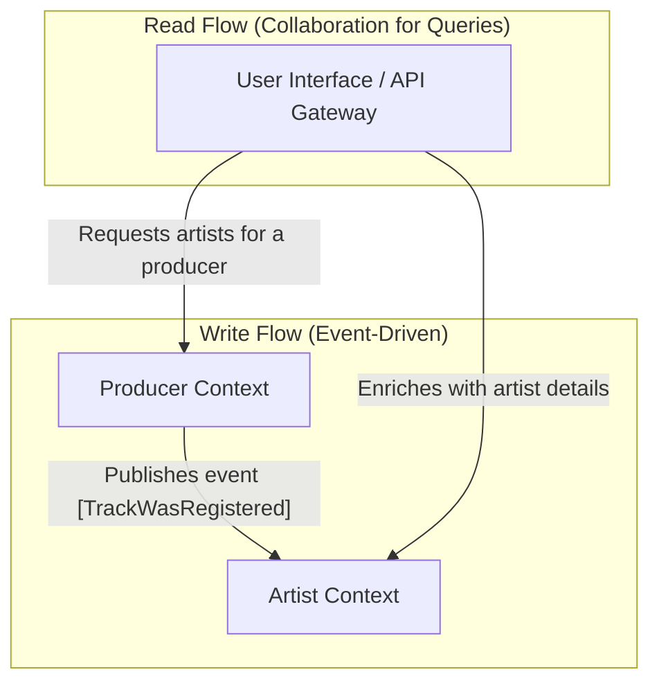
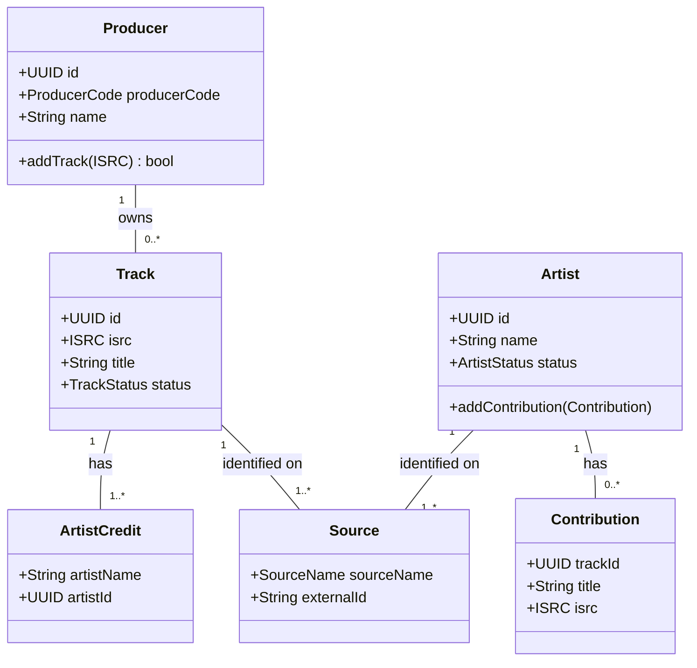

# Domain Charter: Music Hub

* **Version:** 1.0
* **Last Updated:** 2025-09-06

## 1\. Vision & Core Business Problem

Music Hub's mission is to create a centralized product to consolidate and verify music catalogs for producers, labels, and artists. The core business problem it solves is eliminating the time-consuming and error-prone manual management of catalogs currently handled in spreadsheets, which leads to a lack of data reliability.

-----

## 2\. Ubiquitous Language (Business Glossary)

This is the single source of truth for all business terms. Code, tests, documentation, and conversations **must** use these terms and definitions.

| Term | Business Definition | Technical Notes / Constraints |
| :--- | :--- | :--- |
| **ISRC** | (International Standard Recording Code) The unique, international identifier for a sound recording. | Format: `CC-XXX-YY-NNNNN`. Always stored without hyphens. |
| **Producer** | The entity (often a label) that owns the rights to one or more recordings (Tracks), identified by a `ProducerCode`. | Represents the primary aggregate of the "Producer" context. |
| **ProducerCode** | The unique 5-character identifier for a `Producer`, derived from the first 5 characters of an ISRC. | Example: 'FRLA1'. Used to group all tracks under the same rights holder. |
| **Track** | A unique musical recording, identified by an ISRC. | Belongs to the `Producer` aggregate. Cannot exist on its own. |
| **Artist** | The person or group credited on a `Track`. | The primary aggregate of the "Artist" context. |
| **ArtistCredit** | The official credit linking an `Artist` to a specific `Track`. | Part of the `Track` data model. Contains the artist's name and potentially their unique ID. |
| **Contribution** | A record of a `Track` to which an `Artist` has contributed. | Part of the `Artist` data model. Contains the track's ID, title, and ISRC to link back to the track. |
| **Source** | A record linking an entity (like a `Track` or `Artist`) to its unique identifier on a specific external platform or internal system. | A composite object containing a `sourceName` (e.g., 'SPOTIFY') and an `externalId` (the entity's ID on that platform). |
| **Status** | Represents the lifecycle state of an entity like a Track or Artist, indicating its level of validation. | Can be `PROVISIONAL` (automatically created, needs review) or `VERIFIED` (manually confirmed or from a trusted source). |

-----

## 3\. Bounded Contexts

A description of the application's logical subdomains.

### A. Producer Context

* **Mission:** To manage the catalog of producers and the registration of their musical tracks. It is the entry point for all new music.
* **Core Aggregates:** `Producer`, `Track`.
* **Key Responsibilities:**
    * Validate a `ProducerCode` from an ISRC and create the `Producer` if it's unknown.
    * Fetch track metadata from external services (e.g., Spotify, Tidal).
    * Register a new `Track` and add it to the correct `Producer` aggregate.
    * Publish a `TrackWasRegistered` event upon successful registration.
    * Provide a consolidated view of all artists who contributed to its tracks.

### B. Artist Context

* **Mission:** To manage information about artists and their contributions to various tracks. It consolidates the "artist" view of the catalog.
* **Core Aggregates:** `Artist`.
* **Key Responsibilities:**
    * Consume `TrackWasRegistered` events from the Producer Context.
    * For each artist credit in the event, perform a reconciliation:
        * Search for a matching artist in its own database.
        * If the artist is unknown or provisional, query external APIs (using the track's source information) to find a definitive profile and `externalId`.
    * Create a new `Artist` profile (with a `PROVISIONAL` or `VERIFIED` status) if one doesn't exist.
    * Link a registered track to the corresponding `Artist`'s list of contributions.
    * Provide functionalities to view and update Artist information.
    * Provide a consolidated view of all producers an artist has collaborated with.

-----

## 4\. Context Map

How the contexts interact with each other.

* **Event-Driven Relationship (Upstream/Downstream):** The **Producer** context is **Upstream** and publishes events (`TrackWasRegistered`). The **Artist** context is **Downstream** and subscribes to these events to update its own data. This is a "Published Language" relationship.
* **Query Relationship (Collaboration):** For read operations, a query may require data from both contexts. For instance, to get a list of artists for a specific producer, the request will originate in the `Producer Context` but may be enriched with data from the `Artist Context`, often at the API Gateway or UI level to build a complete view for the user.

-----

## 5\. Domain Object Model

This diagram represents the core entities of our rich domain model, their key attributes, and their relationships. It serves as a visual guide for the backend implementation.

-----

## 6\. Core Business Rules

This section documents critical, cross-cutting business rules.

### 6.1. Source of Truth Hierarchy

When data for a `Track` or `Artist` is available from multiple sources, the following ordered hierarchy is used to resolve conflicts and determine the authoritative data. The highest source in the list always takes precedence.

1.  **MANUAL** (Highest authority)
2.  **TIDAL**
3.  **SPOTIFY**
4.  **DEEZER**
5.  **APPLE\_MUSIC** (Lowest authority)

-----

## 7\. Key Domain Events

A list of important business events that occur in the system.

* **TrackWasRegistered:** Occurs when a new `Track` is successfully validated and registered in the Producer context. This is the primary cross-context event, published by the **Producer Context** and consumed by the **Artist Context** to trigger artist profile updates.

    * **Data Payload:** `isrc`, `title`, `producerId`, `artistCredits`, `sources`.

* **(Future Event Example) ArtistDetailsWereUpdated:** A potential event that could be published by the **Artist Context** when a user modifies an artist's data (as described in Story A2). This would allow other future downstream systems to react to changes in artist information.