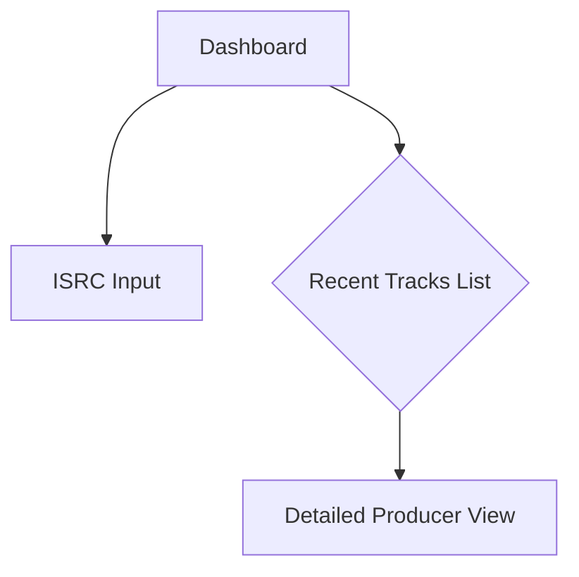
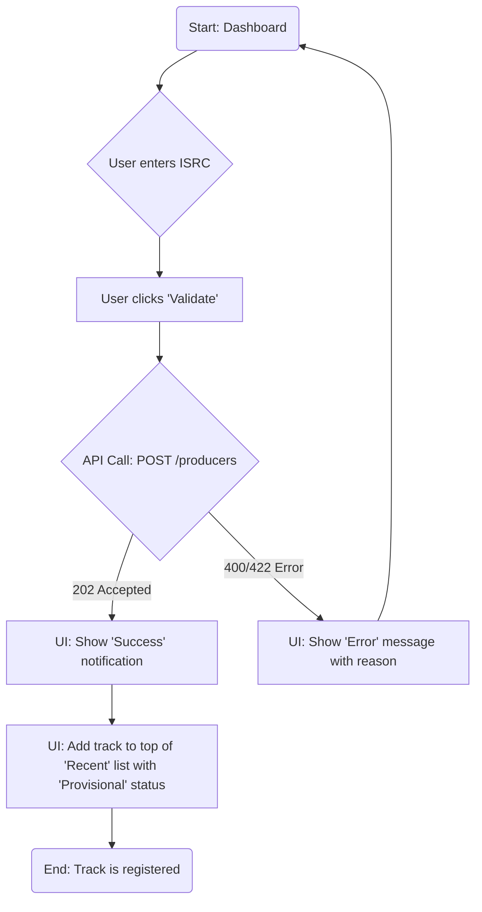
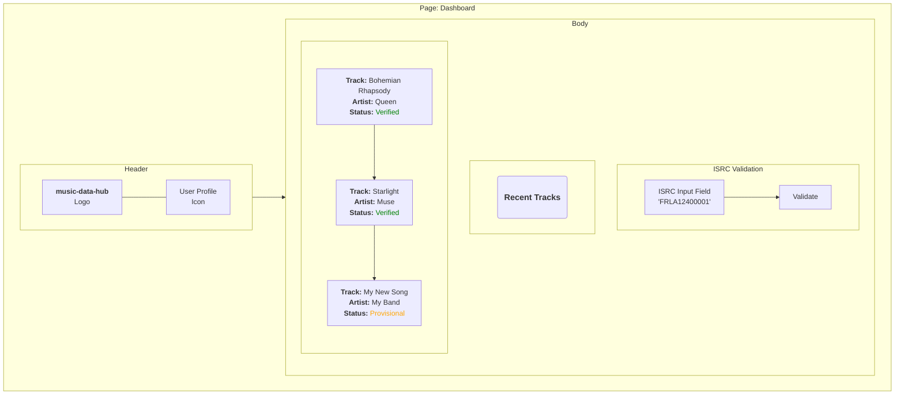

# music-data-hub UI/UX Specification

## Introduction
This document defines the user experience goals, information architecture, user flows, and visual design specifications for music-data-hub's user interface. It serves as the foundation for visual design and frontend development, ensuring a cohesive and user-centered experience.

### Change Log

| Date | Version | Description | Author |
| --- | --- | --- | --- |
| | | | |

### Overall UX Goals & Principles

#### Target User Personas
- **Producer/Label (Primary User):** Music professionals who need a fast, reliable way to validate ISRCs and manage their track catalog. They value efficiency and data accuracy.
- **Artist (Secondary User):** Musicians whose work is managed in the system. They might have future access to view their information.

#### Usability Goals
- **Validation Efficiency:** A producer should be able to submit an ISRC and receive confirmation (or an in-progress status) in under 10 seconds.
- **Information Clarity:** The status of each track (`Provisional`, `Verified`) must be immediately and clearly visible.
- **Centralized Management:** Producers should be able to intuitively view and manage their entire track catalog.

#### Design Principles
1. **Reliability First:** The interface must build trust by presenting accurate data and clear statuses. Every design element should reinforce this sense of dependability.
2. **Speed and Efficiency:** The primary user flow of validating an ISRC must be as short and simple as possible, removing all friction.
3. **Progressive Disclosure:** The main interface focuses on the core validation task. More complex management features are accessible but do not clutter the initial experience.

## Information Architecture (IA)

### Site Map / Screen Inventory

For the initial version, the application will be centered around two main screens:

1.  **Dashboard (Homepage):** This is the primary landing page for the main user (the producer). It will feature:
    *   A prominent input field to submit an ISRC.
    *   A list of recently submitted/validated tracks, showing their status.
2.  **Producer View:** A detailed page listing *all* tracks belonging to a specific producer, with search and filtering capabilities.

Visually, the site map can be represented as:

### Navigation Structure
- **Primary Navigation:** Given the initial simplicity, complex navigation is not required. The logo in the top-left will always link back to the Dashboard.
- **Secondary Navigation:** None initially.
- **Breadcrumb Strategy:** A simple breadcrumb will be used on the "Producer View" page. For example: `Dashboard > Producer "Label XYZ"`.

## User Flows

### Flow 1: Validate a New ISRC

- **User Goal:** A producer wants to quickly check the validity of an ISRC and add it to their catalog.
- **Entry Points:** The main input field on the Dashboard.
- **Success Criteria:**
    - The user receives immediate feedback confirming the submission was accepted.
    - The new track appears in the "Recent Tracks" list with the status `Provisional`.

#### Flow Diagram

#### Edge Cases & Error Handling:
- **Malformed ISRC:** If the user enters a code that does not match the ISRC format (e.g., too short, wrong characters), the "Validate" button remains disabled, and a help message appears below the field (e.g., "Please enter a valid 12-character ISRC code.").
- **Valid but Unprocessable ISRC:** If the API returns a 422 error (e.g., the ISRC is valid but not found on external platforms), the UI displays a clear message (e.g., "This ISRC is valid but could not be found. It has been added as 'Provisional'.").
- **Server Error:** In the event of a 500 error, a generic message is displayed, asking the user to try again later.

## Wireframes & Mockups

### Primary Design Tool
**Figma** will be used as the primary tool for creating wireframes, high-fidelity mockups, and interactive prototypes. It will serve as the single source of truth for all visual design, facilitating collaboration and developer handoff.

### Key Screen Layouts

#### Dashboard Screen
- **Purpose:** To provide the fastest path for ISRC validation and offer an immediate overview of recent activity.
- **Key Elements:**
    1.  **Header:** `music-data-hub` logo on the left, user profile icon on the right.
    2.  **Primary Input Area:** A large, prominent text field with a "Validate" button.
    3.  **Recent Tracks List:** A table or card list showing the last 5-10 submitted tracks. Each item will display:
        - Track Title (`TrackTitle`)
        - Artist Name (`ArtistName`)
        - ISRC
        - A highly visible status badge (`Provisional` / `Verified`)

#### Dashboard Wireframe

## Component Library / Design System

### Design System Approach
As defined in the architecture document, we will use **`shadcn/ui`**. The approach is not to build a design system from scratch, but rather to **customize `shadcn/ui` components** to match the unique brand identity of `music-data-hub`, which will be defined in the "Branding & Style Guide" section.

### Core Components (MVP)
Based on the dashboard wireframe and planned features, these are the initial components we will need to use and customize:

1.  **`Input`:** For the ISRC entry field.
2.  **`Button`:** For the "Validate" button.
3.  **`Badge`:** To clearly display `Provisional` and `Verified` statuses.
4.  **`Card` / `Table`:** A hybrid approach will be used:
    - **`Card`:** For the "Recent Tracks" list on the Dashboard to provide a modern, easily scannable overview.
    - **`Table`:** Planned for the full "Producer View" to allow for dense data display, sorting, and filtering of the entire catalog.
5.  **`Toast`:** To display non-intrusive success or error notifications after an ISRC submission.

## Branding & Style Guide

### Visual Identity
As there is no pre-existing style guide, this section establishes a foundational look and feel that reinforces the core principles of "Reliability" and "Efficiency".

### Color Palette (Proposal)

| Type | Hex Code | Usage |
| :--- | :--- | :--- |
| **Primary** | `#1E3A8A` (Deep Blue) | Main buttons, links, headers. Inspires trust and professionalism. |
| **Accent** | `#3B82F6` (Bright Blue) | Hover indicators, active elements. |
| **Success** | `#10B981` (Green) | `Verified` status, success notifications. |
| **Warning**| `#F59E0B` (Orange) | `Provisional` status. Draws attention without being alarming. |
| **Error** | `#EF4444` (Red) | Error messages, destructive actions. |
| **Neutrals** | `#F3F4F6` (BG), `#4B5563` (Text) | Light grays for backgrounds, dark grays for text to ensure high readability. |

### Typography (Proposal)

- **Font Family:** **Inter**. A highly readable sans-serif font designed specifically for user interfaces. It is open-source and provides excellent clarity at all sizes.
- **Type Scale:** A simple, standard scale will be used initially.
    - **H1 Title:** 24px, Bold
    - **Body Text:** 16px, Regular
    - **Small/Helper Text:** 14px, Regular

## Accessibility Requirements

### Compliance Target
For this project, the recommended target is **WCAG 2.1 Level AA**. This is the industry standard that ensures the application is usable by the widest range of people, including those with visual, motor, or cognitive disabilities.

### Key Requirements
Based on our design choices, here are the primary focus areas:

1.  **Color Contrast:** All text-to-background color combinations (especially our status color palette) must meet a minimum contrast ratio of 4.5:1.
2.  **Keyboard Navigation:** The entire application must be fully operable using only the `Tab` key. A visible focus indicator (an outline or halo) must clearly show the selected element. `shadcn/ui` handles this well by default.
3.  **Alternative Text:** All non-decorative icons and images must have `alt text` that describes their function.
4.  **Form Labels:** The ISRC input field must be properly associated with its label so that screen readers can announce it correctly.

### Testing Strategy
- Automated testing with tools like `axe`.
- Regular manual testing of the keyboard navigation flow.

## Responsiveness Strategy

### Philosophy
A "Mobile-First" approach will be adopted. Even if the primary use case is on desktop, designing for mobile first forces a focus on core content and ensures a quality experience across all devices.

### Breakpoints
We will use the standard breakpoints provided by Tailwind CSS, the underlying utility for `shadcn/ui`:

| Breakpoint | Min Width | Target Devices |
| :--- | :--- | :--- |
| **Mobile** | < 640px | Smartphones |
| **Tablet** | 640px - 1024px | Tablets |
| **Desktop**| > 1024px | Laptops, Desktops |

### Adaptation Patterns
- **Layout:** On mobile, elements will primarily be stacked vertically. For example, the list of `Card` components will be a single column.
- **Navigation:** N/A for now, as the navigation is very simple.
- **Text Size:** Font sizes will adapt to remain legible on smaller screens.

## Animation & Micro-interactions

### Motion Principles
Animations should be **purposeful and subtle**. Their goal is not to impress, but to improve comprehension and provide feedback. They must be fast and never slow the user down.

### Key Animations (MVP)
1.  **Status Transitions:** When a status changes from `Provisional` to `Verified`, a gentle fade or a "flash" of green can be used to draw the eye to the change.
2.  **Button Feedback:** Subtle state changes (hover, click) on buttons and input fields to make the interface feel responsive.
3.  **Notification Appearance:** Success and error toasts will slide smoothly into view rather than appearing abruptly.

## Next Steps

### Immediate Actions
1.  **Review and Validation:** Have this document validated by all stakeholders (development, product).
2.  **Mockup Creation:** Begin creating the high-fidelity mockups in Figma based on this specification.
3.  **Theme Configuration:** Set up the base theme in the front-end project (colors, fonts) to reflect the style guide.

### Design Handoff Checklist
This list ensures we are ready for developers to start working from our designs.
- [x] All primary user flows are documented.
- [x] The component inventory is complete.
- [x] Accessibility requirements are defined.
- [x] The responsive strategy is clear.
- [x] Branding guidelines are established. 